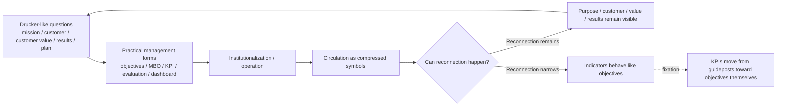

# 001. Drucker, Management, and Compression into KPIs

## HSS Observation Report

## 0. How this report handles the topic

This report is an HSS observation note.

It does not attempt to prove, refute, or definitively interpret Drucker.

It observes how Drucker-like questions and management concepts may become visible when routed through objectives, MBO, KPIs, evaluation formats, dashboards, and other practical management forms.

The first object of this report is the averaged image of “Drucker’s management” that can be taken from broadly circulated external materials such as Wikipedia, explanations of MBO, Drucker-related management commentary, and business articles.

On that basis, this report places HSS vocabulary as a tentative observation axis and organizes what kind of connection structure becomes visible.

The purpose is to observe how the relation structure appears to change when Drucker-like questions are compressed into objectives, KPIs, evaluation systems, dashboards, and similar forms.

## 1. Averaged image available from external sources

In the broadly circulated image, Peter Drucker is often discussed in connection with modern management, management by objectives and self-control, and knowledge workers. In this report, Peter Drucker - Wikipedia is used only as a source anchor for confirming that widely circulated association.

Management by Objectives is sometimes explained as a management style in which concrete objectives are defined inside an organization, individual goals and organizational goals are aligned, and results are measured against standards. In this report, Management by Objectives - Wikipedia is also used only as a source anchor for confirming the context in which MBO is described through objectives, alignment between individual and organizational goals, measurement, and evaluation.

Drucker-related materials around The Five Most Important Questions treat questions such as mission, customer, customer value, results, and plan as central. Here, these are used as one source anchor for the questions that circulate as Drucker-like questions. The New Yorker and HBR are treated as supporting sources for confirming the surrounding context, not as sources that prove the HSS-side interpretation.

In contexts such as the Drucker Institute / Management Top 250, Drucker-derived management principles can also be seen operationalized into measurable management dimensions such as customer satisfaction, employee engagement and development, innovation, social responsibility, and financial strength. This report treats that not as Drucker’s original intent, but as a supporting example of how Drucker-related management thought is operationalized in the present.

Here, these materials are handled not as a settled interpretation of Drucker’s original texts, but as the circulated image of Drucker.

## 2. Points not fully decomposed by the averaged explanation

In general explanations, purpose, customer, value, results, objectives, KPIs, and evaluation systems are sometimes connected relatively smoothly.

The following are not conclusions directly stated by external sources. They are decomposition questions that arise when the averaged image of Drucker is observed through HSS vocabulary.

As observation questions, the following changes may not be fully decomposed:

- when purpose is compressed into indicators
- when results sink into evaluation systems
- when customer value becomes numerical
- when self-control becomes self-responsibilization
- when KPIs move from guideposts toward objectives themselves
- when management by objectives can no longer reconnect to a systemic view

## 3. HSS decomposition

In HSS terms, Drucker-like questions can be observed as higher-level connection routes through which an organization reconnects to purpose, customer, value, results, and plan.

At the same time, MBO, objectives, KPIs, dashboards, and evaluation systems can be observed as compressed symbols for bringing those higher-level connection routes down into practical operation.

Here, compression is observed as a structure in which abstract questions are converted into forms that can be handled in practice.

An organization may handle abstract purposes and values as objectives, indicators, and evaluation systems.

The observation point is the difference between cases where a compressed symbol reconnects to the original purpose, customer, value, and results, and cases where reconnection becomes difficult.

```text
mission / customer / customer value / results / plan
↓
objectives / MBO / KPI / evaluation / dashboard
↓
when reconnection remains available:
  purpose, customer, value, results remain visible
↓
when reconnection becomes weak:
  indicators begin to behave like objectives
```

### Observation flow



This diagram is not a definitive interpretation of Drucker. It is a working HSS observation aid for showing how questions and purposes can be compressed into indicators and evaluation formats, and how reconnection may remain possible or become narrow.

## 4. Decomposition results

| Averaged image of Drucker | Compression into practice | State visible through HSS |
| ------------------------- | ------------------------- | ------------------------- |
| Mission | policy / objectives | higher-level connection route |
| Customer | customer segments / customer satisfaction | compression of customer relations |
| Customer value | NPS / retention rate / sales | symbolization of value |
| Results | evaluation indicators / results measurement | fixation of results |
| Plan | MBO / KPI / execution plan | compression of execution routes |
| Self-control | self-management / responsibility for goal achievement | self-responsibilization of autonomy |
| MBO | goal synchronization / evaluation | capture of the objective function |
| Performance measurement | achievement rate / compensation / evaluation | loss of return movement |

## 5. Observation hypotheses inferred from the HSS model

The following hypotheses are not conclusions directly derived from external sources. They are observation hypotheses formed from the decomposition results when HSS is placed as a tentative observation axis.

### Hypothesis 1: KPIs can be observed as compressed symbols of purpose

KPIs function as compressed symbols for handling mission, customer, value, results, and related elements in practice.

The observation point is the difference between cases where KPIs reconnect to the original connection route and cases where reconnection becomes difficult.

At that point, KPIs begin to behave not as guideposts, but as objectives themselves.

### Hypothesis 2: MBO can be observed from the viewpoint of reconnection to a systemic view

As a limitation of MBO, it is sometimes pointed out that objective-setting without systems understanding may become disconnected from quality and original results.

In HSS terms, the observation point is not objectives themselves, but a state in which objectives can no longer return to systemic view, quality, and purpose.

In other words, HSS can observe part of MBO operation as a state in which goals can no longer return to higher-level connection routes.

### Hypothesis 3: Customer value can be quantified, but numbers alone do not always retain customer relations

Customer value can be compressed into NPS, customer satisfaction, retention rate, sales, churn rate, and similar indicators.

However, those indicators alone may not make it easy to see why customers experience value, which relations are layered, or which trust routes are being maintained.

In HSS terms, customer indicators compress part of customer relations, but they do not necessarily retain layered history or Shiwa.

### Hypothesis 4: Self-control among knowledge workers may become self-responsibilization depending on indicator operation

Drucker is sometimes discussed in connection with knowledge workers and self-control.

In HSS terms, this can originally be observed as a route through which knowledge workers reconnect their own work to purpose and results.

However, when indicator operation becomes strong, self-control may be compressed into self-management, self-optimization, and self-responsibility.

At that point, the organization-side systemic view and responsibility for support may become narrower.

### Hypothesis 5: Drucker-like questions are not answers, but reconnection triggers

Questions such as mission, customer, customer value, results, and plan can be observed not as tools for giving fixed answers, but as triggers for an organization to periodically return to the original connection routes.

In HSS terms, Drucker-like questions can be read as reconnection triggers for re-expanding fixed management indicators.

## 6. What this report does not determine

This report does not handle the following:

- determining Drucker’s original intent
- value judgments about KPIs, MBO, or measurement
- judging actual success or failure in individual organizations
- proving the truth or validity of HSS

## 7. Source anchors

These sources are used as source anchors, not as foundations, authorities, or proof for HSS.

- [001. Drucker Sources](../../sources/en/001_drucker_sources.md)

- Peter Drucker - Wikipedia

  - https://en.wikipedia.org/wiki/Peter_Drucker
  - Used to confirm the averaged image in which Drucker is connected with management theory and practice, management by objectives and self-control, and knowledge workers.

- Management by Objectives - Wikipedia

  - https://en.wikipedia.org/wiki/Management_by_objectives
  - Used to confirm the context in which MBO is connected with defining objectives, alignment between individual and organizational goals, measurement, and Deming’s systems-view criticism.

- Knowledge worker - Wikipedia

  - https://en.wikipedia.org/wiki/Knowledge_worker
  - Used as a supporting source anchor for confirming the connection between the knowledge worker concept and Drucker.

- The Five Most Important Questions You Will Ever Ask About Your Organization

  - https://en.wikipedia.org/wiki/Peter_Drucker
  - Used as a source anchor for treating questions such as mission, customer, customer value, results, and plan as a circulated Drucker-related context. This is not an exhaustive Drucker literature review.

- The Rise and Fall of Getting Things Done - The New Yorker

  - https://www.newyorker.com/tech/annals-of-technology/the-rise-and-fall-of-getting-things-done
  - Used as a supporting source anchor for confirming contexts around Drucker, knowledge worker autonomy, management by objectives, personal productivity management, and organizational load.

- The Theory of the Business - Harvard Business Review

  - https://hbr.org/1994/09/the-theory-of-the-business
  - Used as a supporting source anchor for confirming the distinction between management techniques and deeper assumptions about a business, including mission, environment, and core competencies.

- Management Top 250 / Drucker Institute references via WSJ

  - https://www.wsj.com/business/biggest-gains-customer-satisfaction-management-top-250-1e6a585b
  - https://www.wsj.com/business/biggest-gains-employee-engagement-d4f4ff15
  - https://www.wsj.com/business/top-companies-social-responsibility-1b4b807e
  - https://www.wsj.com/business/top-companies-innovation-183755db
  - Used as supporting source anchors for observing an example in which the Drucker Institute’s Management Top 250 operationalizes Drucker’s management principles into measurable management dimensions such as customer satisfaction, employee engagement and development, innovation, social responsibility, and financial strength.

## 8. Short conclusion

Drucker-like questions are compressed into KPIs and evaluation indicators in practical operation.

What this report observes is the connection structure in which those compressed symbols may reconnect to the original questions, or may become difficult to reconnect.

When compressed symbols no longer reconnect to the original questions, routing toward purpose, customer, value, and results becomes narrower, and indicators themselves begin to behave like objectives.

In HSS terms, this state can be observed as capture of the objective function, loss of return movement, narrowing of layered history, and scraping away of Shiwa.
