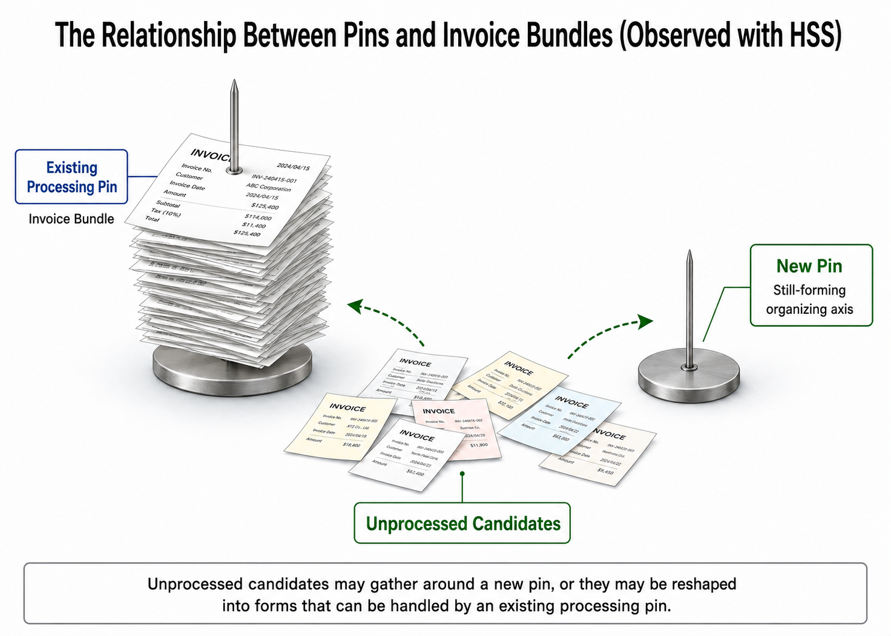

# 003. Why Innovation Stops as an Invoice Bundle

## HSS Observation Report

## 0. How this report handles the topic

This report is not a strict literature review or strict analysis of management studies, organization theory, or innovation studies.

It also does not evaluate or rank innovation, existing work, innovation processes, approval processes, budget processes, business cases, KPIs, phase-gate processes, or related organizational handling routes.

What this report handles is the structure in which new connection candidates are recognized, explained, compressed, routed, and processed inside organizations, or maintained as exploratory routes.

## 1. Averaged image available from external sources

In general explanations, innovation is often described as the practical implementation of new ideas or improvements into goods, services, processes, business models, and related forms.

As source anchors, `innovation`, `innovation management`, `diffusion of innovations`, `business case`, `business process`, `phase-gate process`, and `formal organization` provide externally recognizable contexts around this topic.

`Innovation - Wikipedia` is used as a source anchor for the context in which innovation is connected with practical implementation of ideas, newness, improvement, and spread.

`Innovation management - Wikipedia` is used as a source anchor for the context in which innovation management is connected with recognizing opportunities and introducing new ideas, processes, and products. It also places activities and tools such as search, selection, implementation, capture, brainstorming, prototyping, phase-gate models, project management, and portfolio management in the surrounding context.

`Diffusion of innovations - Wikipedia` is used as a source anchor for the context in which new ideas and technologies spread through communication channels, time, and social systems.

Meanwhile, in contexts where planning and investment move inside organizations, business cases, business processes, and phase-gate processes are often used as processing forms.

`Business case - Wikipedia` is used as a source anchor for the context in which a business case organizes reasons for starting a project or task, including benefits, costs, risks, KPIs, resources, and justification.

`Business process - Wikipedia` is used as a source anchor for contexts around inputs, outputs, processes, activities, customer value, and organizational structure.

`Phase-gate process - Wikipedia` is used as a source anchor for the context in which projects or initiatives are divided into stages or phases and gates, and continuation decisions are made based on factors such as business cases, risks, and resources.

`Formal organization - Wikipedia` is used as a source anchor for organizational contexts based on fixed rules, procedures, and structures.

Here, these are handled not as definitive interpretations in organization theory, but as the following averaged observation objects.

```text
innovation
= movement that attempts to implement and expand new connection candidates

innovation management
= search, selection, implementation, capture, prototyping, phase-gate handling, and portfolio management around new connection candidates

business case / business process / phase-gate / formal organization
= organizational processing forms that can handle proposals, justification, resources, risks, evaluation, and continuation decisions

invoice bundle
= a processing form compressed into approval, budget, responsibility scope, KPI, risk, and explainability
```

## 2. Points not fully decomposed by the averaged explanation

In general explanations, innovation may be described through phrases such as new ideas, creativity, technology, challenge, market launch, practical implementation, spread, and transformation.

Meanwhile, in organizational practice, it is handled through forms such as planning, budget, ringi, approval, business case, KPI, risk, resource, and phase-gate.

However, that explanation alone does not always make the following structural differences easy to see.

- When does an idea become an innovation candidate inside an organization?
- When does a candidate become a project, proposal, business case, budget item, KPI item, or approval item?
- When does a still-unnamed connection become a business case?
- When are discomfort and hypotheses in the exploratory stage compressed into KPIs?
- Which connection routes are thickened by budget, responsibility, and approval, and which routes become harder to see?
- When does a new connection route remain visible as an exploratory route?
- When is a candidate compressed into an existing processing form?
- When do approval, budget, and evaluation formats become stronger than the unfixed connection candidate?
- When do the original discomfort, observation, prototype, customer reaction, or technical possibility disappear behind processable documents?
- Which Blue residuals become narrow when a candidate is quickly converted into an existing processing form?
- What routing becomes visible when a new connection candidate is maintained as an exploratory route?

Below, these points are provisionally decomposed using HSS vocabulary.

## 3. HSS decomposition

Seen through HSS, the early state of innovation can be observed as an unfixed connection candidate, or as a group of unprocessed candidates, that has not yet fit into a fixed classification or evaluation format.

It does not necessarily appear from the beginning as sales, KPI, ROI, responsible owner, or an approved plan.

Rather, it may appear as things such as the following.

- Discomfort that does not yet have a name
- An observation that does not fit an existing classification
- A small improvement idea
- A gap involving customers or the field
- A prototype
- A hypothesis outside existing procedures
- A sign that is hard to explain but hard to ignore

At the same time, inside an organization, resource allocation and responsibility scope become objects of processing.

For that reason, a new connection candidate is converted into forms such as a business case, ringi, budget, phase-gate, KPI, risk, resource, or owner.

In HSS, this conversion is observed as a structure in which an unconverged connection candidate is compressed into symbols and routing that can be processed inside the organization.

```text
unfixed connection candidate
↓
observation / hypothesis / prototype
↓
business case / budget / owner / KPI / gate
↓
when exploratory routing remains available:
  Blue residuals and reconnectable areas remain visible
↓
when the candidate is compressed early into existing formats:
  routing narrows toward existing categories, metrics, and responsibilities
```

Here, “invoice bundle” translates 伝票の束, a metaphor for documents, approval items, budget items, KPI items, explanatory materials, and other units that an existing organization can process.

The invoice bundle is not approval or budget management itself.

In HSS, the invoice bundle is observed as a processing form through which an organization connects resources, responsibility, risk, evaluation, and explainability.

### When something remains only as an invoice

When an unfixed connection candidate does not graze anyone’s reconnectable area inside the organization, it may become difficult to see as a connection candidate.

However, inside the organization, its trace may not disappear completely. It may remain as a processing form such as a business case, ringi item, ticket, KPI, approval item, or explanatory material.

At that point, what is propagating is not connection possibility, but the processing form itself.

In HSS, this state is observed as a phase in which the connection candidate remains in a form processable as an invoice, while the route back to the connection possibility contained inside it becomes narrow.

The structure in which “something that does not graze remains as a trace” is also handled in Report 004, The Connection Structure of “Sasaru” and “Kasuru.”

## 4. “Pin” and “invoice bundle”

In HSS, a new pin is observed as a still-small new connection axis, an unfixed organizing axis, or an innovation seed that has not yet grown.

Around it, there may be unprocessed candidates such as discomfort, observation, prototype, customer reaction, technical possibility, and other not-yet-fixed candidates.

Meanwhile, inside an organization, there are already operating existing processing pins such as approval, budget, KPI, ringi, evaluation, risk, owner, phase-gate, and responsibility scope.

Unprocessed candidates may gather around the new pin and grow an independent connection axis.

However, when they are compressed early into an existing processing form, those unprocessed candidates may be reshaped into forms that fit existing processing pins before they grow the new pin, and then be processed as an invoice bundle.

At that point, the invoice bundle means processing forms such as business cases, ringi items, budget items, KPI items, explanatory materials, and approval items reshaped so that they fit existing processing pins.

- New pin: a still-small new connection axis, an unfixed organizing axis, or an innovation seed
- Unprocessed candidates: discomfort, observation, prototype, customer reaction, technical possibility, or other not-yet-fixed candidates
- Existing processing pin: existing routing for approval, budget, KPI, ringi, evaluation, risk, owner, phase-gate, or responsibility scope
- Invoice bundle: a processing form in which unprocessed candidates have been reshaped so that they fit existing processing pins

The new pin itself does not become an invoice bundle.

Rather, candidates around the new pin may become an invoice bundle when they are reshaped into forms that existing processing pins can handle.

Processing forms used inside organizations include questions such as the following.

- Who is responsible?
- Which budget will be used?
- Which KPI will be used to view it?
- Which risk category does it belong to?
- Which approval route should it pass through?
- Which department’s work is it?
- Which result should it be reported as?



What HSS observes is not which is correct, the pin or the invoice.

What it observes is whether unprocessed candidates gather around a new pin and grow as an independent connection axis, or whether they are reshaped into forms that fit existing processing pins and processed as an invoice bundle.

Through that branch, HSS observes which connection routes appear to remain and which connection routes appear to become narrow.

## 5. Decomposition results

| Observed object | State visible through HSS | Processing form or connection destination |
| --- | --- | --- |
| Small discomfort | Unfixed connection candidate | Field observation, customer reaction, hypothesis |
| Idea | Low-fixation symbol | Prototype, conversation, exploratory route |
| Unprocessed candidates | Connection material that may gather around a new pin | Discomfort, observation, prototype, customer reaction |
| New pin | Still-small new connection axis, unfixed organizing axis | Discomfort, observation, prototype, customer reaction |
| Existing processing pin | Existing routing connected to approval, budget, and evaluation formats | KPI, owner, risk, phase-gate |
| Invoice bundle | Processing form in which unprocessed candidates have been reshaped to fit existing processing pins | Business case, ringi, explanatory material |
| Prototype | Temporary implementation of a connection candidate | Customer reaction, technical verification, reinterpretation |
| Business case | Explainable form of a connection candidate | Budget, approval, responsibility, resource |
| KPI | Measurement form of a connection candidate | Evaluation, progress, comparison |
| Phase-gate | Staged processing of a connection candidate | Continuation decision, resource allocation |
| Existing work | Stable processing routing | Responsibility scope, quality, reproducibility |
| Exploratory route | Routing that leaves Blue residuals | Reconnectable area, alternative interpretation, additional observation |

## 6. Observation hypotheses inferred from the HSS model

The following hypotheses are not conclusions directly derived from external sources. They are observation hypotheses formed from the decomposition results when HSS is placed as a tentative observation axis.

### Hypothesis 1: The early state of innovation can be observed as an unfixed connection candidate

Innovation does not necessarily appear from the beginning as a completed plan or KPI.

In HSS, its early state can be observed as a connection candidate whose classification or evaluation format has not yet been fixed.

### Hypothesis 2: A business case can be observed as a compression symbol that makes a connection candidate processable inside an organization

A business case can be observed as a form that connects a connection candidate to budget, expected effect, risk, resource, owner, KPI, and related items.

Through this form, the organization can handle the connection candidate more easily.

At the same time, unfixed exploratory room is compressed into explainable items.

### Hypothesis 3: A phase-gate can be observed as routing that processes a connection candidate in stages

A phase-gate can be observed as a structure that divides a connection candidate into stages or gates and connects each stage to continuation decisions and resource allocation.

In HSS, phase-gate is treated as routing that processes an unconverged connection candidate in stages.

This routing may preserve reconnection routes when observation, reinterpretation, and prototype feedback remain visible.

It may also narrow reconnection routes when the candidate is handled only as gate-passing material.

### Hypothesis 4: Early compression into existing processing forms may narrow Blue residuals

A new connection candidate may be compressed at an early stage into existing KPIs, budgets, responsibility scopes, business departments, or existing classifications.

At that point, still-unnamed discomfort, alternative interpretations, unverified hypotheses, and small gaps involving customers or the field may become harder to see.

In HSS, this state can be observed as a phase in which Blue residuals and reconnectable areas become narrow.

### Hypothesis 5: When exploratory routes remain, new connection candidates become easier to re-expand

A connection candidate may remain open to prototypes, observation, dialogue, connection with other departments, customer reactions, and reinterpretation, without being fixed immediately into an existing form.

At that point, HSS can observe the unfixed connection candidate as maintaining an exploratory route.

When exploratory routes remain, the candidate can reconnect to the original discomfort, observation, prototype, customer reaction, or technical possibility, and re-expansion becomes easier.

### Hypothesis 6: Approval, budget, and evaluation formats can reshape unfixed connection candidates

Approval, budget, and evaluation formats can make a connection candidate visible inside an organization.

At the same time, they can turn an unfixed connection candidate into a budget item, KPI item, risk item, owner item, responsibility item, or continuation-decision item.

The question here is not whether process is bad.

The observation point is whether reconnection to the original connection candidate remains possible after the candidate is processed through those formats.

## 7. What this report does not determine

This report does not handle the following.

- Evaluation of individual companies or organizations
- Value judgments about approval processes, budget management, business cases, KPIs, or phase-gate processes
- Determination of the success or failure of innovation measures
- Definitive organization-theory or innovation-studies arrangement
- Explaining all innovation through this structure

## 8. Source anchors

- [003. Innovation / Business Process Sources](../../sources/en/003_innovation_sources.md)

The source anchors listed in that note are as follows.

- Innovation - Wikipedia
  - https://en.wikipedia.org/wiki/Innovation
- Innovation management - Wikipedia
  - https://en.wikipedia.org/wiki/Innovation_management
- Diffusion of innovations - Wikipedia
  - https://en.wikipedia.org/wiki/Diffusion_of_innovations
- Business case - Wikipedia
  - https://en.wikipedia.org/wiki/Business_case
- Business process - Wikipedia
  - https://en.wikipedia.org/wiki/Business_process
- Phase-gate process - Wikipedia
  - https://en.wikipedia.org/wiki/Phase-gate_process
- Formal organization - Wikipedia
  - https://en.wikipedia.org/wiki/Formal_organization

These sources are used as source anchors, not as foundations, evidence, or authorities for HSS.

They are used to keep the external context visible before applying HSS as a tentative observation axis.

## 9. Short conclusion

The early state of innovation can be observed not as an already fixed plan or KPI, but as an unfixed connection candidate.

Organizations convert that connection candidate into processing forms such as business case, budget, approval, KPI, owner, risk, and phase-gate in order to handle it.

Innovation candidates do not stop because they are bad.

They may stop because their connection possibilities are compressed into forms that existing organizations can approve, budget, evaluate, assign, and process.

In HSS terms, the observation point is whether the candidate can reconnect to the new pin, or whether it remains only as an invoice bundle attached to an existing processing pin.
