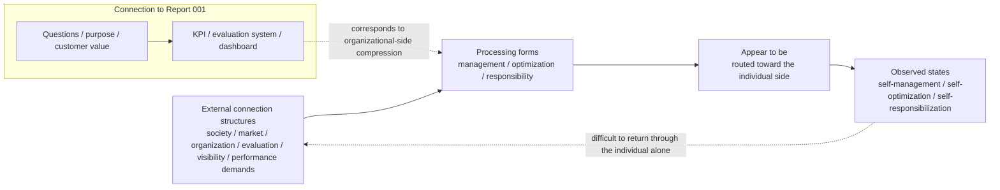

# 005. Self-Responsibilization as a Personal KPI

## HSS Observation Report

## 0. How this report handles the topic

This report is an observation note that reads Byung-Chul Han’s discussion coarsely within the range observable through the HSS model.

Here, states such as self-management, self-optimization, and self-responsibilization that appear in Han-related discussion are decomposed as connection structures through HSS vocabulary.

This is not a definitive interpretation of Han’s original texts.

## 1. Averaged Han image available from external sources

The Burnout Society functions as a source anchor for handling stress and exhaustion in the context of competitive / service-oriented societies not merely as events inside individuals, but as social and historical phenomena.

Psychopolitics functions as a source anchor for confirming contexts around neoliberalism, the productive force of the psyche, freedom, self-optimization, Big Data, and technological domination or control.

The Transparency Society functions as a source anchor for confirming the connection between visibility and control through contexts around transparency, exposure, control, information, and interpretation.

In Han-related discussion, achievement society, fatigue, self-optimization, self-exploitation, transparency, visibility, and self-responsibilization are discussed as problems of contemporary society.

Here, these are used not as a definitive interpretation of Han’s original texts, but as source anchors for observing a state in which management, optimization, and responsibility appear to connect toward the individual side in contemporary society.

## 2. Points not fully decomposed by the averaged explanation

Han’s discussion describes a state in which the contemporary subject appears to manage itself, optimize itself, and become fatigued.

However, the HSS observation questions are not the following.

- Why individuals do this
- What the individual’s true psychology is

The HSS observation questions are the following.

- Where management, optimization, and responsibility appear to come from
- How they are placed on the individual side
- Why external connection structures that are difficult for an individual to control appear as individual problems

For that reason, this report treats the following points as decomposition targets.

- Whether management really arises from inside the individual
- Whether optimization is really freely chosen by the individual
- Whether responsibility is really within the individual’s controllable range
- How performance demands and visibility connect to the individual side
- From which external connection structures self-management, self-optimization, and self-responsibilization appear to arise

## 3. HSS decomposition

Self-responsibilization can be observed not as a state in which the individual’s responsibility has actually increased, but as a connection state in which external connection structures that are difficult for an individual to control appear to be routed toward the individual side in the forms of management, optimization, and responsibility.

What is important here is not to start from “self.”

In HSS, management, optimization, and responsibility exist first as processing forms. They then appear to be placed on the individual side. As a result, self-management, self-optimization, and self-responsibilization are observed as states that arise from that routing.

### Observation flow



This diagram is not a summary of Han’s whole discussion. It is a working diagram for organizing, within the range observable through HSS, the connection state in which management, optimization, and responsibility appear to be routed toward the individual side.

## 4. Connection with Report 001, “Drucker, Management, and Compression into KPIs”

Report 001 observed a structure in which Drucker-like questions and purposes can be compressed into KPIs, MBO, evaluation systems, and dashboards.

Report 005 observes a corresponding HSS-side structure on the individual side.

This does not mean that Drucker and Han said the same thing. It also does not mean that Han refers to Drucker, or that Drucker caused this state.

What is stated here is limited to the point that HSS can observe corresponding compression and routing structures.

```text
001:
mission / customer / value / results / plan
↓
objectives / KPI / evaluation / dashboard

005:
society / market / organization / evaluation / visibility / performance demands
↓
management / optimization / responsibility
↓
appear to be routed toward the individual side
```

## 5. Decomposition results

| Observed object | State visible through HSS | Connection destination |
| --- | --- | --- |
| Performance demands | Evaluation symbols from outside | Evaluation, comparison, visibility |
| Visibility | Making states measurable | Indicators, dashboard, comparison with others |
| Management | Setting of processing forms | Behavior, time, results, self-image |
| Optimization | Adaptation to evaluation formats | Productivity, efficiency, results |
| Responsibility | Placement of processing load | Explanatory obligation on the individual side, self-management |
| Self-management | State in which management appears to be placed on the individual side | Time, behavior, results |
| Self-optimization | State in which optimization appears to be placed on the individual side | Ability, efficiency, productivity |
| Self-responsibilization | State in which responsibility appears to be placed on the individual side | Evaluation, results, explanatory demands |

## 6. Observation hypotheses inferred from the HSS model

### Hypothesis 1: Self-responsibilization can be observed not as an increase in responsibility, but as routing of responsibility

Self-responsibilization can be observed not as a state in which the individual’s responsibility has actually increased, but as a connection state in which management, optimization, and responsibility appear to be routed toward the individual side.

### Hypothesis 2: Self-management may appear not as expansion of freedom, but as individual-side processing of external structures

Self-management may appear to be a state in which the individual freely manages itself.

However, HSS observes that external connection structures that are difficult for an individual to control may appear to be arranged as management tasks for the individual.

### Hypothesis 3: Self-optimization can be observed as adaptation to evaluation formats rather than reconnection to purpose

Self-optimization is not necessarily an act in which the individual deeply reconnects to its own purpose.

In HSS, it may appear as a state in which the individual adapts to evaluation formats in response to visibility, evaluation, and performance demands.

### Hypothesis 4: Fatigue can be observed as asymmetry in connection routes

HSS does not define fatigue itself as a psychological state.

However, when management, optimization, and responsibility come toward the individual side while the return routes to the original external connection structures are narrow, processing load appears to be biased toward the individual side.

### Hypothesis 5: Han-like self-responsibilization can be observed as individual-side routing of the Drucker/KPI problem

Report 001 observed a structure in which questions and purposes are compressed into KPIs, evaluation systems, and dashboards.

Report 005 observes a structure in which management, optimization, and responsibility are routed toward the individual side and appear as self-management, self-optimization, and self-responsibilization.

## 7. What this report does not determine

This report does not handle the following.

- A definitive interpretation of Han’s overall discussion
- Psychological diagnosis of individuals
- Medical explanation of fatigue
- Value judgments about self-management, self-optimization, or self-responsibility
- Explaining all modern social problems through this structure

## 8. Source anchors

- [005. Han Sources](../../sources/en/005_han_sources.md)

- The Burnout Society - Stanford University Press

  - https://www.sup.org/books/title/?id=25725&promo=S19XMLA
  - Treated as a source anchor for confirming contexts around achievement society, fatigue, stress, and the load placed on individuals in contemporary society.

- Psychopolitics - Verso Books

  - https://www.versobooks.com/products/226-psychopolitics
  - Treated as a source anchor for confirming contexts around neoliberalism, psychopolitics, Big Data, freedom, self-optimization, and technological domination or control.

- The Transparency Society - Stanford University Press

  - https://www.sup.org/books/title?id=25832
  - Treated as a source anchor for confirming contexts around transparency, visibility, control, information, and interpretation.

### 001. Drucker, Management, and Compression into KPIs

- [001_drucker_management_kpi.md](001_drucker_management_kpi.md)
- Referenced as an internal HSS connection for connecting to the structure in which questions and purposes are compressed into KPIs, evaluation systems, and dashboards on the HSS side.

These source anchors are source anchors. They are not evidence or foundations for HSS.

## 9. Short conclusion

Han-related self-management, self-optimization, and self-responsibilization can be observed through HSS not as a state in which individual responsibility has actually increased, but as a connection state in which external connection structures that are difficult for individuals to control appear to be routed toward the individual side in the forms of management, optimization, and responsibility.

This observation does not start from “self.”

HSS treats self-management, self-optimization, and self-responsibilization as states arising when management, optimization, and responsibility appear to be cut out from external connection structures and placed on the individual side.
