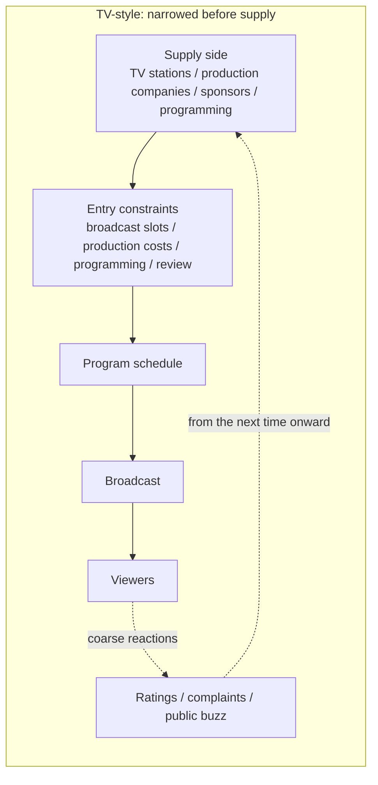
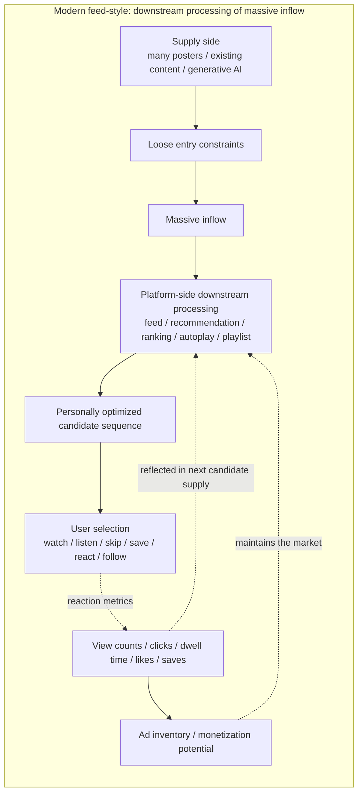
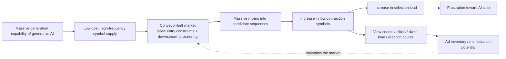

# 006. AI Slop as a Conveyor-Belt Problem

## HSS Observation Report

## 0. How this report handles AI slop

The term AI slop is generally used to refer to low-quality digital content mass-produced by generative AI.

However, the term still does not have a single stable definition.

In external sources, low quality, high quantity, AI generation, low effort, lack of meaning or quality, the attention economy, advertising revenue, and mass circulation on platforms appear as elements used to explain AI slop.

This report does not integrate those definitions into one fixed definition. Instead, it extracts elements that commonly appear across multiple source anchors and re-translates them in HSS vocabulary.

In this report, AI slop is not the name of “AI generation itself” as a problem.

In HSS, AI slop is treated as a state observed when massive generation capability from generative AI connects to processing forms such as platforms, feeds, advertising revenue, play counts / view counts, clicks, dwell time, and reaction metrics, and is observed as low-connection, mass-circulated, low-reconnection symbols.

## 1. Common elements extracted from external definitions

This report refers to the following external sources as source anchors.

- Merriam-Webster Word of the Year 2025: Slop
  - https://www.merriam-webster.com/wordplay/word-of-the-year
  - Use: to confirm senses around low-quality / AI / quantity
- AI slop - Wikipedia
  - https://en.wikipedia.org/wiki/AI_slop
  - Use: to confirm contexts around low-quality AI-generated digital content, lacking effort, quality, or meaning, high volume, clickbait, attention economy, monetization, creator economy, social media, and online advertising
- Spam, junk … slop? The latest wave of AI behind the “zombie internet” - The Guardian
  - https://www.theguardian.com/technology/article/2024/may/19/spam-junk-slop-the-latest-wave-of-ai-behind-the-zombie-internet
  - Use: to confirm contexts around spam / junk / slop, AI-generated web clutter, advertising revenue, and search traffic
- Measuring AI “Slop” in Text - arXiv
  - https://arxiv.org/abs/2509.19163
  - Use: to confirm low-quality AI-generated text, the instability of agreed definitions and measurement methods, and the subjectivity of slop judgments
- Why Slop Matters - arXiv
  - https://arxiv.org/abs/2601.06060
  - Use: to confirm contexts around superficial competence, asymmetry of effort, mass producibility, and the digital ecosystem of generation and consumption
- AI-Generated Algorithmic Virality - arXiv
  - https://arxiv.org/abs/2508.01042
  - Use: to confirm contexts around AI-generated content in TikTok and Instagram search results, low cost, fast production speed, gaming the algorithm, and scale production

From external definitions and media usage, at least the following elements overlap in AI slop.

- It is generated by AI or strongly related to generative AI.
- It is regarded as low quality, low effort, or low meaning.
- It is generated and circulated in large quantities.
- It connects to platforms, feeds, search, social media, advertising revenue, view counts, clicks, and reaction metrics.
- It may take forms resembling human creative works or information content while having weak connection possibility or weak reconnectability.

HSS does not combine these into the evaluation that “AI generation is the cause.”

Rather, it observes which circulation forms, evaluation forms, and revenue forms AI generation as production capability connects to when it is observed as slop.

## 2. Provisional HSS observation definition

In HSS, AI slop is not a property of generative AI itself, but an observed state that occurs when generation capability connects to platforms, feeds, view-count models, advertising revenue, and reaction metrics.

In this state, symbols are generated, circulated, and acquire reactions in large quantities.

However, those symbols do not necessarily connect deeply to an individual’s connectable area.

Even when they do connect, they may be carried to the next symbol before advancing into reconnection, re-expansion, or layered history.

For that reason, AI slop can be observed not only as “low-quality AI-generated output,” but as a state in which low-connection symbols circulate in large quantities and are processed in reaction metrics, yet do not easily advance into continuous connection or re-expansion.

## 3. Why this can be called a “conveyor belt”

The conveyor belt here is not the name of a specific app, but a candidate-supply structure.

This does not mean that users have no intention.

Nor does this section define user interiority or free will.

What HSS observes is the connection structure: whether users are exploring a wide Web space or cultural space, or selecting within a candidate sequence supplied by a platform.

Conveyor-belt consumption can be observed as a consumption form in which a candidate sequence is supplied first by platforms, search, recommendations, rankings, autoplay, playlists, and similar structures, and users perform selection within that candidate sequence by watching, listening, skipping, saving, reacting, following, and so on.

TikTok, YouTube Shorts, Instagram Reels, YouTube, Spotify, Apple Music, YouTube Music, and similar services are treated as examples of this kind of feed-, recommendation-, ranking-, autoplay-, and playlist-style candidate-supply structure.

These are examples of candidate-supply structures, not value judgments about individual services.

This structure existed before AI-generated content flowed into it.

AI-generated content did not create the conveyor belt.

Generative AI is taken up in later sections as an amplifier of the amount and speed of symbols poured into this existing candidate-supply structure.

## 4. Difference between TV-style and modern feed-style supply

TV-style supply also included passive reception in a certain sense.

However, the supply-side structure differs from modern feed-style supply.

In TV-style supply, supply-side entry constraints are strong, and candidates are narrowed before reaching viewers by broadcast slots, production costs, programming, and editorial / organizational gates.

Reactions also return relatively coarsely and slowly as ratings, complaints, or public buzz.

In modern feed-style supply, supply-side entry constraints are loose, and candidates that have flowed in massively are processed downstream.

Platforms, feeds, recommendations, rankings, autoplay, and playlists arrange candidates, and user reactions are measured and returned to the next candidate supply.

In TV-style supply, candidates are strongly narrowed before reaching viewers by broadcast slots, production costs, programming, review, and similar gates.

In modern feed-style supply, supply-side entry constraints are loosened, and candidates that have flowed in massively are processed downstream.

AI slop becomes easier to see because massive generation capability from generative AI connects to the latter market structure.

### Difference as a view-count business

TV-style supply also had advertising revenue and ratings.

However, in TV-style supply, candidates are narrowed at the supply-side entrance by broadcast slots, production costs, programming, review, and similar gates, and reactions return relatively coarsely and slowly as ratings, complaints, or public buzz.

By contrast, in modern feed-style supply, after candidates flow in massively, view counts, clicks, dwell time, likes, saves, shares, and similar metrics are measured per candidate.

These metrics are not connection depth itself.

However, on platforms they are processed as proxy indicators of demand, interest, trend, value, ad inventory, and monetization potential.

HSS observes this state as a phase in which connection possibility is compressed into processing forms such as view counts, clicks, dwell time, and reaction counts.

For that reason, the reason AI slop can easily arise is not AI generation itself.

Even low-connection symbols can be processed as view counts, clicks, dwell time, and reaction counts when there is a market structure that can process them in those forms, and when ad inventory or monetization potential is connected to those processing forms.

In other words, AI slop becomes easier to occur where a conveyor-belt candidate-supply structure connects with view-count business.

### Compression into play counts as a processing form

Play counts and view counts do not directly represent the depth of connection to a work.

One song listened to deeply and repeatedly and many songs touched shallowly once may leave different traces on the human side. The former may leave memory, attachment, reasons to return, entry into daily life, and an ongoing relationship with the creator. The latter may be closer to contact, passing-through, becoming background music, list consumption, or processing on recommendations.

On platforms, however, both first enter processing forms as play events or view events. In these processing forms, connection depth, how something remains in memory, reasons for revisiting it, and continuity of relationship are not easily decomposed sufficiently.

For that reason, even low-connection output may appear to hold as processing if it circulates in large quantity and can be converted into play counts, view counts, dwell time, and similar signals. When AI lowers production friction, this mass input becomes easier. However, AI use itself is not treated as slop. AI slop is treated not as AI generation itself, but as something that becomes easier to observe when low-connection mass output is poured into these processing forms.

## 5. What generative AI amplifies

Generative AI is not the conveyor belt itself.

Generative AI amplifies the supply capability of symbols that can be poured into the conveyor belt.

The observation target is not the existence of AI generation, but connection to candidate-supply structures, reaction metrics, and monetized flows.

What this diagram observes is not a value judgment about AI-generated products.

What HSS observes is a state in which, when generation capability connects to candidate-supply structures, reaction metrics, and view-count business, low-connection symbols circulate in large quantities and do not easily advance into reconnection or re-expansion.

Even low-connection symbols connect to ad inventory or monetization potential when they are processed as view counts, clicks, dwell time, and reaction counts.

Therefore, AI slop can be observed not as mere noise, but as a state in which candidates can remain measurable, circulable, and monetizable within a conveyor-belt market.

## 6. Difference between choice and selection

HSS does not deny that users feel they are choosing.

Here, it separates the following two forms.

- Choice: making one’s own connection route and editing a connectable area
- Selection: watching, skipping, saving, or reacting within a candidate sequence presented by a platform

AI slop did not destroy free choice.

Rather, it can be observed as a state that makes visible that what appeared to be free choice was conveyor-belt consumption selecting within candidate sequences on platforms.

What is handled here is not the user’s free will or interiority.

What HSS observes is the connection structure: whether the user is making the connection route, or selecting within a candidate sequence supplied by a platform.

## 7. Position of follow, search, and recommendation

Follow is not a pure relation itself.

Follow can be observed not as free Web exploration itself, but as a routing condition that specifies which supply sources are mixed into a candidate sequence inside a platform.

Follow is a trace of active connection.

However, display order, mixed-in recommendations, related posts, advertisements, reaction collection, and re-recommendation design are placed in platform-side processing forms.

Therefore, follow does not completely exit conveyor-belt consumption, but is treated as part of the conditions that compose a candidate sequence.

Search can also be observed as a candidate-supply structure when search result pages, rankings, advertisements, snippets, related results, and recommendation widgets shape a candidate sequence.

Recommendation, autoplay, and playlists can be observed as stronger conveyor-belt forms in which the candidate sequence is supplied first.

## 8. Two uses of short videos

Short videos are not themselves AI slop.

In HSS, short videos are observed by separating cases where they are used as advertising media and cases where they are used as circulation media.

As advertising media, short videos work as one-shot symbols that capture attention briefly and collect reactions.

As circulation media, short videos may work as introduction symbols for returning to songs, performers, full works, live events, communities, or layered history.

AI slop becomes easier to problematize when one-shot symbols optimized as advertising media are supplied in large quantities while wearing the face of circulation media.

Report 002 handled one-shot symbols and cases where processing forms circulate instead of connection possibility.

Report 004 handled “sasaru” (a deep “hits home” connection) not as short-term reaction, but as connection to existing history.

This report connects those two by treating short videos as a structure that can be either one-shot symbols or entrances for reconnection.

## 9. Decomposition results

| Observed object | State visible through HSS | Connection destination |
| --- | --- | --- |
| Generative AI | Amplification of symbol supply capability | Low-cost generation, massive generation |
| AI slop | Mass circulation of low-connection symbols | Feeds, search, social media, advertising revenue |
| Feed | Generation and presentation of candidate sequences | Recommendation, ranking, autoplay |
| Play counts / view counts | Processing form that compresses connection depth into play events or view events | Proxy indicators of value, ad inventory, monetization potential |
| Click | Processing symbol of contact | Candidate supply, reaction metrics |
| Dwell time | Processing symbol of attention | Recommendation, evaluation, monetization |
| Like / save | Reaction symbol | Next candidate supply |
| Follow | Routing condition | Candidate sequence, belonging signal, recommendation material |
| Passive selection | Processing within a candidate sequence | Watching, skipping, saving, reacting |
| Active choice | Editing of connection routes | Exploration, contextualization, reconnection |
| Low-connection symbol | Compressed symbol that is difficult to reconnect | Short-term reaction, passage, disposal |
| Conveyor-belt market | Candidate-supply structure that processes massive inflow downstream and converts reaction metrics into proxy indicators of value | View-count business, ad inventory, monetization potential |

## 10. Observation hypotheses inferable from the HSS model

### Hypothesis 1: AI slop can be observed not as a quality name for AI-generated products, but as a connection state between generation capability and market structure

AI slop appears not as AI generation itself, but as an observed state that occurs when generation capability connects to platforms, feeds, view-count models, advertising revenue, and reaction metrics.

### Hypothesis 2: In conveyor-belt consumption, selection tends to come to the foreground rather than choice

Users appear to choose for themselves.

However, HSS observes cases where selection comes to the foreground: watching, listening, skipping, saving, and reacting within a candidate sequence presented by a platform.

### Hypothesis 3: In a view-count model, throughput, dwell time, and reaction counts tend to be valorized more easily than connection possibility

View counts, clicks, dwell time, likes, saves, and similar metrics are not connection depth itself.

HSS observes them as processing forms in which passage traces and reaction symbols are numericized.

When ad inventory or monetization potential connects to this processing form, even low-connection symbols become objects of circulation, measurement, and monetization in the market.

For that reason, AI slop becomes easier to arise from a structure in which low-connection symbols are not excluded, but can remain as processable candidates in view-count business.

### Hypothesis 4: Generative AI is not the cause of slop itself; it works as supply capability that accelerates and exposes existing mass-circulation models

Generative AI amplifies the supply capability of symbols that can be poured into conveyor-belt markets.

As a result, the limits of market structures originally built on downstream processing of massive inflow become easier to see.

### Hypothesis 5: The term AI slop compresses not only unease toward AI, but also unease toward platformized circulation structures

The term AI slop may contain not only frustration toward low-quality AI-generated products, but also unease toward candidate-supply structures, view-count business, selection load, and low-connection symbols.

HSS does not use this term as a cause name as-is. It treats it as a label into which multiple connection structures are compressed.

### Hypothesis 6: The same generation capability can be used not only for conveyor belts, but also for editing connectable areas

Generative AI is not only something that mass-supplies low-connection symbols to platform candidate sequences.

When individuals generate, edit, and select according to their own uses, contexts, memories, and preferences, the same generation capability may be used toward editing their own connectable areas.

## L1–L3 observation points

- L1 contact layer:
  AI-generated content, thumbnails, videos, music, posts, search results, recommendation candidates, and similar items come into contact with users.
- L2 reaction / trace layer:
  Viewing, skipping, saving, unease, frustration, low-connection feeling, reactions, clicks, dwell time, and similar items remain as traces.
- L3 processing / routing layer:
  They are processed into feeds, recommendations, rankings, view counts, clicks, dwell time, advertising revenue, playlists, search ranking, and similar forms.

## Connection-confirmation states

- Connection confirmed:
  AI slop can be treated not as AI generation itself, but as an observed state where generation capability connects to platforms, feeds, recommendations, view counts, advertising revenue, reaction metrics, and similar forms.
- Absorption into processing forms:
  The connection possibility of symbols is easily absorbed into processing forms such as view counts, clicks, dwell time, saves, and reaction counts. Deep revisits and shallow contacts may be processed as the same play counts, view counts, or time-spent signals.
- Blue residuals / reconnectable area:
  Even when low-connection symbols circulate in large quantities, unease, frustration, saves, revisits, reinterpretation in another context, and similar traces can be observed as reconnectable areas.
- Possibility of feedback deficit:
  Even when reaction metrics are circulating, if routes back to connection depth, layered history, and reconnection possibility are hard to see, this can be observed as a possibility of feedback deficit.
- Information shortage / pending:
  Individual content, platforms, and user reactions are not determined by this report alone.

## 11. What this report does not determine

This report does not handle the following.

- Value judgments about AI-generated products themselves
- Superiority or inferiority between AI creation and human creation
- Copyright issues as a whole
- Evaluation of individual platforms or individual services
- Evaluation of individual users, posters, or creators
- Definitions of emotion, desire, free will, or dependency
- Critique of all recommendation systems
- Critique of the whole Web

## 12. Source anchors

- Merriam-Webster Word of the Year 2025: Slop
  - https://www.merriam-webster.com/wordplay/word-of-the-year
  - Confirms the context in which slop is explained as low-quality digital content usually mass-produced by AI.
- AI slop - Wikipedia
  - https://en.wikipedia.org/wiki/AI_slop
  - Confirms the context in which AI slop is explained in connection with generative AI, low quality, high quantity, the attention economy, monetization, social media, and online advertising.
- Spam, junk … slop? The latest wave of AI behind the “zombie internet” - The Guardian
  - https://www.theguardian.com/technology/article/2024/may/19/spam-junk-slop-the-latest-wave-of-ai-behind-the-zombie-internet
  - Confirms the context in which AI-generated content is discussed as spam / junk / slop on the Web and connected to advertising revenue and search inflow.
- Measuring AI “Slop” in Text - arXiv
  - https://arxiv.org/abs/2509.19163
  - Confirms the context in which the term AI slop still lacks a stable agreed definition or measurement method.
- Why Slop Matters - arXiv
  - https://arxiv.org/abs/2601.06060
  - Confirms contexts in which AI slop is treated not merely as digital pollution, but as an object of study connected with superficial competence, asymmetry of effort, and mass producibility.
- AI-Generated Algorithmic Virality - arXiv
  - https://arxiv.org/abs/2508.01042
  - Confirms contexts around TikTok and Instagram search results, AI-generated content, low-cost and high-speed generation, and algorithmic virality.
- 002. One-shot Gags, Buzz, and Connection to Performance Systems (Japanese report)
  - [002_ippatsu_gag_buzz_gei_system.md](002_ippatsu_gag_buzz_gei_system.md)
  - Referenced to connect with one-shot symbols and structures in which processing forms circulate instead of connection possibility.
- 004. The Connection Structure of “Sasaru” and “Kasuru” (Japanese report)
  - [004_sasaru_kasuru_connection.md](004_sasaru_kasuru_connection.md)
  - Referenced to connect with the structure that treats “sasaru” not as short-term reaction, but as connection to existing history.

## 13. Short conclusion

AI slop is not the name of the problem of AI generation itself.

In HSS, AI slop is treated as an observed state in which massive generation capability from generative AI connects to a conveyor-belt market structure whose supply-side entry constraints are loose and which downstream-processes massively inflowing candidates through platforms, feeds, recommendations, rankings, autoplay, playlists, and reaction metrics, thereby exposing the design limits of that structure.

In this structure, symbols are easily compressed into reaction metrics such as view counts, clicks, dwell time, likes, and saves before they are deeply reconnected as works or contexts.

Even low-connection symbols connect to ad inventory or monetization potential when they are processed as view counts, clicks, dwell time, and reaction counts.

For that reason, AI slop can be observed, before it is an AI problem, as a design breakdown of conveyor-beltized view-count business.

## What HSS made visible

- AI slop can be observed not as the quality problem of AI generation itself, but as a connection state between massive generation capability and platform-like candidate-supply structures.
- Low-connection symbols can remain in circulation when they are processable as view counts, clicks, dwell time, reactions, ad inventory, and recommendation signals.
- HSS makes visible the difference between choosing by making one’s own connection route and selecting within a supplied candidate stream.

## What remains unseen / pending

- This report suggests that the same generation capability could also be used to edit or expand reconnectable areas, but it does not strongly observe that point.
- Concrete cases where AI generation supports reconnection or re-expansion remain pending.
- This report does not evaluate platforms, AI generation, creators, or users as good or bad.
