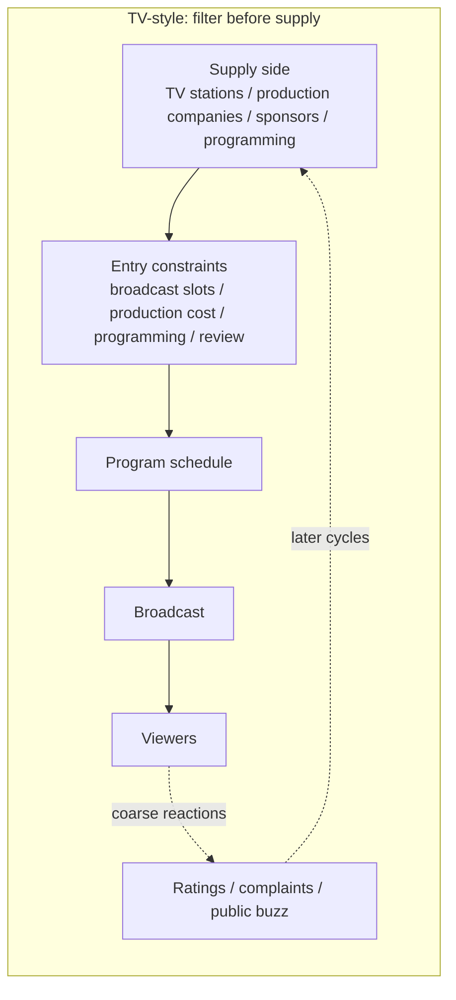
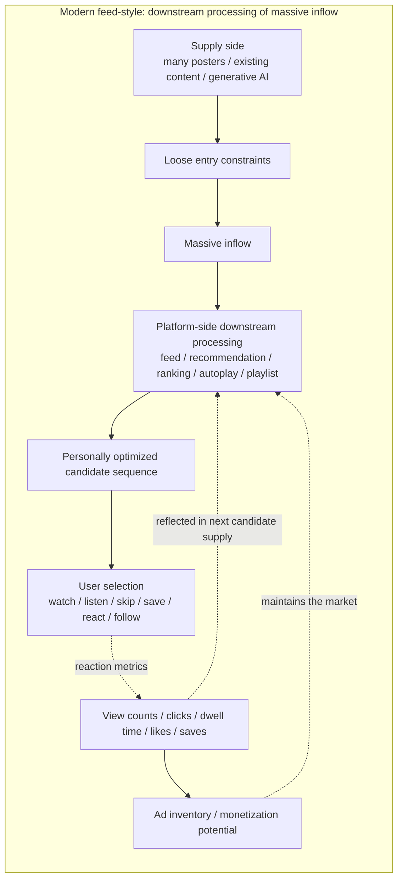
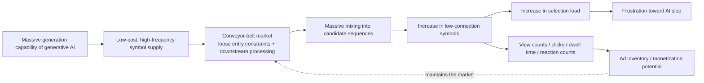

# 006. AI Slop as a Conveyor-Belt Problem

## HSS Observation Report

## 0. How this report handles AI slop

The term AI slop is generally used to refer to low-quality digital content mass-produced by generative AI.

However, the term still does not have one stable, single definition.

In external source anchors, low quality, high quantity, AI generation, low effort, lack of meaning or quality, the attention economy, advertising revenue, and mass circulation on platforms appear as elements used to explain AI slop.

This report does not merge those definitions into one fixed definition. Instead, it extracts elements that appear across multiple source anchors and re-translates them using HSS vocabulary.

In this report, AI slop is not the name of the AI-generation problem itself.

In HSS, AI slop is treated as a state observed when massive generation capability from generative AI connects to processing forms such as platforms, feeds, advertising revenue, view counts, clicks, dwell time, and reaction metrics, producing low-connection, mass-circulated, low-reconnection symbols.

## 1. Common elements extracted from external definitions

This report refers to the following external sources as source anchors.

- Merriam-Webster Word of the Year 2025: Slop
https://www.merriam-webster.com/wordplay/word-of-the-year
Use: to confirm meanings around low quality, AI, and quantity.
- AI slop - Wikipedia
https://en.wikipedia.org/wiki/AI_slop
Use: to confirm contexts around low-quality AI-generated digital content, lacking effort, quality, or meaning, high volume, clickbait, the attention economy, monetization, the creator economy, social media, and online advertising.
- Spam, junk … slop? The latest wave of AI behind the “zombie internet” - The Guardian
https://www.theguardian.com/technology/article/2024/may/19/spam-junk-slop-the-latest-wave-of-ai-behind-the-zombie-internet
Use: to confirm contexts around spam, junk, slop, AI-generated web clutter, advertising revenue, and search traffic.
- Measuring AI “Slop” in Text - arXiv
https://arxiv.org/abs/2509.19163
Use: to confirm the instability of agreed definitions or measurement methods for AI slop, and the subjectivity of slop judgments.
- Why Slop Matters - arXiv
https://arxiv.org/abs/2601.06060
Use: to confirm contexts around superficial competence, asymmetry of effort, mass producibility, and the digital ecosystem of generation and consumption.
- AI-Generated Algorithmic Virality - arXiv
https://arxiv.org/abs/2508.01042
Use: to confirm contexts around AI-generated content in TikTok and Instagram search results, low cost, fast production speed, gaming the algorithm, and scale production.

From external definitions and media usage, at least the following elements overlap in AI slop.

- It is strongly related to AI generation or generative AI.
- It is regarded as low quality, low effort, or low meaning.
- It is generated and circulated in large quantities.
- It connects to platforms, feeds, search, SNS, advertising revenue, view counts, clicks, and reaction metrics.
- It may take forms resembling human creative works or information content while having weak connection possibility or weak reconnectability.

HSS does not evaluate these collectively as “AI generation is the cause.”

Rather, HSS observes which circulation forms, evaluation forms, and revenue forms AI generation as production capability connects to when something becomes observable as slop.

## 2. Provisional HSS observation definition

In HSS, AI slop is not a property of generative AI itself. It is an observed state that occurs when generation capability connects to platforms, feeds, view-count models, advertising revenue, and reaction metrics.

In this state, symbols are generated, circulated, and processed through reactions in large quantity.

However, those symbols do not necessarily connect deeply to a person’s reconnectable area.

Even when they connect, they may be carried to the next symbol before advancing into reconnection, re-expansion, or layered history.

Therefore, AI slop can be observed not only as low-quality AI-generated output, but as a state where low-connection symbols circulate in large quantity, are processed by reaction metrics, and do not easily advance into continuous connection or re-expansion.

## 3. Why this can be called a “conveyor belt”

The conveyor belt here is not the name of a specific app. It is a candidate-supply structure.

This does not mean users have no intention.

Nor does this report define user interiority or free will.

What HSS observes is the connection structure: whether users are exploring a wide web or cultural space, or selecting within a candidate sequence supplied by platforms.

Conveyor-belt consumption is not the use of a specific app itself. It can be observed as a consumption form in which platforms, search, recommendations, rankings, autoplay, playlists, and similar systems supply candidate sequences first, and users select within them by watching, listening, skipping, saving, reacting, following, and so on.

The conveyor-belt structure here refers to feed-, recommendation-, ranking-, autoplay-, and playlist-style candidate-supply structures represented by services such as TikTok, YouTube Shorts, Instagram Reels, YouTube, Spotify, Apple Music, YouTube Music, and similar services.

These are treated as examples of candidate-supply structures, not as value judgments about individual services.

This structure existed before AI-generated content flowed into it.

AI-generated content did not create the conveyor belt.

Generative AI amplifies the amount and speed of symbols that can be poured into that conveyor belt.

What matters is a conveyor-belt market structure in which supply-side entry constraints are loose, many candidates flow in, platforms, feeds, recommendations, rankings, playlists, and reaction metrics process those candidates downstream, and the receiver side receives them as a personally optimized candidate sequence.

In this structure, candidates are not strongly narrowed at the supply-side entrance. Instead, platforms arrange the massively inflowing candidates and present them to the receiver side as a personally optimized candidate sequence.

Users then select within that candidate sequence by watching, listening, skipping, saving, reacting, following, and so on.

The massive inflow of AI-generated content mixes many low-connection symbols into this candidate sequence and reduces the comfort of a receiving environment in which candidates arrive without active searching.

Frustration toward AI slop can therefore be observed not only as frustration toward AI-generated items themselves, but also as frustration toward the comfort of conveyor-belt candidate supply being threatened by AI generation speed.

## 4. Difference between TV-style supply and modern feed-style supply

TV-style supply also included passive reception in a certain sense.

However, the supply-side structure differs from modern feed-style supply.

In TV-style supply, supply-side entry constraints are strong. Broadcast slots, production cost, programming, editing, and organizational gates narrow candidates before they reach viewers.

Reactions also return relatively coarsely and slowly as ratings, complaints, or public buzz.

In modern feed-style supply, supply-side entry constraints are loose, and massive inflow is processed downstream.

Platforms, feeds, recommendations, rankings, autoplay, and playlists arrange candidates. User reactions are measured and returned to the next candidate supply.

In TV-style supply, candidates are strongly filtered by broadcast slots, production cost, programming, review, and similar gates before reaching viewers.

In modern feed-style supply, supply-side entry constraints are loosened and massive inflow is processed downstream.

AI slop becomes easier to see because massive generation capability from generative AI connects to the latter market structure.

### Difference as view-count business

TV-style supply also had advertising revenue and ratings.

However, in TV-style supply, candidates are filtered at the supply-side entry by broadcast slots, production cost, programming, review, and similar gates, and reactions return coarsely and slowly as ratings, complaints, or public buzz.

By contrast, in modern feed-style supply, after candidates flow in massively, view counts, clicks, dwell time, likes, saves, shares, and related metrics are measured per candidate.

These metrics are not connection depth itself.

However, on platforms they are processed as proxy indicators of demand, interest, trend, value, ad inventory, and monetization potential.

HSS observes this as a phase where connection possibility is compressed into processing forms such as view counts, clicks, dwell time, and reaction counts.

The reason AI slop can arise easily is not AI generation itself.

Even low-connection symbols can be processed as view counts, clicks, dwell time, and reaction counts when there is a market structure that can process them in that form and when ad inventory or monetization potential is connected to that processing form.

In other words, AI slop becomes easier to occur where conveyor-belt candidate-supply structures connect with view-count business.

## 5. What generative AI amplifies

Generative AI is not the conveyor belt itself.

Generative AI amplifies the supply capability of symbols that can be poured into the conveyor belt.

The observation target is not the existence of AI generation, but the connection to candidate-supply structures, reaction metrics, and monetized flows.

What this diagram observes is not a value judgment about AI-generated products.

What HSS observes is a state in which, when generation capability connects to candidate-supply structures, reaction metrics, and view-count business, low-connection symbols circulate in large quantity and do not easily advance into reconnection or re-expansion.

Even low-connection symbols connect to ad inventory or monetization potential when they are processed as view counts, clicks, dwell time, and reaction counts.

Therefore, AI slop can be observed not as mere noise, but as a state in which candidates can remain measurable, circulable, and monetizable within a conveyor-belt market.

Generative AI amplifies generation amount and generation speed. It lowers the cost of producing symbol candidates. It can mass-produce things similar to text, images, videos, music, information, and explanations. It can feed many candidates into structures that process reactions.

The core problem is not simply that AI makes low-quality content. The problem appears when large-scale generation capability connects to conveyor-belt candidate supply, view-count business, and reaction metrics.

HSS observes this as amplification of supply capability into a market structure that can process low-connection symbols.

## 6. Difference between choice and selection

HSS does not deny that users may feel they are choosing.

This report distinguishes the following two forms.

- Choice: making connection routes oneself and editing a reconnectable area from a wider space.
- Selection: watching, skipping, saving, or reacting within a candidate sequence presented by a platform.

AI slop did not destroy free choice.

Rather, it can be observed as a state that makes visible that what appeared to be free choice was often conveyor-belt consumption that selected within platform candidate sequences.

What is handled here is not the user’s free will or interiority.

HSS observes the connection structure: whether the user is making connection routes, or selecting within a candidate sequence supplied by a platform.

Conveyor-belt consumption tends to foreground selection. AI slop becomes visible when low-connection symbols are mixed into that supplied candidate sequence at high volume.

## 7. Position of follow, search, and recommendation

Following, searching, and recommendation are not all the same.

Follow is not a pure relation itself. It can thicken a connection route to a specific person, channel, creator, artist, topic, or source.

At the same time, follow can be observed as a routing condition that specifies which supply sources are mixed into a candidate sequence inside a platform, rather than as free web exploration itself.

Follow is a trace of active connection.

However, display order, mixed-in recommendations, related posts, advertisements, reaction collection, and re-recommendation design are placed within platform-side processing forms.

Therefore, follow does not completely exit conveyor-belt consumption. It is treated as part of the conditions that compose a candidate sequence.

Search can reconnect from the receiver-side question or interest.

Search can also be observed as a candidate-supply structure when search result pages, rankings, advertisements, snippets, related results, and recommendation widgets shape the candidate sequence.

Recommendation, autoplay, and playlists can be observed as stronger conveyor-belt forms in which the candidate sequence is supplied first.

In practice, following, searching, and recommendation can overlap.

HSS observes which side holds the stronger routing initiative.

- Receiver-side search or follow-based reconnection.
- Platform-side candidate supply.
- Reaction-metric feedback.

In conveyor-belt consumption, platform-side candidate supply and reaction-metric feedback can become stronger.

## 8. Two uses of short videos

Short videos are not themselves AI slop.

Short videos can be used in at least two different ways.

One use is active search or sampling.

- The receiver looks for information, entertainment, ideas, music, creators, or topics.
- The short format supports quick sampling.

Another use is conveyor-belt consumption.

- Candidates arrive sequentially.
- The receiver watches, skips, reacts, or saves within that supplied flow.

The report does not evaluate short videos themselves. HSS observes which connection route is dominant.

A short video may work as an advertising medium that captures attention briefly and collects reactions as a one-shot symbol.

It may also work as a circulation medium, a presentation symbol that returns to music, performers, a full work, live events, a community, or layered history.

AI slop becomes easier to problematize when a one-shot symbol optimized as an advertising medium is mass-supplied while wearing the face of a circulation medium.

Report 002 handled one-shot symbols and cases where processing forms circulate instead of connection possibility.

Report 004 handled sasaru not as short-term reaction, but as connection to existing history.

This report connects those two observations by treating short videos as a structure that can become either one-shot symbols or entrances for reconnection.

## 9. Decomposition results

| Observed object | State visible through HSS | Connection destination |
| --- | --- | --- |
| Generative AI | Amplification of symbol supply capability | Low-cost generation, massive generation |
| AI slop | Mass circulation of low-connection symbols | Feeds, search, SNS, advertising revenue |
| Platform / feed | Generation and presentation of candidate sequences | Recommendation, ranking, autoplay |
| Candidate sequence | Supplied row of candidates | Selection, reaction metrics, receiver-side processing |
| View count | Numericization of passage traces | Proxy indicator of value, ad inventory, monetization potential |
| Click | Processing symbol of contact | Candidate supply, reaction metrics |
| Dwell time | Processing symbol of attention | Recommendation, evaluation, monetization |
| Reaction metrics | Numericized reactions such as likes, saves, shares, and reaction counts | Next candidate supply, view-count business |
| Like / save | Reaction symbol | Next candidate supply |
| Follow | Routing condition | Candidate sequence, belonging signal, recommendation material |
| Search | Receiver-side question that may reconnect, or a candidate sequence arranged by results | Exploration, ranking, related results, recommendation widgets |
| Recommendation | Platform-side candidate supply | Candidate sequence, reaction-metric feedback |
| Short video | One-shot symbol or entrance for reconnection | Short-term reaction, music, creator, full work, layered history |
| Passive selection | Processing inside the candidate sequence | Watching, skipping, saving, reacting |
| Active choice | Editing of connection routes | Exploration, contextualization, reconnection |
| Low-connection symbol | Compressed symbol that is difficult to reconnect | Short-term reaction, passage, disposal |
| Connection possibility | Possibility that a symbol connects to a reconnectable area | Continuous connection, reconnection, re-expansion |
| Re-expansion | Expansion after reconnection | Context, practice, interpretation, layered history |
| Layered history | Accumulated history to which sasaru can connect | Reconnection, continuous connection, re-expansion |
| Conveyor-belt market | Candidate-supply structure that processes massive inflow downstream and converts reaction metrics into proxy indicators of value | View-count business, ad inventory, monetization potential |
| Conveyor-belt consumption | Consumption form in which a candidate sequence is supplied first and the receiver selects within it | Platform-side candidate supply, reaction-metric feedback |

## 10. Observation hypotheses inferred from the HSS model

### Hypothesis 1: AI slop can be observed not as a quality name for AI-generated products, but as a connection state between generation capability and market structure

AI slop appears not as AI generation itself, but as an observed state that occurs when generation capability connects to platforms, feeds, view-count models, advertising revenue, and reaction metrics.

### Hypothesis 2: In conveyor-belt consumption, selection tends to come to the foreground more than choice

Users appear to choose for themselves.

However, HSS observes cases where selection comes to the foreground: watching, listening, skipping, saving, and reacting within a candidate sequence presented by a platform.

### Hypothesis 3: In a view-count model, throughput, dwell time, and reaction counts tend to be valorized more easily than connection possibility

View counts, clicks, dwell time, likes, saves, and similar metrics are not connection depth itself.

HSS observes them as processing forms in which passage traces and reaction symbols are numericized.

When ad inventory or monetization potential connects to this processing form, even low-connection symbols become objects of circulation, measurement, and monetization in the market.

Therefore, AI slop becomes easier to arise from a structure in which low-connection symbols are not excluded, but can remain as processable candidates in view-count business.

### Hypothesis 4: Generative AI is not the cause of slop itself; it works as supply capability that accelerates and exposes existing mass-circulation models

Generative AI amplifies the supply capability of symbols that can be poured into conveyor-belt markets.

As a result, the limits of market structures originally built on downstream processing of massive inflow become easier to see.

### Hypothesis 5: The term AI slop compresses not only unease toward AI, but also unease toward platformized circulation structures

The term AI slop may contain not only frustration toward low-quality AI-generated products, but also unease toward candidate-supply structures, view-count business, selection load, and low-connection symbols.

HSS does not use this term as a cause name as-is. It treats it as a label into which multiple connection structures are compressed.

### Hypothesis 6: The same generation capability can be used not only for conveyor belts, but also for editing reconnectable areas

Generative AI is not only something that mass-supplies low-connection symbols to platform candidate sequences.

When an individual generates, edits, and selects according to their own use, context, memory, and preferences, the same generation capability may be used toward editing the person’s own reconnectable area.

## 11. What this report does not determine

This report does not determine the following.

- One stable fixed definition for AI slop.
- Value judgments about AI or generative AI.
- Value judgments about individual platforms or services.
- Psychological diagnosis of users.
- Superiority or inferiority of TV-style supply and feed-style supply.
- Explaining all digital content problems through this structure.
- Value judgments about AI-generated products themselves.
- Superiority or inferiority between AI creation and human creation.
- Copyright issues as a whole.
- Evaluation of individual users, posters, or creators.
- Definitions of emotion, desire, free will, or dependency.
- Critique of all recommendation systems.
- Critique of the whole web.

## 12. Source anchors

See also:

- [006. AI Slop Sources](../../sources/en/006_ai_slop_sources.md)

Source anchors:

- Merriam-Webster Word of the Year 2025: Slop
https://www.merriam-webster.com/wordplay/word-of-the-year
Used to confirm the context in which slop is described as low-quality digital content usually mass-produced by AI.
- AI slop - Wikipedia
https://en.wikipedia.org/wiki/AI_slop
Used to confirm contexts in which AI slop is explained in connection with generative AI, low quality, high quantity, the attention economy, monetization, social media, and online advertising.
- Spam, junk … slop? The latest wave of AI behind the “zombie internet” - The Guardian
https://www.theguardian.com/technology/article/2024/may/19/spam-junk-slop-the-latest-wave-of-ai-behind-the-zombie-internet
Used to confirm contexts in which AI-generated content is discussed as spam, junk, or slop on the web and connected with advertising revenue and search inflow.
- Measuring AI “Slop” in Text - arXiv
https://arxiv.org/abs/2509.19163
Used to confirm the context in which the term AI slop still lacks a stable agreed definition or measurement method.
- Why Slop Matters - arXiv
https://arxiv.org/abs/2601.06060
Used to confirm contexts in which AI slop is treated not merely as digital pollution, but as an object of study connected with superficial competence, asymmetry of effort, and mass producibility.
- AI-Generated Algorithmic Virality - arXiv
https://arxiv.org/abs/2508.01042
Used to confirm contexts around TikTok and Instagram search results, AI-generated content, low-cost and high-speed generation, and algorithmic virality.

Internal HSS connections:

- [002. One-Shot Gags, Buzz, and Connection to Performance Systems](002_ippatsu_gag_buzz_gei_system.md)
Used to connect with one-shot symbols and structures in which processing forms circulate instead of connection possibility.
- [004. The Connection Structure of “Sasaru” and “Kasuru”](004_sasaru_kasuru_connection.md)
Used to connect with a structure that treats sasaru not as short-term reaction, but as connection to existing history.

These source anchors are source anchors, not evidence, foundations, or authorities for HSS.

## 13. Short conclusion

AI slop is not simply the problem name of AI generation itself.

In HSS, AI slop can be observed as a state in which massive generation capability connects to conveyor-belt candidate supply, view-count business, and reaction metrics.

Generative AI did not create the conveyor belt; it amplifies what can be poured into it.

Frustration toward AI slop can also be observed as frustration toward a candidate-supply structure whose comfort declines when many low-connection symbols are mixed into it.

In HSS terms, the observation point is not whether AI-generated content is good or bad, but which connection structures generation capability connects to, and whether symbols move toward continuous connection, reconnection, re-expansion, and layered history, or are processed only as passage, reaction, and metrics.
