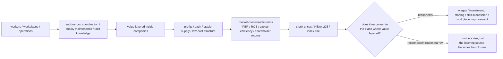

# 007. What Layering Is the Nikkei 225 Rise Pricing?

## HSS Observation Report

## 0. How this report handles the topic

- This report is not investment-advice.
- This report does not predict rises or declines in the Nikkei 225, TOPIX, exchange rates, or individual stocks.
- This report does not handle buying or selling decisions for individual stocks.
- This report does not evaluate companies, investors, workers, management, government, unions, or industries as good or bad.
- What this report handles is the possibility, observed with HSS vocabulary, that in the rise of the Nikkei 225 as an index symbol, what is being valued and what is rising as numbers do not match.

This report does not treat the Nikkei 225 rise as a simple rise of the whole Japanese economy.
In HSS, the Nikkei 225 is treated as an index symbol into which multiple corporate values, expectations, capital efficiency, index contribution, fund flows, and layered histories are compressed.
On that basis, this report observes the possibility that, when value layered over a long time in workers, workplaces, and operations is priced as corporate value, capital efficiency, stock prices, and the Nikkei 225, what is being valued and where numbers rise may not match.

## 1. Averaged image available from external sources

The averaged image available from external sources can be organized as follows.

- The Nikkei 225 circulates as an index symbol representing Japanese stocks.
- However, the Nikkei 225 is not the Japanese economy itself; it is a price-weighted index consisting of 225 stocks.
- The Nikkei 225 rise is strongly affected by high-contribution stocks, thematic stocks, fund flows, and index design.
- Corporate governance reform and capital-efficiency improvement become visible to the market through processing forms such as PBR, ROE, shareholder returns, and capital allocation.
- On the labor side, there may be a gap from living experience, such as real wages declining even when nominal wages rise.
- Therefore, if the Nikkei 225 rise is read only as “Japan as a whole is rising,” it becomes difficult to see where value has layered and where numbers are rising.

The source anchors referenced here are contexts in which the Nikkei 225 is described as a price-weighted equity index consisting of 225 stocks listed on the Prime Market of the Tokyo Stock Exchange; Nikkei 225 constituent weights and daily summaries; surges driven by AI-related stocks and high-contribution stocks; divergence from TOPIX; skewed advancing-stock counts; TSE requests for management conscious of cost of capital and stock price; Japanese corporate cash holdings and capital allocation; and real wage trends.

## 2. Points not fully decomposed by the averaged explanation

The averaged explanation alone leaves the following questions.

- What is really rising when the Nikkei 225 rises?
- Is the whole Japanese economy rising, or is an index symbol rising?
- Are high-contribution stocks and AI-related expectations rising?
- Is value layered inside companies being priced as capital efficiency, shareholder returns, PBR, or ROE?
- Is part of that value layered in workers, workplaces, and operations?
- Do what is being valued and where numbers rise match?
- Does priced value reconnect to the place where value has layered?

## 3. What HSS adds to this observation

Ordinary economic analysis can also observe gaps between real wages and stock prices, TOPIX and the Nikkei 225, and high-contribution stocks and the whole market.

What HSS adds here is to see these not merely as indicator differences, but as the following connection structures. In short, what HSS adds is an observation of where connection routes are formed or narrowed.

- Where value has layered.
- Which processing forms that value was converted into.
- Which numbers it was priced as.
- Whether priced value has reconnection routes to the place where it layered.

Therefore, the HSS observation in this report is not to explain the reason for the Nikkei 225 rise, but to observe the structure in which the connection source and pricing destination diverge when value layered in workers, workplaces, and operations is priced as stock prices, indexes, and capital efficiency.

HSS treats continuous connection, reconnection, re-expansion, fixation, and layered relationship formation as major observation targets. This report focuses on fixation into the Nikkei 225 as an index symbol, value layered in workers, workplaces, and operations, and whether priced value reconnects to the place where it has layered.

## 4. How this report uses “layering”

This report does not use “layering” in only one sense. To avoid confusion, it distinguishes the following uses.

- Layered history
Memory, context, and reconnectable areas formed over time, such as the post-bubble period, the lost decades, post-deflation Japan, and Japan revaluation.
- Labor-side layering
Endurance, coordination, quality maintenance, tacit knowledge, and connection maintenance for keeping the company running, accumulated in workers, workplaces, and operations.
- Value layering
A state in which management, technology, capital, equipment, brand, intellectual property, demand, labor, and workplace operations accumulate inside a company and can later be priced as corporate value.
- Priced layering
A state in which layered value has been converted into numbers or forms that markets can process easily, such as PBR, ROE, capital efficiency, shareholder returns, stock prices, and the Nikkei 225.

## 5. HSS decomposition

The Nikkei 225 rise can be observed not as a rise in the whole Japanese economy, but as a state in which specific groups of stocks, expectations, evaluation forms, fund flows, and layered histories are priced inside the index symbol called the Nikkei 225.

Part of that pricing may be supported not only by corporate financial indicators and capital policy, but also by endurance, quality maintenance, coordination, tacit knowledge, and stable low-cost operation layered over a long period in workers, workplaces, and operations.

- This diagram does not claim workers are the only source of value.
- Corporate value has multiple connection destinations, including management, technology, capital, equipment, brand, intellectual property, demand, exchange rates, policy, and capital markets.
- This report observes, as one part of that structure, the gap that appears when value layered in workers, workplaces, and operations is priced as stock prices or an index.

### What does “reconnection routes narrow” observe?

This subsection clarifies the observation point of narrowing reconnection routes.

In this report, “reconnection routes narrow” refers to a state in which value priced as stock prices, indexes, PBR, ROE, capital efficiency, and shareholder-return expectations does not have sufficient routes back to workers, workplaces, and operations.

This does not state a simple one-to-one causality in which stock prices rise but wages do not immediately rise.

What HSS observes is the following asymmetry of connection.

- Stock prices and indexes rise, but reconnection to wages, workplace improvement, staffing, skill succession, and operational sustainability is difficult to see.
- Capital efficiency and shareholder-return expectations are processed as numbers, while the workplace operations and quality maintenance that have supported that value are difficult to see as numbers.
- The Nikkei 225 rises, but the whole market, living experience, and labor-side experience do not necessarily rise in the same way.

For this reason, observing reconnection requires looking not only at stock prices and indexes, but also at connection with wages, staffing, workplace investment, skill succession, operational improvement, and living experience.

## 6. The Nikkei 225 as an index symbol

- The Nikkei 225 is not the whole Japanese economy.
- The Nikkei 225 is a price-weighted index symbol made of 225 stocks.
- The Nikkei 225 may behave like a KPI / dashboard for reading Japanese companies or the Japanese economy.
- However, KPI / dashboard is not the thing itself.
- A Nikkei 225 rise does not mean all Japanese companies, all workers, households, regional economies, or living experience rise in the same way.

When the Nikkei 225 and TOPIX diverge, or when the Nikkei 225 rise and the number of advancing constituents diverge, it becomes easier to see that the Nikkei 225 as an index symbol is not uniform market-wide rising, but a number priced through high-contribution stocks and index design.

In HSS, this gap is treated as a supplementary line for checking reconnection between the dashboard-like processing form called the Nikkei 225 and the broader market, labor side, and living experience.

## 7. Repricing of layering that appears as optimization

This rise may appear on the surface as an optimization form made of AI-related expectations, high-contribution stocks, capital efficiency improvement, shareholder returns, foreign fund inflow, and index contribution.
However, HSS observes the possibility that behind this are layered histories such as long-term deflation, low valuation, low PBR, cash holdings, workplace maintenance, quality maintenance, low-cost operation, and labor-side endurance.

- AI is not a sole cause, but may function as a strong symbol that reconnects layered history.
- Capital-efficiency reform converts layered corporate value into forms that markets can process easily.
- PBR, ROE, shareholder returns, share buybacks, and capital allocation are processing forms that make layering easier to price.
- What rises as numbers is stock prices or indexes, and does not necessarily match the place where value has layered.

## 8. The gap between what is valued and which numbers rise

What may actually be valued:

- Long-maintained workplace operations.
- Quality maintenance.
- Delivery deadlines, coordination, and improvement.
- Stable supply at low cost.
- Tacit knowledge inside organizations.
- Processing load absorbed by workers, workplaces, and management.
- Connection maintenance that keeps the company running.

What rises as numbers:

- Stock prices.
- Nikkei 225.
- Index contribution.
- PBR.
- ROE.
- Capital efficiency.
- Shareholder-return expectations.
- Corporate-value evaluation.
- High-contribution stocks.

In HSS, this gap is observed as a mismatch between where value has layered and where value is priced.

## 9. Observation boundary: social connection through work

Behind this layering, there may be a form in Japanese society in which work has functioned not merely as a way to earn income, but as a medium for connecting to society, surroundings, life, and roles.

This can be observed only as an auxiliary line: one form through which Japanese people have connected to society through work.

However, this cultural connection OS itself is not the direct observation target of this report.

This report handles not proof of that cultural connection OS, but only the structure up to the point where value layered in workers, workplaces, and operations is priced as corporate value, capital efficiency, stock prices, and the Nikkei 225.

## 10. Decomposition result

| Observed object | State visible through HSS | Connection destination |
| --- | --- | --- |
| Nikkei 225 | A number priced as an index symbol | Stock prices, fund flows, dashboard |
| High-contribution stocks | Connection points that strongly push up the index rise | Themes, expectations, index design |
| AI-related expectations | Symbols that reconnect layered history | Growth expectations, capital markets |
| PBR / ROE | Evaluation forms that markets can process easily | Capital efficiency, corporate value |
| Shareholder returns | Forms for reading corporate value as distributable potential | Dividends, share buybacks, investors |
| Capital efficiency | A form that converts layered value into financial indicators | Management improvement, market evaluation |
| Cash inside companies | Room for revaluation as undistributed value | Growth investment, returns, M&A |
| Workplace operations | Places where value is maintained day by day | Stable supply, quality, customers |
| Quality maintenance | Continuous layering that is difficult to quantify | Trust, brand, profits |
| Labor-side endurance | A layer that has absorbed processing load | Operational stability, living experience |
| Tacit knowledge | Connection knowledge that is difficult to formalize | Improvement, coordination, succession |
| Real wages | An indicator of the gap visible on the living side | Households, labor-side experience |
| Stock-price rise | The surface of priced evaluation | Investors, indexes, media |
| Priced value | A state in which layering has been converted into market forms | Stock prices, indexes, capital policy |
| Reconnection | Routes through which priced value returns | Wages, investment, staffing, workplace improvement |

### Observation result

The gap observed in this report can be divided into the following three layers.

- Where numbers rise
Stock prices, the Nikkei 225, index contribution, PBR, ROE, capital efficiency, and shareholder-return expectations.
- Valued layering that may be present
Endurance, coordination, quality maintenance, tacit knowledge, and stable low-cost operation accumulated over a long period in workers, workplaces, and operations.
- Where reconnection is questioned
Wages, investment, staffing, skill succession, workplace improvement, and operational sustainability.

If these three layers match, priced value has a route back to the place where value has layered.

However, when the three layers diverge, even if the Nikkei 225 or stock prices rise, valued layering does not necessarily reconnect to workers, workplaces, and operations.

In HSS, this state is observed as a mismatch between what is being valued and what is rising as numbers.

## 11. Observation hypotheses inferred from the HSS model

The following hypotheses are not conclusions directly derived from external sources. They are observation hypotheses that become visible when HSS is placed as a tentative observation axis.

They are not settled conclusions.

Future observation of wages, workplace investment, staffing, skill succession, capital allocation, shareholder returns, and the broader market connection may strengthen or weaken them.

### Hypothesis 1: The Nikkei 225 rise can be observed not as a rise in the whole Japanese economy, but as pricing of an index symbol

The Nikkei 225 is not the whole Japanese economy itself. It can be observed as a number processed through specific groups of stocks and index design.

### Hypothesis 2: What is really valued and what rises as numbers may not match

Valued layering may appear as numbers in another place, such as stock prices, indexes, PBR, ROE, and capital efficiency.

### Hypothesis 3: Value layered in workers, workplaces, and operations may be priced as corporate value

Long-maintained workplace operations, quality maintenance, coordination, and tacit knowledge may be priced as part of corporate value.

### Hypothesis 4: PBR, ROE, capital efficiency, and shareholder returns can be observed as forms that make layered value easier for markets to process

These indicators and policies can be observed as processing forms that convert value layered inside companies into forms that markets can read.

### Hypothesis 5: The Nikkei 225 behaves like a KPI / dashboard for the Japanese economy, but is not the Japanese economy itself

The Nikkei 225 circulates as a representative number for reading Japanese companies or the Japanese economy, but it does not directly indicate living experience, regional economies, or the state of the labor side.

### Hypothesis 6: Behind a stock-price rise that appears as optimization, there may be repricing of labor, operations, and quality maintenance layered over a long time

Even when a stock-price rise appears as capital-efficiency improvement, long-term operational maintenance and quality maintenance may be revalued behind it.

### Hypothesis 7: If priced value does not reconnect to the place where value has layered, the numbers may rise while the felt sense of being valued has difficulty returning

Even if stock prices or indexes rise, if they do not reconnect to wages, investment, staffing, skill succession, and workplace improvement, the felt sense of being valued has difficulty returning to the layering source.

## 12. What this report does not determine

- Future rises or declines in the Nikkei 225, TOPIX, exchange rates, or individual stocks.
- Investment decisions.
- Whether individual companies are good or bad.
- Whether management, investors, workers, government, or unions are good or bad.
- The assertion that the Nikkei 225 represents the whole Japanese economy.
- The assertion that workers are the only source of value.
- The assertion that companies do not understand labor-side layering.
- Proof of a Japanese cultural connection OS.
- Analysis of specific employment systems or labor-law systems.
- Explaining all Japanese stock rises through this structure.

## 13. Source anchors

- [007. Nikkei 225 / Corporate Value / Labor-Side Layering Sources](../../sources/en/007_nikkei_sources.md)

### Nikkei 225 and index-structure source anchors

- Nikkei Stock Average Profile - Nikkei Indexes
https://indexes.nikkei.co.jp/en/nkave/index/profile
Used to confirm the context in which the Nikkei 225 is described as a price-weighted equity index consisting of 225 stocks listed on the Prime Market of the Tokyo Stock Exchange.
- Nikkei 225 Daily Summary - Nikkei Indexes
https://indexes.nikkei.co.jp/en/nkave/archives/summary?idx=nk225
Used to confirm constituent weights, P/E, P/B, advancer and decliner counts, daily summary data, and how the index is processed as numbers.

### Nikkei 225 surge and high-contribution stock source anchor

- Japan's Nikkei tops 67,000 on AI boost; SoftBank becomes most valuable Japanese firm - Reuters
https://www.reuters.com/world/asia-pacific/japans-nikkei-tops-67000-first-time-ai-boost-softbank-becomes-japans-most-2026-06-01/
Used to confirm the context in which a Nikkei 225 surge is reported together with AI-related stocks, SoftBank Group's contribution, divergence from TOPIX, and skewed advancing-stock counts.

### Corporate governance and capital-efficiency source anchors

- TSE to Publish a List of Companies That Have Disclosed Information Regarding “Action to Implement Management That is Conscious of Cost of Capital and Stock Price” - Japan Exchange Group
https://www.jpx.co.jp/english/news/1020/20231026-01.html
Used to confirm the context in which TSE requests listed companies to implement management conscious of cost of capital and stock price, and publishes disclosure status for investors.
- Action on Cost of Capital-Conscious Management and Other Requests - Japan Exchange Group
https://www.jpx.co.jp/english/news/1020/e20230414-01.html
Used to confirm contexts around cost of capital, stock price, corporate value improvement, and dialogue with investors as processing forms for corporate-value improvement.
- Japan governance reforms set to prise open $1.8 trillion cash hoard - Reuters
https://www.reuters.com/world/asia-pacific/japan-governance-reforms-set-prise-open-18-trillion-cash-hoard-2026-06-11/
Used to confirm contexts around Japanese corporate cash holdings, post-bubble and post-deflation financial conservatism, capital allocation, shareholder returns, growth investment, and M&A expectations.

### Labor-side layering source anchors

- 2025年の実質賃金指数の前年比はマイナス1.3％で、4年連続のマイナスに - JILPT
https://www.jil.go.jp/kokunai/blt/backnumber/2026/04/kokunai_01.html
Used to confirm the context in which real wages declined even while nominal wages rose, and as a supplementary line for observing the gap between processing load and living experience on the labor side and numbers priced as corporate value or stock prices.
- Monthly Labour Survey - Ministry of Health, Labour and Welfare
https://www.mhlw.go.jp/english/database/db-l/monthly-labour.html
Used as a source anchor for confirming the statistical context of the Monthly Labour Survey, including wages, working hours, and regular employment. The specific context of the 2025 real wage decline is confirmed through the JILPT source.

### Internal HSS connections

- [001. Drucker, Management, and Compression into KPIs](001_drucker_management_kpi.md)
Used for reading the Nikkei 225 as a KPI-like or dashboard-like processing form for reading the Japanese economy and corporate value.
- [003. Why Innovation Stops as an Invoice Bundle](003_innovation_invoice_bundle.md)
Used for reading how unfixed value and connection candidates are converted into market-processable forms such as PBR, ROE, capital efficiency, and shareholder returns.
- [004. The Connection Structure of “Sasaru” and “Kasuru”](004_sasaru_kasuru_connection.md)
Used for reading how the Nikkei 225 rise may connect to layered histories such as the post-bubble period, the lost decades, post-deflation Japan, and Japan revaluation.
- [005. Self-Responsibilization as a Personal KPI](005_han_self_responsibility_kpi.md)
Used for reading the relation between management, optimization, and responsibility routed toward the individual side and value layered in workers, workplaces, and operations being priced as corporate value.

These are not grounds or proof for HSS, but source anchors for confirming the external context of the observed object.

## 14. Short conclusion

The Nikkei 225 rise looks like the revaluation of Japanese corporate value.

However, HSS separates where that value has layered from where it is priced.

Load absorbed over a long time by workers, workplaces, and operations, maintained quality, and accumulated tacit knowledge may be revalued by the market as corporate value, capital efficiency, and shareholder-return potential.

In that case, the numbers that rise are stock prices and the index, while the place where valued layering occurred is not the same.

Therefore, the observation point is not who is bad, but whether priced value reconnects to the place where it has layered.
