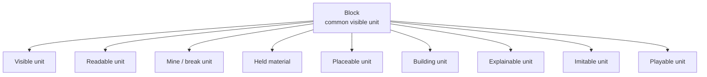

# 008. Why Did Minecraft Make Blocks a “Readable, Writable, and Playable” Common Language?

## HSS Observation Report

## 0. How this report handles the topic

This report observes Minecraft as a game-internal connection OS that made the world readable, writable, and playable through blocks as common visible units.

It is not an evaluation of Minecraft as a game, a proof of its educational effects, a sales or spread analysis, or a ranking against other sandbox or open-world games.
It also does not claim that Minecraft invented block play, crafting, sandbox design, or world editing.

Here, “common language” does not mean a natural language such as English or Japanese.
It refers to blocks as visible units that many people can roughly understand when they see them, without depending strongly on language, age, or game experience.

This report does not handle the whole of what makes Minecraft interesting.
It handles the connection structure in which the unit for reading, breaking, placing, building, explaining, imitating, and playing with the world is aligned around blocks.

## 1. Typical picture from external sources

The typical external picture can be organized as follows.

- Minecraft provides game modes such as Survival, Creative, and Adventure that connect to different ways of playing.
- Creative mode strongly foregrounds placement, destruction, and making with blocks as a mode suited to building and prototyping.
- Redstone is explained in contexts that create mechanism-like or logic-like connections inside the block world, such as lighting, traps, automatic doors, and automatic farms.
- In Minecraft Education contexts, reconnections to education and making are shown through coding concepts, game design, mini-game creation, and similar activities.

These source anchors are not foundations for proving HSS.
They are treated as auxiliary lines for checking how Minecraft tends to be explained externally, and what kinds of connection destinations are described through game modes, Redstone, and education / making contexts.

## 2. Points not fully decomposed by common explanations

Common explanations of Minecraft often say the following.

- Minecraft has a high degree of freedom.
- Minecraft is a sandbox game.
- Minecraft lets players make many kinds of things.
- Minecraft is also used for education and programming.
- Minecraft is played across generations.

These explanations are not wrong.
However, by themselves, they do not fully decompose what kind of connection structure makes Minecraft easy to read, easy to rewrite, and easy to share.

The remaining questions are as follows.

- What kind of unit makes the world readable?
- What kind of unit makes the world writable?
- Why can players who do not share age, language, or play history still roughly understand things that have been made?
- Why does Minecraft leave room for reconnection to building, exploration, logic, Redstone, videos, education, and players from another generation?
- What remains unfixed inside blocks?
- How do blocks become common visible units rather than merely materials?

## 3. HSS decomposition

Minecraft’s characteristic feature is not simply that it has a high degree of freedom.
Many games contain freedom.
In HSS terms, Minecraft can be observed as a game-internal connection OS that aligns the world’s construction units around blocks as a “readable, writable, and playable” common language.

Blocks are visible units that many people can roughly understand when they see them, without depending strongly on language, age, or game experience.
At the same time, they are also operational units that players can break, place, rearrange, explain, imitate, and share.

“Freedom to choose inside a built world” and “freedom to rewrite the world’s own construction units” are different.
This report handles only the latter connection structure.

World
↓
aligned to blocks as common visible units
↓
read
↓
break / mine
↓
hold / turn into material
↓
place / make / rearrange
↓
return to the world
↓
others read / imitate / modify / share

Minecraft does not only make players choose options inside a completed world.
Players can break the world into blocks, hold those blocks as materials, place them elsewhere, and rebuild through the same units they use to read the world.

## 4. The readable unit and writable unit are the same

In many games, what players see, touch, break, and make are not always the same unit.
Things visible as background, things with collision, things that can be destroyed, things that can be crafted, and things that can be explained may be separated from each other.

In Minecraft, the unit for reading the world and the unit for rewriting the world are quite close.

- Visible unit: block
- Breakable unit: block
- Placeable unit: block
- Building unit: block
- Explainable unit: block
- Imitable unit: block
- Playable unit: block

This alignment can be shown as follows.

Because of this alignment, players do not only read a completed world; they can rewrite the world in the same unit.

A block is a visual form on the screen and, at the same time, an operation target, a material, a placement unit, and an explanatory unit for sharing.
For this reason, in Minecraft, connections such as “break what one sees,” “hold what one broke,” “place what one holds,” and “others read what was placed” all loop back through the same visible unit.

Because this structure exists, Minecraft’s freedom appears not merely as a large number of choices, but as freedom to rewrite the world in the unit by which the world was read.

## 5. Blocks as Blue residuals

Blue residuals in Minecraft do not remain only in unresolved stories, hidden settings, or emotional margins.
In many cases, they remain inside block units whose meanings are not fully fixed.

A block is not fixed to a single meaning.
Depending on context, the same block can return to connection destinations such as the following.

- wall
- floor
- road
- hole
- tower
- field
- resource
- marker
- Redstone component
- trap
- pixel art
- trace of an unfinished build
- shared building
- educational material

Blocks remain as low-fixed symbols — units whose meanings stay open.
For that reason, they can return to different connection destinations for different players.

However, this does not mean that Blue residuals are always good.
Nor does it treat every block as a Blue residual.
The observation here is that Minecraft’s block structure tends to leave many reconnectable areas.

## 6. Why Minecraft reconnects to another generation

Minecraft does not depend strongly on specific story memories or character coursework.
Wide connection entrances remain: seeing blocks, placing blocks, breaking blocks, stacking blocks, and making something that looks like a house.

For example, a player who played around 2012 and a younger relative who newly began playing around 2023 may be able to converse through the same block units.
This is not treated as statistical evidence; it is an observation clue.

This reconnection is not merely nostalgia.
This means that players from another generation still have a way back into the world through common visible units whose readable and writable forms stay close.

## 7. L1–L3 observation points

- L1 contact layer:
  Blocks, terrain, buildings, water, clouds, monsters, resources, tools, placement, unfinished structures, and similar elements come into contact with players and viewers.

- L2 reaction / trace layer:
  Reactions remain, such as wanting to make, break, dig, imitate, repair, show, or continue. Traces also remain, such as dug marks, placed marks, partly built structures, partly broken structures, screenshots, videos, and world data.

- L3 processing / routing layer:
  Routing occurs toward mining, crafting, building, Redstone, modes such as Creative / Survival / Adventure, multiplayer, servers, videos, educational use, distributed worlds, tutorials, and similar forms.

## 8. Decomposition result

| Observation target | State visible in HSS | Connected destinations |
| --- | --- | --- |
| Block | Common visible unit that can be read and written | building, mining, placement, explanation, imitation |
| Mine / digging | Processing that turns the world into material | inventory, resource, next build |
| Craft / making | Processing that returns material to the world | tools, buildings, mechanisms |
| Inventory / holding | Form that temporarily holds the broken world | materials, selection, replacement |
| Creative mode | Connection route that strongly foregrounds block placement and destruction | prototyping, building, imitation, sharing |
| Survival mode | Connection route through mining, resource conversion, danger, and life maintenance | exploration, base, tools, building |
| Redstone | Logic connection inside the block world | circuits, mechanisms, automation |
| Building | Processing that rearranges blocks into meaningful structures | houses, towers, cities, pixel art, shared objects |
| Unfinished build | Trace where Blue residuals remain | continuation, sharing, imitation |
| World | Readable and writable area where block units have accumulated | exploration, modification, saving, distribution |
| Video / gameplay commentary | Route that converts block operations into a form others can read | viewing, imitation, tutorials |
| Educational use | Context that connects the block world to making, explanation, and coding concepts | classes, mini-game, game design |
| New play by another generation | Reconnection to common units rather than nostalgia | children, new players, education, video culture |

## 9. What HSS made visible

Seen through HSS, Minecraft’s freedom is not only freedom to choose inside a completed world.
It appears as a structure in which the unit for reading the world and the unit for rewriting the world are aligned around blocks.

Blocks work as low-fixed symbols.
Through the same units, players can read, write, break, place, imitate, teach, and share.

For this reason, Minecraft has room to reconnect to building, exploration, Redstone, videos, educational use, multiplayer, and new play by another generation.
That strength is not fully decomposed by simply saying that Minecraft has a high degree of freedom.

## 10. What remains unseen / pending

This report does not handle the following points.

- It does not determine why Minecraft sold at large scale.
- It does not prove Minecraft’s educational effects.
- It does not measure player demographics or generational distribution.
- It does not compare Minecraft’s quality with other sandbox games.
- It does not say that all players connect in the same way.
- The degree to which blocks are reconnected to in each region, community, streaming culture, or educational setting remains an observation point.

## 11. Connection-confirmation states

- Connection confirmed:
  Minecraft can be observed as a game-internal connection OS that aligns units for reading, writing, breaking, making, sharing, and playing around blocks.

- Blue residuals present:
  Blocks remain as low-fixed symbols and can reconnect to buildings, roads, traps, circuits, resources, traces of unfinished builds, shared buildings, and educational materials.

- Reconnectable areas present:
  Block units leave routes for reconnection to new players, other generations, builders, Redstone users, video viewers, educational users, and multiplayer communities.

- Absorption into processing forms:
  Mining, crafting, inventory, game modes, Redstone, servers, videos, and tutorials process or route block units into different forms of play.

- Insufficient information / pending:
  Actual play-style distribution, educational outcomes, and reception by generation are not confirmed in this report.

- Outside scope:
  Sales analysis, business strategy, game rankings, proof of educational effects, and a definitive position in game history are not handled.

## 12. Source anchors

The source anchors referred to by this report are collected in the following source note.

- [sources/en/008_minecraft_sources.md](../../sources/en/008_minecraft_sources.md)
