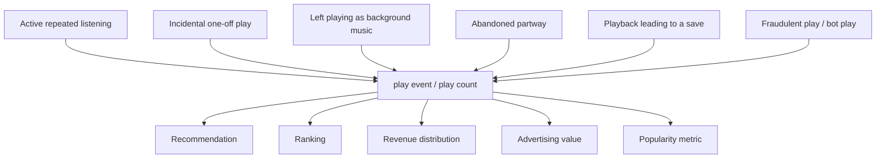
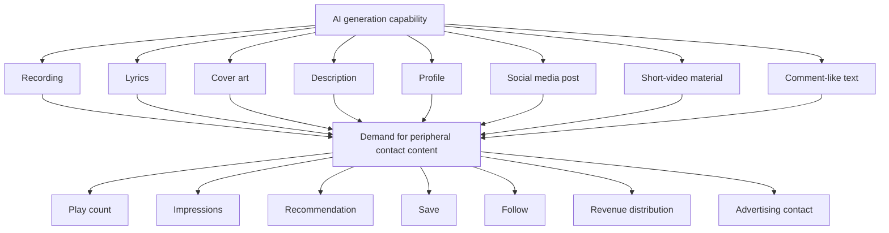

# 009. What Does the Phenomenon Called AI Slop Actually Problematize?

## Observation Report Using the HSS Model

> This report is an individual observation report using the HSS core model.
> For HSS definitions, terminology, and scope, see [hss-observation-notes](https://github.com/kuroam/hss-observation-notes).
> This report does not prove HSS. It is an observation memo on connection structures, using HSS vocabulary as a tentative observation axis.

## 0. Position and Observation Method of This Report

This report does not assume a simple opposition between those who use AI and those who do not, or between human production and AI generation.

In many current processes of production, development, research, analysis, and document writing, AI may be involved in drafting, assistance, organization, examination, generation, editing, or checking.

For that reason, classifying works or creators in bulk only by whether AI was involved is treated here as issue compression that does not sufficiently reflect the current reality of production.

This report does not address whether AI use is good or bad.
It also does not judge the value of AI-generated outputs themselves.

What it addresses is which issues the term AI slop bundles into a single label.

Being AI-generated, being low-quality, being low-effort, being mass-posted, having low play counts, having low connection, aiming at fraudulent revenue, disguising itself as human-authored, including rights issues, being regarded as threatening existing industries, and platforms being unable to process works sufficiently.

These may connect to one another.
However, they are not the same thing.

The strength of the term AI slop lies in its ability to compress these issues into a short, single negative label.

Using HSS observation vocabulary, this report decomposes the connection structure compressed into the term AI slop.

What is observed here is the connection source, connection destination, mediating symbol, processing form, traces, and routing.

---

## 1. Central Question

What does the phenomenon called AI slop problematize?

This report does not treat this question as a judgment of the good or bad, or the quality, of AI-generated outputs.

The question here is what becomes problematized by the term AI slop, and which connection structures, processing forms, and revenue models are compressed into one label.

The place into which AI slop is said to flow is often a platform.
Especially in music, streaming platforms, playlists, recommendations, social media, short video, play counts, saves, impressions, advertising, and subscription revenue distribution are involved.

If so, the first question to ask is different.

**Before asking what AI slop is, what does the revenue model into which AI slop is said to flow count and process as the connections linking music, peripheral content, creators, and listeners?**

This is the central question of this report.

If existing streaming platforms are treated as the baseline and AI-generated music is then treated only as a foreign object on top of them, something becomes difficult to see.

When did music become a play event?
What do play counts measure?
Are deep connections to music and shallow contact processed as the same play event?
How are recordings, videos, social media posts, profiles, comments, live-performance routes, and fan communities connected to the same platform metrics?
Where did AI generation capability connect to that structure?

This report does not treat the phenomenon called AI slop as a problem of AI-generated outputs themselves.

It treats it as a problem observed when AI's low-friction mass-generation capability connects to a revenue model that takes play counts, impressions, recommendations, saves, follows, social media reactions, peripheral contact content, and revenue distribution as value units.

For convenience, this report calls the structure that connects contact metrics such as play counts, impressions, saves, follows, comments, shares, and dwell time to recommendations, exposure, advertising, subscription retention, and revenue distribution the “contact-revenue model.”

---

## 2. How to Read the Primary Target Paper

The primary target of this report is a paper that analyzes AI music slop in terms of increases on streaming platforms, low play counts, mass posting, recommendations, distributor passage, detector fragility, and related points.

That paper provides important data.

That AI-generated music is increasing.
That many AI-generated songs remain at low play counts.
That some AI generators engage in mass posting.
That distributor and platform detection and review may not be functioning sufficiently.
That AI detectors have operational limits.

These are important as source anchors.

However, this report does not treat the paper as “a paper that proved AI slop.”

Rather, it treats the paper as an observation target for seeing what the term AI slop compresses.

In the primary target paper, AI slop is connected early on to connection destinations such as low quality, mass volume, revenue motives, disguise as human-made work, fake consumption, and a self-sustaining shadow industry.

For that reason, the paper can be read less as neutrally defining and then measuring AI music slop, and more as an observation target for seeing which issues the label AI slop bundles and to which processing forms or industrial defenses it connects.

This report takes the following stance toward the primary target paper.

* Use the data.
* Do not adopt the interpretation as-is.
* See the compression structure of the term AI slop, not proof of AI slop.
* Separate what is observed, what is treated as a proxy indicator, and where interpretation is added.

---

## 3. Concrete Decomposition of the Primary Target Paper

The observations in the primary target paper include many important points.
However, what each point indicates needs to be separated.

| Observation in the primary target paper | Interpretation it easily connects to | Decomposition in this report |
| --- | --- | --- |
| Many AI tracks have low play counts | Low quality / slop | Low play counts need to be separated into low quality, low connection, undiscovered status, difficulty being recommended, lack of demand, and short time since release |
| AI musicians post in large volumes | Spray-and-pray / slop artist | Mass posting, low effort, exploration strategy, revenue optimization, and fraud are treated separately |
| Multi-genre posting is observed | Low quality / spam-like | Multi-genre posting needs to be separated into mass production, genre targeting, platform optimization, and production policy |
| AI tracks tend to connect to one another in recommendations | AI slop cluster / spam farm | Acoustic features, metadata, genre, low-play clusters, and proximity in recommendation models need to be separated |
| AI songs pass through distributor experiments | Weak entry constraints / threat of AI inflow | Self-reporting systems, AI detection, review operations, policy enforcement, and quality review need to be separated |
| Detector evasion is possible | Difficulty of AI moderation | This shows instability in AI judgment, but it is not a judgment of music quality |
| There are royalty estimates | Becoming a shadow industry | Revenue possibility and autonomous industrialization are separate. This is treated as connectability to a revenue model |
| The question is posed as preventing / throttling AI music slop | Industry defense | It is necessary to check whether the existing streaming ecosystem is being treated as the baseline |

The point of this table is not to say that the primary target paper is wrong.

What matters is separating observed facts from the interpretations to which those facts are connected.

Being AI-generated, having low play counts, being mass-posted, being multi-genre, being low-quality, being fraudulent, and threatening existing industries are not the same thing.

If the term AI slop is used without making this separation, multiple connections are compressed into one word.

---

## 4. Changes in Processing Units in the Music Business

To read the primary target paper, it is necessary to look not only at AI-generated music, but also at which revenue model music is connected to.

The music business appears to handle music itself directly.
However, in practice, each era has converted music into different processing units.

| Period | Main processing unit | Revenue center | Connection with creators | What is hard to see |
| --- | --- | --- | --- | --- |
| CD sales | Physical product | Purchase | Live performances, fan clubs, stores, magazines, TV, radio | Depth of listening after purchase, revisits, memory |
| Download sales | Data product | Purchase | Live performances, Web, official sites, blogs, early social media | Connection after purchase, copying, piracy, unauthorized circulation |
| Streaming | Play event | Play counts, streamshare, advertising, subscription distribution | Playlists, recommendations, social media, videos, follows, saves | Depth of connection, context, live-performance connection, long-term relationship |

In CD sales, music was mainly treated as a physical product.
CDs, albums, singles, cover art, lyric booklets, stores, distribution, and purchase were at the center of revenue.

Of course, CD sales figures also do not fully measure the depth of connection to music.
How many times it was listened to after purchase, or which memories it connected to, cannot be known from sales figures alone.

Even so, in CD sales, the relatively heavy act of “purchase” was at the center of revenue.

In download sales, music moved from physical product to data product.
Audio files, single-track purchases, album purchases, downloads, and use close to ownership became central.

The constraints of physical distribution weakened, but problems specific to data domains, such as copying, piracy, DRM, and unauthorized circulation, also became stronger.

As a revenue structure, however, “purchase” still remained central.

In streaming, this structure changes greatly.

Music shifts from a product that is owned to a processing unit that is continuously played, recommended, saved, and revenue-distributed on a platform.

What becomes important here is not purchase, but the play event.

In a streaming-type model, music is both a work and a processing event on a platform.
The phenomenon called AI slop becomes an occasion that makes the roughness of this streaming-type model's processing form easier to see.

---

## 5. Music Is No Longer Only “Sound”

In the music market after streaming, music does not circulate only as a recording by itself.

Music itself includes the track, song, performance, recording, lyrics, composition, arrangement, saving, repeated listening, and playlist context.

At the same time, peripheral contact content connected to music has also increased.

Music videos, short videos, social media posts, live announcements, production processes, profiles, comments, fan communities, playlist context, sharing routes, artwork, and descriptions.

These are not music itself.

However, in the streaming / social media era, they function as peripheral content that maintains and expands connections to music and connects them to reaction metrics on platforms.

Through this change, music has moved closer from “a commodity that sells sound” to “a composite social-media-community-type commodity centered on sound.”

Creators are pressured to provide not only recordings, but also social media posts, videos, comments, live-performance routes, fan communities, production processes, and related elements for free or with low revenue.

An asymmetry appears here.

The connection elements provided by creators increase.
Meanwhile, revenue and evaluation are roughly compressed into platform processing units such as play counts, saves, recommendations, follows, impressions, comments, shares, and dwell time.

In this structure, music is not only “sound.”

Recordings, videos, social media, profiles, live-performance routes, and fan communities are bundled as an environment for producing continuous contact.

If the phenomenon called AI slop is seen only as a mass inflow of AI-generated recordings, this premise becomes difficult to see.

---

## 6. Who Is Demanding Peripheral Contact Content?

The pressure to supply peripheral contact content does not come from a single actor.

| Demanding actor | Surface demand | What is actually optimized |
| --- | --- | --- |
| Consumers | Want to listen conveniently, find things, connect | Low-friction access, recommendations, continuous contact |
| platform | Continued use, dwell time, reactions, circulation | Subscription retention, advertising contact, recommendation quality |
| Advertising / revenue model | Number of contacts, viewing, dwell time | Inventoried attention |
| Recommendation algorithm | Has no intention | Forms that get reactions and are hard to leave |
| Labels / distributors | Exposure, growth, fan retention | Metric improvement, catalog utilization |
| Creators | Want to reach, remain, sell | Social media, videos, live-performance routes, fan response |
| Actors aiming at mass generation / monetization | Want to monetize, test, fill | Low-cost mass input |

Demand here does not mean only consumers' explicit desires.

It also includes supply pressure produced by the overlap of platform metrics, recommendations, exposure, revenue distribution, and creator-side survival strategies.

This demand is not something ordered by any one person.

Consumers' demand for convenience is converted into platform metrics.
Platform metrics are converted into recommendation and exposure.
Recommendation and exposure return to creators' survival strategies.
Creators supply not only recordings but also peripheral contact content.
That supplied material returns again to platform metrics.

Through this cycle, demand for contact content increases.

AI slop did not create this demand pressure.

AI generation capability connected to the already-increasing demand for contact content as a low-friction means of mass supply.

---

## 7. Play-Count Business and Absorption into Processing Forms

Play count is a convenient processing unit.

In digital distribution, subscriptions, advertising, and rights distribution, some aggregateable unit is necessary.
Play count is easy to count, easy to compare, easy to process automatically, and easy to connect to rankings, recommendations, revenue distribution, and advertising value.

Therefore, the play-count model did not begin simply as a bad mechanism.

However, when play count becomes the basis for revenue, recommendations, exposure, and evaluation, it is no longer merely an observed value. It becomes an optimization target.

Even for the same one play, there are different states as human-side connections.

Deep repeated listening differs from shallow one-off contact.
Playback leading to a save differs from background-music-like passage.
Fraudulent plays and bot plays also differ from ordinary listening.

However, on the platform, they are first processed as play events.

Here there is absorption into a processing form.

AI generation capability did not create this play-count model.

However, because it can supply audio data and peripheral content in large quantities with low friction, it can easily connect to the roughness and incentive distortions that the play-count model already had.

The phenomenon called AI slop becomes easier to observe through this connection.

---

## 8. Data-Domain Anxiety and the AI Label as a Market Processing Tag

Anxiety about AI slop includes not only anxiety about AI generation itself, but also anxiety about expressive materials in the data domain.

Data is easy to copy, easy to modify, prone to unclear provenance, easy to circulate in large quantities, and easy to process into platform metrics.

This anxiety existed before AI.

Piracy, copying, unauthorized reposting, imitation, SEO articles, stock materials, and content farms.
These too have been problematized when expressive materials in the data domain connected to copying, circulation, search, revenue, provenance, rights, and authenticity.

However, this report does not equate AI-generated outputs with piracy or unauthorized reposting.

What is observed here is that the term AI slop easily carries not only anxiety about AI generation, but also the reproducibility, opacity of provenance, ease of circulation, and convertibility into platform processing forms of expressive materials in the data domain.

Also, the AI-generated label may be used not as a judgment of music quality itself, but as a processing form within the market.

Detect whether something is AI-generated.
Tag AI-generated songs.
Change how they are handled in recommendations and playlists.
Separate how they are handled on charts.
Discuss effects on reward distribution and royalty pools.
Show platform reliability.
Appeal to users as a “safe” platform.

What is at issue here is not only whether the sound is good or bad.

It is that the AI-generated label is connected to recommendation control, chart classification, reward differences, copyright ethics, protection of human artists, and platform reliability.

Platforms that present AI detection or AI labels are not outside the streaming-type revenue model.

Detecting AI-generated music, tagging it, excluding it from recommendations, scoring it, and appealing as a safe platform do not mean only neutral review of AI slop.

They are also processing forms that connect AI-generated labels or anti-AI labels to platform reliability, recommendation control, chart classification, reward distribution, and customer-acquisition routes.

Deezer-related cases are treated not as evaluations of the quality of AI-generated music itself, but as examples in which the AI-generated label connects to recommendation control, chart classification, reward distribution, platform reliability, and customer-acquisition routes.

Because there are unconfirmed points and cautions regarding survey methods and routes, this report does not treat them as grounds for neutral quality evaluation.

---

## 9. Different Connection Destinations of the Term AI slop

The term AI slop does not point to the same problem for everyone.

Even with the same symbol AI slop, there is not only one connection destination.

| Position | Connection to protect / obstructed connection | What appears as AI slop | Issues easily confused | HSS view |
| --- | --- | --- | --- | --- |
| Creator wanting to spread their own songs / works | Search, recommendations, social media display, playlists, approval, paths for discovery | Competing noise that takes visibility | AI generation, low quality, mass posting, exposure competition | “Routes by which works arrive” become clouded by low-connection mass-generated outputs |
| User wanting to consume flowing content | Feed, playlists, short video, recommendation candidate rows, scrolling experience | Low-quality noise that worsens the feed experience | Low quality, similar content, bait, repeated display | Appears as quality degradation in the candidate rows supplied by platforms |
| Fan / community participant wanting to follow deeply | Actual artist identity, continuity, story, live-performance routes, memory, relationships | Noise that makes authenticity or actual artist identity doubtful | AI judgment, disguise, artist authenticity, fan relationships | Connection to creator, place, and memory becomes unstable, not only the work itself |
| Curator / reviewer / moderator / distributor | Selection, review, recommendation, publication judgment, quality checking | Selection, review, and moderation load | Quality judgment, AI detection, policy enforcement | Processing load before judgment increases, and confirmation work is externalized |
| Existing creator / rightsholder / label / catalog holder | Rights, revenue distribution, search results, catalog value, brand | Dilution of rights, revenue, and existing catalogs | Rights infringement, imitation, revenue leakage, industry defense | While described as an AI problem, it is routed toward defense of existing assets |
| Creator using AI | Explanation of production route, work evaluation, legitimate connection | Label pollution in which AI involvement alone makes something treated as slop | AI generation, low effort, low quality, disguise | The generation route alone is emphasized, crushing evaluation of the work or connection |
| platform / advertiser | Trust, advertising quality, user retention, recommendation quality | Risk that lowers platform reliability and advertising value | bot, fake consumption, low-quality inventory, advertising damage | Short-term contact increase and long-term reliability decline collide |
| Actor aiming at mass generation / monetization | Play counts, impressions, guidance, monetization routes | Not an obstacle, but an available processing form | Low-cost generation, mass production, optimization, boundary with fraud | The actor connects low-friction generation to the expanded contact-revenue model |

The purpose of this table is not to list people who dislike AI slop.

The purpose is to show that the same term AI slop points to different connection obstructions depending on position.

Before saying “AI slop is a problem,” it is necessary to separate whose connection is being obstructed and in what way.

---

## 10. Where AI Generation Capability Connects

AI did not create the play-count model.
It also did not create the streaming-type revenue model.
Nor is it the entire cause of music moving closer to a social-media-community-type composite commodity.

However, AI has capabilities that connect very easily to that structure.

AI does not generate only recordings.

Lyrics, cover art, descriptions, profiles, social media posts, short-video materials, comment-like text, derivative content.
It can supply these with low friction, in large quantities, and in a short time.

What becomes an issue here is not that AI “can make music” itself.

The issue is that AI's mass-generation capability has connected to the already-increasing demand for contact content.

In the streaming / social media type music market, what is required of creators is not only recordings.
Peripheral content for delivering the recording, profile presence, videos, posts, live-performance routes, community maintenance, and continuous contact are also required.

And on platforms, these are processed into play counts, impressions, saves, follows, comments, shares, dwell time, recommendations, and revenue distribution.

AI generation capability connects to this processing form.

Therefore, the phenomenon called AI slop is observed not as a problem that AI produced by itself, but as a state in which AI's low-friction mass-generation capability has connected to the expanded contact-revenue model.

---

## 11. Organization as an HSS Observation

The discussion so far can be organized as an HSS observation.

The observation targets of this report are AI slop discourse, the AI music slop paper, the streaming-type music market, the play-count business, and the expanded contact-revenue model.

AI slop is not merely a name for low-quality content.
At least in this report, the term AI slop is treated as a mediating symbol into which multiple issues are compressed.

### 11.1 Connection source

Connection sources include AI generation capability, streaming platforms, creators, consumers, advertising / revenue models, recommendation algorithms, distributors, labels, AI generators, and slop farms.

AI generation capability is not the only connection source.

AI generation capability connects to already-existing platform processing forms, play-count business, demand for contact content, and recommendation structures.

### 11.2 Connection destination

Connection destinations include play counts, impressions, recommendations, revenue distribution, advertising inventory, social media reactions, community maintenance, authenticity display, fraud detection, existing-industry defense, platform reliability, and customer-acquisition routes.

The term AI slop is routed to these connection destinations in different ways.

For creators, it is a problem of visibility.
For consumers, it is a problem of feed experience.
For fans who want to follow deeply, it is a problem of authenticity.
For distributors and moderators, it is a problem of selection load.
For rightsholders, it is a problem of revenue and catalog value.
For creators using AI, it is a problem of label pollution.
For platforms, it is a problem of reliability and the revenue model.

Even with the same term AI slop, there is not a single connection destination.

### 11.3 Mediating symbol

Mediating symbols include AI slop, AI-generated, human-made, low quality, high volume, low effort, play count, fraud, authenticity, slop artist, and human artist livelihood.

These symbols work by briefly bundling multiple issues.

In particular, AI slop compresses AI generation, low quality, low effort, mass posting, low play counts, low connection, fraud, disguise, rights issues, authenticity anxiety, existing-industry defense, platform processing forms, and the expanded contact-revenue model into one word.

Therefore, if the term AI slop is used as-is, it becomes difficult to see which issue is being handled.

### 11.4 Processing form

Processing forms include track, play event, view, save, follow, playlist, recommendation, royalty, detector label, distributor policy, ranking, engagement metric, and AI-generated label.

The AI slop problem cannot be read apart from these processing forms.

AI-generated music becomes problematized not only because AI can make music.

It becomes problematized because AI-generated music is registered as tracks, counted as play events, enters recommendations, connects to royalty pools, appears in playlists and charts, and is controlled by AI-generated labels.

In other words, AI slop is problematized not by the generated object itself, but by which processing form the generated object enters.

### 11.5 Traces

Traces include saves, revisits, repeated listening, comments, becoming a fan, discomfort, distrust, a sense of low connection, skips, playlist additions, and live-performance connection.

Play counts alone cannot sufficiently decompose these traces.

Deep repeated listening differs from one-off contact that only flowed in.
Listening that connects to a live performance also differs from listening that passes through as background music.
Music that is saved, revisited, and remembered also differs from a recording that is quickly forgotten.

However, on platforms, these are first processed as play events.

Here there is absorption into a processing form.

### 11.6 Routing

The term AI slop is routed to AI problems, quality problems, fraud problems, rights problems, platform problems, existing-market defense, authenticity anxiety, business-model problems, and customer-acquisition routes.

The meaning of AI slop changes depending on which route it enters.

Before treating AI slop as one problem, it is necessary to separate which route it is being discussed through.

---

## 12. Examples of Connection Forms Not Reduced to Processing Forms

As seen so far, on streaming platforms, music easily enters processing forms such as track, play event, play count, recommendation, and royalty.

However, music's connection forms are not limited to those.

As supporting lines, this section treats the classical music market and the Hatsune Miku market.

### 12.1 Classical music market

In classical music, music does not exist only as a single track.

Works, scores, composers, performances, interpretations, conductors, performers, orchestras, recordings, halls, repeat performance, criticism, education, history, repertoire, listening experience.

These each have different connection destinations.

Even for the same work, meaning changes depending on who performed it, who conducted it, which recording it is, which era's interpretation it belongs to, which hall it was heard in, and which memory it connects to.

What matters here is not idealizing classical music.
It is also not a claim that classical music is elevated and streaming music is shallow.

What matters is that music has connection forms that cannot be fully processed by track / play count.

### 12.2 Hatsune Miku market

Hatsune Miku is not AI music itself.
Nor is it the intent of this report to equate Hatsune Miku with AI-generated music.

However, the Hatsune Miku market has important implications.

There, connections are formed not by singing recorded from a human voice, but by synthetic voice, character, composer, tuning, live performances, events, derivative creation, fan culture, and derivative works.

Composer, tuning, lyrics, character, derivative creation, covers, live performances, events, fan culture, shared memory, derivative works.

These cannot be measured simply by whether a human is singing.

The Hatsune Miku market shows that the absence of a human voice, the involvement of synthetic technology, and existence in the data domain do not automatically mean low connection or slop.

Here too, what matters is not the type of technology itself.

What matters is which connections are formed.

---

## 13. What Became Visible Through HSS

From the observations so far, the phenomenon called AI slop cannot be read as a problem produced by AI alone.

AI generation capability is an important connection source.
That is because it can generate recordings and peripheral content with low friction and in large quantities.

However, it becomes problematized not because AI-generated outputs exist alone.

AI-generated outputs enter platforms.
They are registered as tracks.
They are counted as play events.
They connect to recommendations.
They may enter playlists.
They connect to royalty pools.
They also become peripheral contact content as social media posts, short videos, profiles, descriptions, and comment-like text.
Through AI-generated labels, they also connect to recommendation control, chart classification, reward differences, transparency, and platform reliability.

In other words, AI slop is problematized not by AI-generated outputs themselves, but by which processing forms AI-generated outputs enter.

This report does not treat the phenomenon called AI slop as a problem of AI-generated outputs themselves.

It is a problem observed when AI's low-friction mass-generation capability connects to a revenue model that takes play counts, impressions, recommendations, saves, follows, social media reactions, peripheral contact content, and revenue distribution as value units.

The term AI slop easily compresses this connection problem on the revenue model into one word together with AI generation, low quality, mass posting, fraud, rights issues, and existing-industry defense.

Therefore, to discuss AI slop, it is necessary first not to judge AI-generated outputs, but to decompose which revenue model, processing form, and connection destination the work or peripheral content is being routed to.

---

## 14. What Was Not Seen / Held in Reserve

This report does not address the following points.

* Evaluation of the quality of AI music
* Superiority or inferiority of human music and AI music
* Judgments under copyright law
* Theories of AI subjective experience
* AI creativity theory
* A settled economic analysis of streaming platforms
* A full analysis of the classical music market
* A full analysis of Hatsune Miku culture
* Classification of creators by degree of AI involvement

All of these are important issues, but they are not the subject of this report.

Also, this report does not deny dissatisfaction with AI-generated outputs.

Low-quality mass generation can exist.
Disguise can become a problem.
Fraudulent plays are a problem.
Rights infringement can also become a problem.
A platform being filled with low-connection outputs can also become a problem.

However, these are not equated with AI generation itself.

Likewise, being human-made does not automatically guarantee quality, depth of connection, cultural value, or legitimacy.

This report addresses not value judgments of AI-generated outputs, but how the term AI slop bundles multiple issues and connects to processing forms.

It is also left as a future observation task whether the structure observed in this report appears in areas other than the music streaming market.

In industries that compress works, tasks, contact, evaluation, and deliverables into processing units on platforms and place those processing units at the center of revenue or evaluation, similar problems may be exposed by the connection of AI generation capability.

However, this report does not make that generalization.

---

## 15. Connection Confirmation State

### Connection confirmed

The term AI slop can be observed as a symbol that compresses multiple issues into one word.

In particular, a state can be confirmed in which AI generation, low quality, low effort, mass posting, low play counts, fraud, disguise, rights issues, authenticity anxiety, existing-industry defense, platform processing forms, and the expanded contact-revenue model are easily compressed into one label.

### Absorption into processing forms

Connections to music itself and peripheral contact content are easily absorbed on platforms into play counts, impressions, saves, follows, comments, shares, recommendations, and revenue distribution.

Deep repeated listening, shallow one-off contact, background-music-like passage, fraudulent plays, and playback leading to a save are different as human-side traces.
However, on platforms, they are first processed as play events.

### Different connection destinations

The term AI slop does not have a single connection destination.

For creators, obstruction of visibility.
For consumers, degradation of feed or playlist quality.
For fans who want to follow deeply, instability in actual artist identity or authenticity.
For curators and distributors, selection and review load.
For rightsholders and labels, dilution of revenue distribution and catalog value.
For creators using AI, label pollution in which AI involvement alone leads to treatment as slop.
For platforms, problems of reliability, advertising quality, customer acquisition, and recommendation quality.

Even with the same term AI slop, the obstructed connection differs.

### Blue residuals present

Discomfort toward AI-generated outputs is not only rejection of AI itself.

It can reconnect as discomfort toward platform processing forms.
It can reconnect as discomfort toward the play-count business.
It can reconnect as discomfort toward the increase in demand for contact content.
It can reconnect as authenticity anxiety.
It can reconnect as existing-market defense.

For this reason, dissatisfaction with AI slop also cannot be dismissed simply as anti-AI sentiment.

On the other hand, dissatisfaction with AI slop cannot be used as grounds to treat all AI-generated outputs as low-quality, low-connection, or fraudulent.

Blue residuals remain here.

### Insufficient information

This report does not measure the long-term connections of AI-generated outputs.

Saves, revisits, repeated listening, live-performance connection, fan formation, community formation, connection to memory, connection to derivative creation.

Without confirming these, it is not possible to judge what connections AI-generated music will form over the long term.

This report also does not compare the quality of AI-generated music and human-produced music.

### Out of scope

The good or bad of AI generation, legal evaluation, superiority or inferiority of human music and AI music, classification of creators by degree of AI involvement, and comprehensive evaluation of existing music markets are not addressed in this report.

---

## 16. Source anchors

This report refers to the following source anchors.

These are treated not as grounds for proving each claim, but as observation footholds for seeing which processing forms, positions, anxieties, and revenue models the term AI slop connects to.

* An Empirical Analysis of AI Slop in Music Streaming

  * Use: Primary target. Checking the framing of the AI music slop paper, low play counts, mass posting, distributors, detectors, and revenue estimates.
* Spotify for Artists / Royalties Guide

  * Use: Checking streaming royalties, streamshare, the absence of a fixed per-stream rate, artist tools, ticketing / merch routes, and related points.
* Spotify Loud & Clear

  * Use: Streaming economy, payout flow, and platform-side explanations.
* Revenue sharing at music streaming platforms

  * Use: Design discussions of streaming revenue-distribution models such as pro-rata / user-centric models.
* The Impact of Social Media on Music Demand

  * Use: Connection between short video / social media exposure and streaming demand.
* AI-Generated Algorithmic Virality

  * Use: The connection between feed/search/ranking/algorithmic virality and AI-generated content.
* Measuring AI “Slop” in Text

  * Use: Instability of AI slop definitions and measurements.
* “That’s AI Slop, You Bot!”

  * Use: AI slop accusation, authenticity, gatekeeping, label pollution.
* Why Slop Matters

  * Use: Contrast with arguments that affirm or valorize AI slop.
* Why AI Slop Matters, but Not Like That

  * Use: Need for socio-technical context.
* An Endless Stream of AI Slop

  * Use: Observation of review burden, commons, confirmation load, and selection load.
* Deezer / Ipsos survey and Deezer AI detection-related materials

  * Use: Cases where the AI-generated label connects to recommendation control, chart classification, reward distribution, platform reliability, and customer-acquisition routes.
