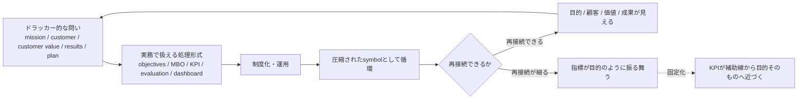

# 001. ドラッカーのマネジメントとKPIへの圧縮

## HSSモデルによる観測レポート

> このレポートは、HSS core model を用いた個別観測レポートです。
> HSS本体の定義・用語・スコープは [hss-observation-notes](https://github.com/kuroam/hss-observation-notes) を参照してください。
> 本レポートはHSSの証明ではなく、HSS語彙を仮の観測軸として用いた接続構造の観測メモです。

## 0. このレポートの扱い

このレポートは、ドラッカー原典の厳密な学術的解釈ではありません。

まず、Wikipedia、MBO解説、ドラッカー関連のマネジメント解説、ビジネス記事などから取れる、広く流通している平均化された「ドラッカーのマネジメント」像を対象にします。

そのうえで、HSS語彙を仮の観測軸として置いたときに、どのような接続構造が見えるかを整理します。


目的は、ドラッカー的な問いが、objectives、KPI、評価制度、ダッシュボードなどへ圧縮されるとき、relation structure がどのように変化して見えるかを観測することです。

## 1. 外部ソースから取れる平均化されたドラッカー像

一般に流通しているドラッカー像では、Peter Drucker は現代マネジメント、management by objectives and self-control、knowledge worker などと結びつけて語られます。ここでの Peter Drucker - Wikipedia は、そのような広く流通した関連づけを確認するための source anchor としてのみ用います。

Management by Objectives は、組織内で具体的な objectives を定義し、個人目標と組織目標を同期させ、成果を基準と比較して測る管理スタイルとして説明されることがあります。ここでの Management by Objectives - Wikipedia も、MBOが objectives、個人目標と組織目標の alignment、measurement、evaluation と結びつけて説明される文脈を確認するための source anchor としてのみ用います。

また、Drucker関連の The Five Most Important Questions 系の資料では、mission、customer、customer value、results、plan といった問いが中心的に扱われます。ここでは、これらをドラッカー的な問いとして流通しているsource anchorのひとつとして用います。The New Yorker や HBR は、この周辺文脈を確認するための補助ソースであり、HSS側の解釈を証明するものではありません。

さらに、Drucker Institute / Management Top 250 などの文脈では、Drucker由来のマネジメント原則が、customer satisfaction、employee engagement and development、innovation、social responsibility、financial strength などの測定可能な管理次元へ運用化される例も見られます。ここでは、これをDrucker本人の原典意図ではなく、現代におけるDrucker関連マネジメント思想の運用化例として補助的に扱います。

ここでは、これをドラッカー原典の確定解釈ではなく、流通しているドラッカー像として扱います。

## 2. 平均化された説明で分解しきれていないポイント

一般的な解説では、目的、顧客、価値、成果、objectives、KPI、評価制度が、比較的なめらかに接続されて語られることがあります。

以下は、外部ソースがそのまま述べている結論ではなく、平均化されたドラッカー像をHSS語彙で観測するときに立ち上がる分解問いです。

その観測上の問いとして、次のような変化が十分に分解されていない場合があります。

- 目的がいつ指標へ圧縮されるのか
- 成果がいつ評価制度へ沈むのか
- 顧客価値がいつ数値になるのか
- 自己管理がいつ自己責任化するのか
- KPIがいつ補助線から目的そのものになるのか
- 目標管理がいつ systemic view へ再接続できなくなるのか

## 3. HSSでの分解

HSSで見ると、ドラッカー的な問いは、組織が目的、顧客、価値、成果、計画へ再接続するための上位接続経路として観測できます。

一方、MBO、objectives、KPI、ダッシュボード、評価制度は、その上位接続経路を実務運用へ落とすために圧縮された symbol として観測できます。

ここでは、圧縮を、抽象的な問いが実務で扱える形式へ変換される構造として観測します。

組織は、抽象的な目的や価値を、objectives や指標や評価制度として扱う場合があります。

観測点は、圧縮された symbol が、元の目的、顧客、価値、成果へ再接続される場合と、再接続されにくくなる場合の差です。

```text
mission / customer / customer value / results / plan
↓
objectives / MBO / KPI / evaluation / dashboard
↓
when reconnection remains available:
  purpose, customer, value, results remain visible
↓
when reconnection becomes weak:
  indicators begin to behave like objectives
```

### 観測フロー



この図は、ドラッカー原典の確定解釈ではなく、HSSで観測できる範囲において、問いや目的が実務上の指標・評価形式へ圧縮され、再接続できる場合と細る場合を整理するための作業図です。

## 4. 分解結果

| 平均化されたドラッカー像            | 実務への圧縮       | HSSで見える状態     |
| ----------------------- | ------------ | ------------- |
| Mission                 | 方針・目標        | 上位接続経路        |
| Customer                | 顧客区分・顧客満足    | 顧客relationの圧縮 |
| Customer value          | NPS・継続率・売上   | 価値のsymbol化    |
| Results                 | 評価指標・成果測定    | 成果の固定化        |
| Plan                    | MBO・KPI・実行計画 | 実行経路の圧縮       |
| Self-control            | 自己管理・目標達成責任  | 自律の自己責任化   |
| MBO                     | 目標同期・評価      | 目的関数の捕獲    |
| Performance measurement | 達成率・報酬・評価    | 揺り戻し欠損     |

## 5. HSSモデルから推測できる仮説

以下の仮説は、外部ソースから直接導かれる結論ではなく、HSSを仮の観測軸として置いたときの分解結果から立てる観測仮説です。

### 仮説1: KPIを目的の圧縮symbolとして観測する

KPIは、mission、customer、value、results などを実務で扱うための圧縮symbolとして機能します。

観測点は、KPIが元の接続経路へ再接続される場合と、再接続されにくくなる場合の差です。

そのとき、KPIは補助線ではなく目的そのもののように振る舞い始めます。

### 仮説2: MBOをsystemic viewへの再接続という観点から観測する

MBOの限界として、システム理解を欠いた目標設定が、品質や本来の成果から切断される可能性が指摘されることがあります。

HSSで見ると、観測点は objectives そのものではなく、objectives が systemic view、quality、purpose へ戻れなくなる状態です。

つまり、HSSでは、MBOの一部運用を、目標が上位接続経路へ戻れなくなる状態として観測できます。

### 仮説3: 顧客価値は数値化できるが、数値だけでは顧客relationを保持できない

顧客価値は、NPS、顧客満足度、継続率、売上、解約率などへ圧縮できます。

しかし、それだけでは、なぜ顧客が価値を感じているのか、どのrelationが積層しているのか、どの信頼経路が維持されているのかまでは見えにくい場合があります。

HSSで見ると、顧客指標は顧客relationの一部を圧縮しますが、積層historyやShiwaを保持できるとは限りません。

### 仮説4: 知識労働者の自己管理は、指標運用次第で自己責任化する

ドラッカーは、knowledge worker や self-control と結びつけて語られることがあります。

HSSで見ると、これは本来、知識労働者が自分の仕事を目的や成果へ再接続するための経路として観測できます。

しかし、指標運用が強くなると、self-control が self-management、self-optimization、self-responsibility へ圧縮される可能性があります。

このとき、組織側の systemic view や支援責任が細る可能性があります。

### 仮説5: ドラッカーの問いは、答えではなく再接続トリガーである

Mission、customer、customer value、results、plan といった問いは、固定された答えを与えるためのものではなく、組織が定期的に元の接続経路へ戻るためのトリガーとして観測できます。

HSSで見ると、ドラッカー的な問いは、固定化した管理指標を再展開するための再接続トリガーとして読めます。

## 6. まだ断定しないこと

このレポートでは、以下を扱いません。

- ドラッカー原典の意図の確定
- KPI、MBO、測定の価値判断
- 個別組織における実際の成否判定
- HSSの真理性や妥当性の証明

## 7. 参考ソース

- Peter Drucker - Wikipedia

  - https://en.wikipedia.org/wiki/Peter_Drucker
  - Druckerがmanagement theory and practice、management by objectives and self-control、knowledge worker などと結びつけられている平均像の確認に用いる。

- Management by Objectives - Wikipedia

  - https://en.wikipedia.org/wiki/Management_by_objectives
  - MBOがobjectivesの定義、個人目標と組織目標の同期、測定、Demingによるsystems-view批判などと結びつく文脈の確認に用いる。

- Knowledge worker - Wikipedia

  - https://en.wikipedia.org/wiki/Knowledge_worker
  - knowledge worker概念とDruckerの接続を確認する補助ソースとして用いる。

- The Five Most Important Questions You Will Ever Ask About Your Organization

  - https://en.wikipedia.org/wiki/Peter_Drucker
  - Druckerの著作一覧・関連文献上で The Five Most Important Questions が確認できるため、mission、customer、customer value、results、plan といった問いを、流通しているDrucker関連文脈として扱うためのsource anchorとして用いる。これは網羅的なDrucker文献レビューではない。

- The Rise and Fall of Getting Things Done - The New Yorker

  - https://www.newyorker.com/tech/annals-of-technology/the-rise-and-fall-of-getting-things-done
  - Drucker、knowledge worker autonomy、management by objectives、個人の生産性管理と組織負荷の関係を確認する補助ソースとして用いる。

- The Theory of the Business - Harvard Business Review

  - https://hbr.org/1994/09/the-theory-of-the-business
  - 管理技法と、より深い事業の前提・mission・environment・core competenciesの区別を確認する補助ソースとして用いる。

- Management Top 250 / Drucker Institute references via WSJ

  - https://www.wsj.com/business/biggest-gains-customer-satisfaction-management-top-250-1e6a585b
  - https://www.wsj.com/business/biggest-gains-employee-engagement-d4f4ff15
  - https://www.wsj.com/business/top-companies-social-responsibility-1b4b807e
  - https://www.wsj.com/business/top-companies-innovation-183755db
  - Drucker Institute による Management Top 250 が、Druckerのマネジメント原則を customer satisfaction、employee engagement and development、innovation、social responsibility、financial strength などの測定可能な管理次元へ運用化している例として補助的に扱う。

## 8. 短い結論

ドラッカー的な問いは、実務運用の中でKPIや評価指標へ圧縮されます。

ここで観測するのは、その圧縮symbolが元の問いへ再接続される場合と、再接続されにくくなる場合の接続構造です。

ただし、その圧縮symbolが元の問いへ再接続されなくなると、目的、顧客、価値、成果へのルーティングが細り、指標そのものが目的のように振る舞い始めます。

HSSでは、この状態を、目的関数の捕獲、揺り戻し欠損、積層historyの細り、Shiwaの削れとして観測できます。

## HSSで見えたこと

- ドラッカー的な問いは、KPIへの答えではなく、mission、customer、value、results、plan へ戻る再接続のトリガーとして観測できる。
- KPI / MBO / dashboard は、圧縮された symbol または処理形式として観測できる。
- HSS上の差分は、単に「KPIが形式化する」ことではなく、再接続のトリガーが処理形式へ圧縮される点にある。

## 見えなかったこと / 保留

- このレポートでは、再接続が強く残る組織や弱くなる組織の具体例までは観測していない。
- 再接続経路が残る場合と、再接続が細る場合の構造差は保留として残る。
- これはDruckerの意図を確定する主張ではない。

## 接続確認状態

- 接続確認: この観測では、Drucker的な問いを再接続トリガーとして扱える。
- 処理形式への吸収: objectives、KPI、評価、dashboard は、元の問いの経路を吸収しうる。
- 再接続可能領域あり: 問いが mission、customer、value、results、plan へ戻れる場合、再接続可能領域が残る。
- 情報不足 / 保留: 具体的な組織事例は、このレポートでは確認していない。
