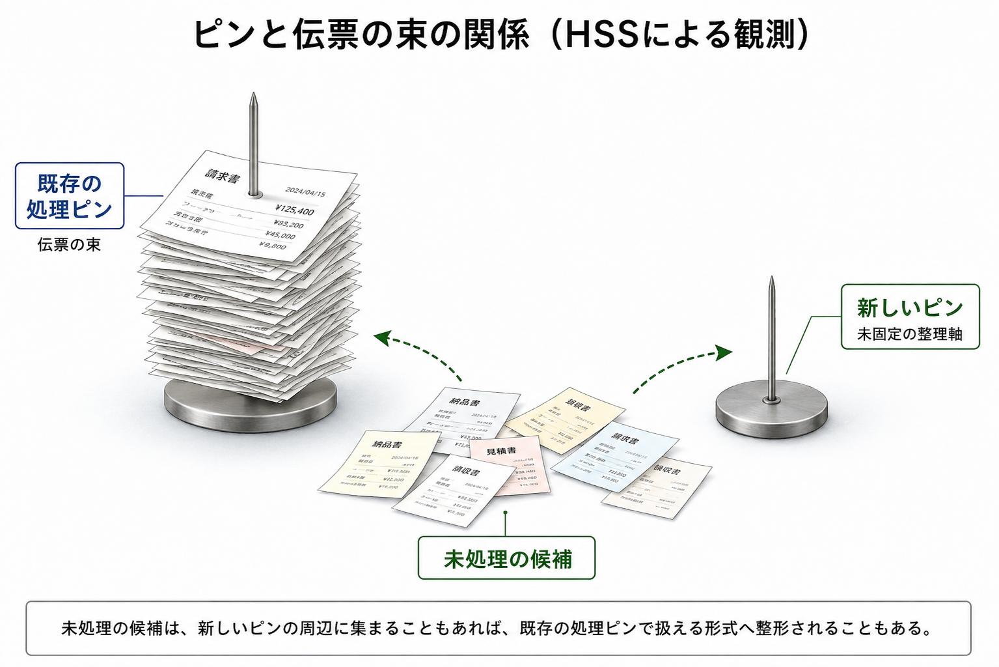

# 003. イノベーションはなぜ伝票の束で止まるのか

## HSSモデルによる観測レポート

## 0. このレポートの扱い

このレポートは、経営学、組織論、イノベーション研究の厳密な文献レビューではありません。

また、イノベーション、既存業務、承認プロセス、予算管理、business case、KPI、phase-gate などを評価・序列化するものでもありません。

ここで扱うのは、新しい接続候補が、どのように認識され、説明され、既存の承認・予算・評価形式へ変換され、あるいは探索経路として維持されるかという構造です。

## 1. 外部ソースから取れる平均化された像

一般的な説明では、innovation は、新しい idea や改善を実際の goods、services、processes、business models などへ実装するものとして語られます。

`Innovation - Wikipedia` では、innovation が ideas の practical implementation として説明され、newness、improvement、spread といった要素とも結びつけられます。

`Innovation management - Wikipedia` では、innovation management が opportunity を把握し、新しい ideas、processes、products を導入するための管理活動として説明されます。また、search、select、implement、capture といった活動や、brainstorming、prototyping、phase-gate model、project management、portfolio management などの道具が挙げられます。

`Diffusion of innovations - Wikipedia` では、新しい ideas や technology が、communication channels、time、social system の中でどのように広がるかが説明されます。

一方、組織内で企画や投資を進める文脈では、business case、business process、phase-gate process などが用いられます。

`Business case - Wikipedia` では、business case が project や task を開始する理由を整理する文書として説明され、benefits、costs、risks、KPI などと結びつけられます。

`Phase-gate process - Wikipedia` では、project が複数の stage や phase に分けられ、gate ごとに business case、risk、resource などをもとに継続判断される仕組みとして説明されます。

ここでは、これらを厳密な組織論の確定解釈としてではなく、次のような平均化された観測対象として扱います。

```text
innovation
= 新しい接続候補を実装・展開しようとする動き

business case / process / phase-gate
= 新しい接続候補を、組織が処理できる形式へ変換する構造

伝票の束
= 承認、予算、責任範囲、KPI、リスク、説明可能性へ圧縮された処理形式
```

## 2. 平均化された説明で分解しきれていないポイント

一般的な説明では、イノベーションは「新しいアイデア」「創造性」「技術」「挑戦」「市場投入」「変革」として語られることがあります。

一方、組織内の実務では、企画、予算、稟議、承認、business case、KPI、risk、resource、phase-gate などの形式で処理されます。

ただし、その説明だけでは、次のような構造差が見えにくい場合があります。

- 新しい接続候補は、いつ組織内で認識可能な形式になるのか
- まだ名前のない接続は、いつ business case へ変換されるのか
- 探索段階の違和感や仮説は、いつKPIへ圧縮されるのか
- 予算・責任・承認は、どの接続経路を太くし、どの接続経路を細く見せるのか
- 既存処理形式へ早く変換されることで、どの Blue residuals が細るのか
- 新しい接続候補が探索経路として維持される場合、どのようなルーティングが見えるのか

以下では、これらをHSS語彙で仮に分解します。

## 3. HSSでの分解

HSSで見ると、イノベーションの初期状態は、まだ固定された分類や評価形式に収まっていない接続候補として観測できます。

それは、最初から売上、KPI、ROI、責任者、承認済み計画として現れるとは限りません。

むしろ、次のようなものとして見えることがあります。

- まだ名前のない違和感
- 既存分類に入らない観察
- 小さな改善案
- 顧客や現場のズレ
- 試作品
- 既存手順から外れた仮説
- 説明しにくいが見逃しにくい兆候

一方、組織内では、資源配分と責任範囲が処理対象になります。

そのため、新しい接続候補は、business case、稟議、予算、phase-gate、KPI、risk、resource、owner などへ変換されます。

HSSでは、この変換を、未収束の接続候補が組織内で処理可能な symbol やルーティングへ圧縮される構造として観測します。

```text
unfixed connection candidate
↓
observation / hypothesis / prototype
↓
business case / budget / owner / KPI / gate
↓
when exploratory routing remains available:
  Blue residuals and reconnectable areas remain visible
↓
when the candidate is compressed early into existing formats:
  routing narrows toward existing categories, metrics, and responsibilities
```

ここでいう「伝票の束」とは、承認や予算管理そのものではありません。

HSSでは、伝票の束を、組織が資源、責任、リスク、評価、説明可能性を接続するための処理形式として観測します。

### 伝票のまま残る場合

未固定の接続候補が、組織内の誰の接続可能領域にもかすらない場合、接続候補としては見えにくくなることがあります。

ただし、組織内では、その痕跡が完全に消えるのではなく、business case、稟議、チケット、KPI、承認項目、説明資料などの処理形式として残る場合があります。

このとき、伝播しているのは接続可能性ではなく、処理形式そのものです。

HSSでは、この状態を、接続候補が伝票として処理可能な形式に残りつつ、その中にあった接続可能性への戻り道が細る局面として観測します。

この「かすらないものが痕跡として残る」構造については、004「刺さる」と「かする」の接続構造でも扱います。

## 4. 「ピン」と「伝票の束」

ここでいう「ピン」とは、まだ大きな計画や制度になっていない小さな接続候補を指します。

それは、ひとつの違和感、ひとつの観察、ひとつの試作、ひとつの顧客反応、ひとつの技術的可能性として現れる場合があります。

一方、「伝票の束」とは、その接続候補を組織内で扱うための処理形式です。

- 誰が責任を持つのか
- どの予算を使うのか
- どのKPIで見るのか
- どのリスクに分類するのか
- どの承認経路を通すのか
- どの部門の仕事なのか
- どの成果として報告するのか



HSSで観測するのは、ピンと伝票のどちらが正しいかではありません。

観測するのは、小さな接続候補が、組織内の処理形式へ変換されるとき、どの接続経路が維持され、どの接続経路が細るように見えるかです。

## 5. 分解結果

| 観測対象          | HSSで見える状態               | 接続される先            |
| ------------- | ----------------------- | ----------------- |
| 小さな違和感        | 未固定の接続候補                | 現場観察、顧客反応、仮説      |
| アイデア          | 低固定symbol               | 試作、会話、探索経路        |
| 試作品           | 接続候補の仮実装                | 顧客反応、技術検証、再解釈     |
| business case | 接続候補の説明可能形式             | 予算、承認、責任、resource |
| KPI           | 接続候補の測定形式               | 評価、進捗、比較          |
| phase-gate    | 接続候補の段階処理               | 継続判断、resource配分   |
| 既存業務          | 安定した処理ルーティング            | 責任範囲、品質、再現性       |
| 探索経路          | Blue residualsを残すルーティング | 再接続可能領域、別解釈、追加観測  |

## 6. HSSモデルから推測できる観測仮説

以下の仮説は、外部ソースから直接導かれる結論ではなく、HSSを仮の観測軸として置いたときの分解結果から立てる観測仮説です。

### 仮説1: イノベーションの初期状態は未固定の接続候補として観測できる

イノベーションは、最初から完成した企画やKPIとして現れるとは限りません。

HSSでは、その初期状態を、まだ分類や評価形式が固定されていない接続候補として観測できます。

### 仮説2: business case は接続候補を組織内で処理可能にする圧縮symbolとして観測できる

business case は、接続候補を予算、期待効果、risk、resource、owner、KPI などへ接続する形式として観測できます。

この形式によって、組織は接続候補を扱いやすくなります。

同時に、未固定の探索余地は、説明可能な項目へ圧縮されます。

### 仮説3: phase-gate は接続候補を段階的に処理するルーティングとして観測できる

phase-gate は、接続候補を stage や gate に分け、各段階で継続判断や resource 配分へ接続する構造として観測できます。

HSSでは、phase-gate を、未収束の接続候補を段階的に処理するルーティングとして扱います。

### 仮説4: 既存処理形式への早期圧縮は Blue residuals を細らせる場合がある

新しい接続候補が、早い段階で既存のKPI、予算、責任範囲、事業部門、既存分類へ圧縮される場合があります。

このとき、まだ名前のない違和感、別解釈、未検証の仮説、顧客や現場の微細なズレが見えにくくなる場合があります。

HSSでは、この状態を、Blue residuals や再接続可能領域が細る局面として観測できます。

### 仮説5: 探索経路が残る場合、新しい接続候補は再展開されやすくなる

接続候補が、すぐに既存形式へ固定されず、試作、観察、対話、別部門との接続、顧客反応、再解釈へ開かれている場合があります。

このとき、HSSでは、未固定の接続候補が探索経路を維持している状態として観測できます。

## 7. まだ断定しないこと

このレポートでは、以下を扱いません。

- 個別企業や組織の評価
- 承認プロセス、予算管理、business case、KPI、phase-gate の価値判断
- イノベーション施策の成否判定
- 組織論やイノベーション研究の確定的整理
- すべてのイノベーションをこの構造で説明すること

## 8. 参考ソース

- Innovation - Wikipedia

  - https://en.wikipedia.org/wiki/Innovation
  - innovation が ideas の practical implementation、newness、improvement、spread などと結びつけて説明される文脈を確認する。

- Innovation management - Wikipedia

  - https://en.wikipedia.org/wiki/Innovation_management
  - innovation management が opportunity、ideas、processes、products、search、select、implement、capture、prototyping、phase-gate、portfolio management などと結びつく文脈を確認する。

- Diffusion of innovations - Wikipedia

  - https://en.wikipedia.org/wiki/Diffusion_of_innovations
  - 新しい ideas や technology が communication channels、time、social system の中で広がる文脈を確認する。

- Business case - Wikipedia

  - https://en.wikipedia.org/wiki/Business_case
  - project や task を開始する理由、benefits、costs、risks、KPI、resource、justification などを整理する形式として確認する。

- Business process - Wikipedia

  - https://en.wikipedia.org/wiki/Business_process
  - input、output、process、activities、customer value、organizational structure などの文脈を確認する。

- Phase-gate process - Wikipedia

  - https://en.wikipedia.org/wiki/Phase-gate_process
  - project や initiative が stages / phases と gates に分けられ、business case、risk、resources などをもとに継続判断される文脈を確認する。

- Formal organization - Wikipedia

  - https://en.wikipedia.org/wiki/Formal_organization
  - fixed rules、procedures、structures などに基づく組織文脈を確認する。

## 9. 短い結論

イノベーションの初期状態は、まだ固定された企画書やKPIではなく、未固定の接続候補として観測できます。

組織は、その接続候補を扱うために、business case、予算、承認、KPI、owner、risk、phase-gate などの処理形式へ変換します。

HSSでは、この変換を、未収束の接続候補が組織内で処理可能な symbol やルーティングへ圧縮される構造として観測します。

探索経路が維持される場合、Blue residuals や再接続可能領域が残りやすくなります。

一方、接続候補が早い段階で既存の分類、責任範囲、評価指標へ圧縮される場合、まだ名前のない違和感や別解釈への戻り道が細く見えることがあります。
