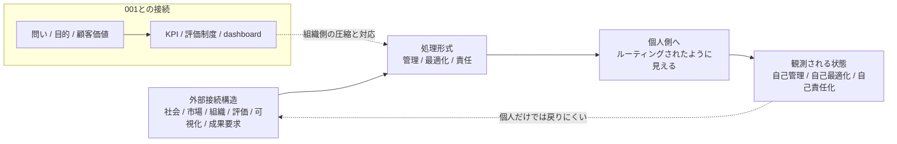

# 005. 自己責任化は個人版KPIである

## HSSモデルによる観測レポート

## 0. このレポートの扱い

このレポートは、HSSモデルで観測できる範囲において、Byung-Chul Han の議論を粗く読解する観測メモです。

ここでは、Hanの議論に見られる自己管理、自己最適化、自己責任化のような状態を、HSS語彙で接続構造として分解します。

## 1. 外部ソースから取れる平均化されたHan像

The Burnout Society は、competitive / service-oriented societies の文脈で、stress や exhaustion を単なる個人内の出来事ではなく、社会的・歴史的な現象として扱うためのsource anchorになります。

Psychopolitics は、neoliberalism、productive force of the psyche、freedom、self-optimization、Big Data、technological domination の文脈を確認するsource anchorになります。

The Transparency Society は、transparency、exposure、control、information、interpretation の文脈から、可視化と制御の接続を確認するsource anchorになります。

Hanの議論では、成果社会、疲労、自己最適化、自己搾取、透明性、可視化、自己責任化などが、現代社会の問題として語られます。

ここでは、それらをHan原典の確定解釈としてではなく、現代社会において管理・最適化・責任が個人側へ接続されて見える状態を観測するためのsource anchorとして扱います。

## 2. 平均化された説明で分解しきれていないポイント

Hanの議論は、現代の主体が、自分自身を管理し、最適化し、疲労していくように見える状態を描き出します。

ただし、HSSでの観測問いは、次ではありません。

- なぜ個人はこれを行うのか
- 個人の本当の心理は何か

HSSでの観測問いは、次です。

- 管理・最適化・責任がどこから来ているように見えるのか
- それらがどのように個人側へ置かれるのか
- 個人で制御しにくい外部接続構造が、なぜ個人の問題のように見えるのか

そのため、ここでは次の点を分解対象にします。

- 管理は、本当に個人の内側から発生しているのか
- 最適化は、本当に個人が自由に選んだものなのか
- 責任は、本当に個人が制御できる範囲にあるのか
- 成果要求や可視化は、どのように個人側へ接続されるのか
- 自己管理・自己最適化・自己責任化は、どの外部接続構造から生じているように見えるのか

## 3. HSSでの分解

自己責任化は、個人の責任が実際に増えた状態ではなく、個人では制御しにくい外部接続構造が、管理・最適化・責任という形式で個人側へルーティングされたように見える接続状態として観測できます。

このとき重要なのは、「自己」を起点にしないことです。

HSSでは、先に管理・最適化・責任という処理形式があり、それが個人側へ置かれたように見える結果として、自己管理、自己最適化、自己責任化が立ち上がるものとして観測します。

### 観測フロー



この図は、Hanの議論全体を要約するものではなく、HSSで観測できる範囲において、管理・最適化・責任が個人側へルーティングされたように見える接続状態を整理するための作業図です。

## 4. 001「ドラッカーのマネジメントとKPIへの圧縮」との接続

Report 001では、Drucker的な問いや目的が、KPI、MBO、評価制度、dashboardへ圧縮されうる構造を観測しました。

Report 005では、それと対応して見えるHSS側の構造を、個人側で観測します。

これは、DruckerとHanが同じことを述べているという意味ではありません。HanがDruckerを参照しているという意味でも、Druckerがこの状態を引き起こしたという意味でもありません。

ここで述べるのは、HSSでは対応する圧縮・ルーティング構造を観測できる、という範囲に限られます。

```text
001:
mission / customer / value / results / plan
↓
objectives / KPI / evaluation / dashboard

005:
社会 / 市場 / 組織 / 評価 / 可視化 / 成果要求
↓
管理 / 最適化 / 責任
↓
個人側へルーティングされたように見える
```

## 5. 分解結果

| 観測対象  | HSSで見える状態            | 接続される先            |
| ----- | -------------------- | ----------------- |
| 成果要求  | 外部からの評価symbol        | 評価、比較、可視化         |
| 可視化   | 状態の測定可能化             | 指標、dashboard、他者比較 |
| 管理    | 処理形式の設定              | 行動、時間、成果、自己像      |
| 最適化   | 評価形式への適応             | 生産性、効率、成果         |
| 責任    | 処理負荷の配置              | 個人側の説明義務、自己管理     |
| 自己管理  | 管理が個人側へ置かれたように見える状態  | 時間、行動、成果          |
| 自己最適化 | 最適化が個人側へ置かれたように見える状態 | 能力、効率、生産性         |
| 自己責任化 | 責任が個人側へ置かれたように見える状態  | 評価、成果、失敗説明        |

## 6. HSSモデルから推測できる観測仮説

### 仮説1: 自己責任化は、責任の増加ではなく責任のルーティングとして観測できる

自己責任化は、個人の責任が実際に増えた状態としてではなく、管理・最適化・責任が個人側へルーティングされたように見える接続状態として観測できます。

### 仮説2: 自己管理は、自由の拡大ではなく、外部構造の個人側処理化として見える場合がある

自己管理は、個人が自由に自分を管理している状態に見えることがあります。

しかしHSSでは、個人では制御しにくい外部接続構造が、個人の管理タスクとして配置されたように見える場合があると観測します。

### 仮説3: 自己最適化は、目的への再接続ではなく、評価形式への適応として観測できる

自己最適化は、個人が自分の目的へ深く接続する行為とは限りません。

HSSでは、可視化、評価、成果要求に合わせて、個人が評価形式へ適応している状態として見える場合があります。

### 仮説4: 疲労は、接続経路の非対称性として観測できる

HSSでは、疲労そのものを心理状態として定義しません。

ただし、管理・最適化・責任が個人側へ来る一方で、元の外部接続構造へ戻る経路が細い場合、個人側に処理負荷が偏っているように見えます。

### 仮説5: Han的な自己責任化は、ドラッカー/KPI問題の個人側ルーティングとして観測できる

001では、問いや目的がKPI・評価制度・dashboardへ圧縮される構造を観測しました。

005では、管理・最適化・責任が個人側へルーティングされ、自己管理・自己最適化・自己責任化として見える構造を観測します。

## 7. まだ断定しないこと

このレポートでは、以下を扱いません。

- Hanの議論全体の確定解釈
- 個人の心理診断
- 疲労の医学的説明
- 自己管理、自己最適化、自己責任の価値判断
- すべての現代社会問題をこの構造で説明すること

## 8. 参考ソース

- The Burnout Society - Stanford University Press

  - https://www.sup.org/books/title/?id=25725&promo=S19XMLA
  - 成果社会、疲労、ストレス、現代社会における個人への負荷を確認するsource anchorとして扱う。

- Psychopolitics - Verso Books

  - https://www.versobooks.com/products/226-psychopolitics
  - neoliberalism、psychopolitics、Big Data、自由、自己最適化、技術的支配の文脈を確認するsource anchorとして扱う。

- The Transparency Society - Stanford University Press

  - https://www.sup.org/books/title?id=25832
  - transparency、可視化、control、情報、解釈の文脈を確認するsource anchorとして扱う。

- 1. ドラッカーのマネジメントとKPIへの圧縮

  - [sources/ja/001_drucker_sources.md](sources/ja/001_drucker_sources.md)
  - HSS側で、問いや目的がKPI・評価制度・dashboardへ圧縮される構造と接続するために参照する。

## 9. 短い結論

Hanの議論に見られる自己管理、自己最適化、自己責任化は、HSSでは、個人の責任が実際に増えた状態としてではなく、個人では制御しにくい外部接続構造が、管理・最適化・責任という形式で個人側へルーティングされたように見える接続状態として観測できます。

この観測では、「自己」を起点にしません。

HSSでは、管理・最適化・責任が外部接続構造から切り出され、個人側へ置かれたように見える結果として、自己管理、自己最適化、自己責任化が立ち上がるものとして扱います。
