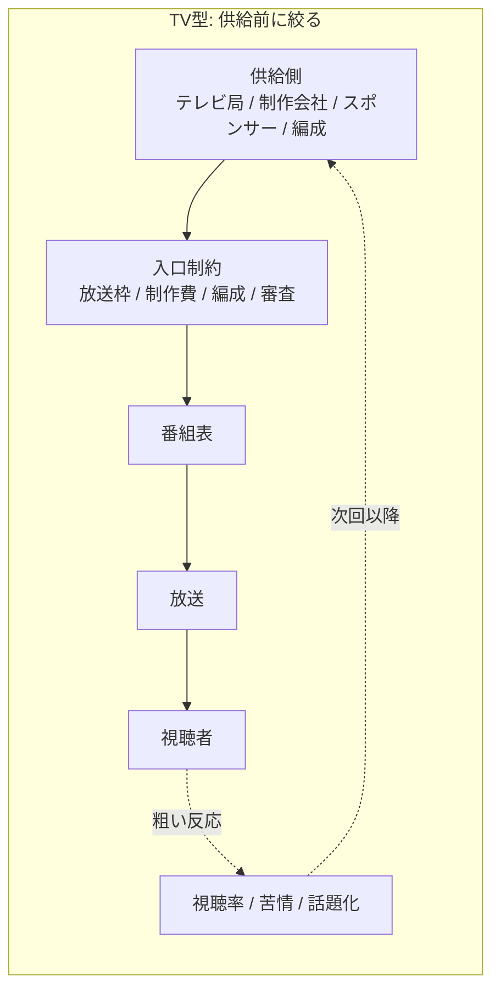
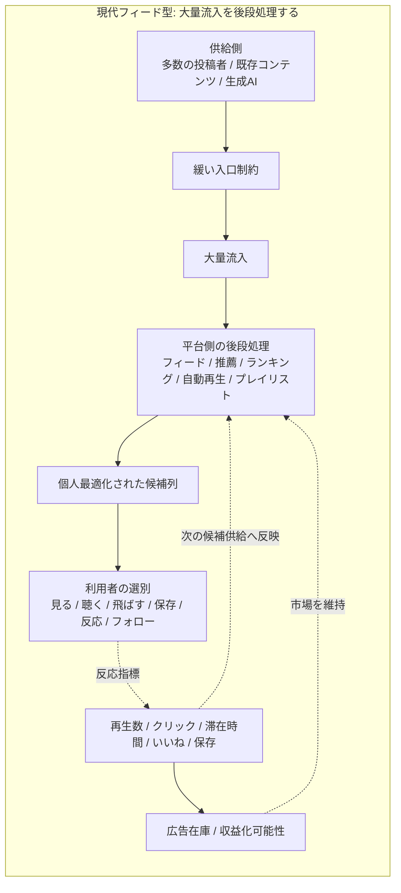
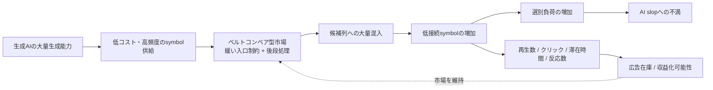

# 006. AI slopはベルトコンベア問題である

## HSSモデルによる観測レポート

> このレポートは、HSS core model を用いた個別観測レポートです。
> HSS本体の定義・用語・スコープは [hss-observation-notes](https://github.com/kuroam/hss-observation-notes) を参照してください。
> 本レポートはHSSの証明ではなく、HSS語彙を仮の観測軸として用いた接続構造の観測メモです。

## 0. このレポートでのAI slopの扱い

AI slopという語は、一般には生成AIによって大量に作られる低品質なデジタルコンテンツを指す語として使われています。

ただし、この語にはまだ安定した単一の定義があるわけではありません。

外部ソースでは、低品質、高数量、AI生成、低努力、意味や品質の不足、attention economy、広告収益、平台上の大量流通などが、AI slopを説明する要素として現れます。

このレポートでは、それらの定義をひとつの確定定義へ統合するのではなく、複数のsource anchorに共通して現れる要素を抽出し、HSS語彙で再翻訳します。

本レポートにおけるAI slopは、「AI生成そのものの問題名」ではありません。

HSSでは、AI slopを、生成AIによる大量生成能力が、平台、フィード、広告収益、再生数、クリック、滞在時間、反応指標などの処理形式へ接続されたときに、低接続・大量流通・低再接続のsymbolとして観測される状態として扱います。

## 1. 外部定義から抽出する共通要素

このレポートでは、次の外部ソースをsource anchorとして参照します。

- Merriam-Webster Word of the Year 2025: Slop
  - https://www.merriam-webster.com/wordplay/word-of-the-year
  - 用途: low-quality / AI / quantity の語義確認
- AI slop - Wikipedia
  - https://en.wikipedia.org/wiki/AI_slop
  - 用途: low-quality AI-generated digital content、lacking effort, quality, or meaning、high volume、clickbait、attention economy、monetization、creator economy、social media、online advertising context の確認
- Spam, junk … slop? The latest wave of AI behind the “zombie internet” - The Guardian
  - https://www.theguardian.com/technology/article/2024/may/19/spam-junk-slop-the-latest-wave-of-ai-behind-the-zombie-internet
  - 用途: spam / junk / slop、AI-generated web clutter、advertising revenue and search traffic context の確認
- Measuring AI “Slop” in Text - arXiv
  - https://arxiv.org/abs/2509.19163
  - 用途: low-quality AI-generated text、合意された定義や測定方法の不安定さ、slop判断の主観性の確認
- Why Slop Matters - arXiv
  - https://arxiv.org/abs/2601.06060
  - 用途: superficial competence、asymmetry of effort、mass producibility、generation and consumption のdigital ecosystemの確認
- AI-Generated Algorithmic Virality - arXiv
  - https://arxiv.org/abs/2508.01042
  - 用途: TikTokやInstagram検索結果におけるAI-generated content、low cost、fast production speed、gaming the algorithm、scale production の確認

外部定義やメディア上の用法から見ると、AI slopには少なくとも次の要素が重なっています。

- AI生成または生成AIに強く関連する
- 低品質、低努力、低意味と見なされる
- 大量に生成・流通する
- 平台、フィード、検索、SNS、広告収益、再生数、クリック、反応指標と接続する
- 人間の創作物や情報コンテンツに似た形式を取りながら、接続可能性や再接続性が弱い場合がある

HSSでは、これらをまとめて「AI生成が原因である」という評価にはしません。

むしろ、AI生成という生産能力が、どの流通形式、評価形式、収益形式へ接続されたときに slop として観測されるのかを見ます。

## 2. HSSでの暫定観測定義

HSSにおいて、AI slopとは、生成AIそのものの性質ではなく、生成能力が平台・フィード・再生数モデル・広告収益・反応指標へ接続されたときに発生する観測状態です。

この状態では、symbolは大量に生成され、流通し、反応を取得します。

しかし、そのsymbolが個人の接続可能領域へ深く接続されるとは限りません。

また、接続されたとしても、再接続・再展開・積層historyへ進む前に、次のsymbolへ流される場合があります。

そのため、AI slopは「低品質なAI生成物」というだけではなく、低接続のsymbolが大量に流通し、反応指標上では処理されるが、継続接続や再展開へ進みにくい状態として観測できます。

## 3. なぜ「ベルトコンベア」と呼べるのか

ここでいうベルトコンベアとは、特定アプリ名ではなく、候補の供給構造です。

それは、利用者に意図がないという意味ではありません。

また、ここでは利用者の内面や自由意思を定義しません。

HSSで観測するのは、利用者が広いWeb空間や文化空間を探索しているのか、それとも平台が供給した候補列の中で選別しているのかという接続構造です。

ベルトコンベア型消費とは、平台・検索・推薦・ランキング・自動再生・プレイリストなどによって候補列が先に供給され、利用者がその候補列の中で、見る、聴く、飛ばす、保存する、反応する、フォローする、といった選別を行う消費形式として観測できます。

TikTok、YouTube Shorts、Instagram Reels、YouTube、Spotify、Apple Music、YouTube Music などは、このようなフィード・推薦・ランキング・自動再生・プレイリスト型の候補供給構造の例として扱います。

これらは、個別サービスの価値評価ではなく、候補供給構造の例です。

この構造は、AI生成物が流入する前から存在していました。

AI生成物がベルトコンベアを作ったのではありません。

生成AIは、この既存の候補供給構造へ流し込めるsymbolの量と速度を増幅するものとして、後続節で扱います。

## 4. TV型と現代フィード型の違い

TV型も、ある意味では受動的な受信形式を含んでいました。

しかし、供給側の構造は現代フィード型とは異なります。

TV型では、供給側の入口制約が強く、放送枠、制作費、編成、編集・組織上のゲートによって、視聴者へ届く前に候補が絞られます。

また、反応は視聴率、苦情、話題化などとして比較的粗く、遅れて戻ります。

現代フィード型では、供給側の入口制約が緩く、大量流入した候補を後段で処理します。

平台、フィード、推薦、ランキング、自動再生、プレイリストが候補を並べ、利用者の反応は測定され、次の候補供給へ戻されます。

TV型では、候補が視聴者へ届く前に、放送枠、制作費、編成、審査などによって強く絞られます。

現代フィード型では、供給側の入口制約を緩くし、大量に流入した候補を後段で処理します。

AI slopが見えやすくなるのは、後者の市場構造に、生成AIの大量生成能力が接続されるためです。

### 再生数ビジネスとしての違い

TV型にも広告収益や視聴率はありました。

ただしTV型では、供給側の入口で放送枠、制作費、編成、審査などによって候補が絞られ、反応も視聴率、苦情、話題化などとして比較的粗く、遅れて戻ります。

一方、現代フィード型では、候補が大量に流入した後で、再生数、クリック、滞在時間、いいね、保存、シェアなどが、候補単位で測定されます。

これらの指標は、接続の深さそのものではありません。

しかし平台上では、需要、関心、流行、価値、広告在庫、収益化可能性を示す代理指標として処理されます。

HSSでは、この状態を、接続可能性が再生数・クリック・滞在時間・反応数などの処理形式へ圧縮される局面として観測します。

そのため、AI slopが生まれやすい理由は、AI生成そのものにあるのではありません。

低接続symbolであっても、再生数、クリック、滞在時間、反応数として処理できる市場構造があり、その処理形式に広告在庫や収益化可能性が接続されているためです。

つまり、AI slopは、ベルトコンベア型候補供給構造と、再生数ビジネスが接続している場所で発生しやすくなります。

### 再生数という処理形式への圧縮

再生数や表示回数は、作品への接続の深さをそのまま表すものではありません。

深く反復された1曲と、浅く接触された多数の曲は、人間側に残る痕跡としては異なります。前者には、記憶、愛着、再訪理由、生活への入り込み、作り手との継続関係が残る場合があります。一方で後者は、接触、通過、BGM化、一覧消費、推薦上の処理に近い場合があります。

しかしplatform上では、どちらもまず再生イベントや表示イベントとして処理形式へ入ります。この処理形式では、接続の深さ、記憶への残り方、再訪される理由、関係性の継続は十分に分解されにくい。

そのため、低接続の出力であっても、大量に流通し、再生数・表示回数・滞在時間などへ変換できるなら、処理上は成立して見える場合があります。AIによって制作摩擦が下がると、この大量投入は起きやすくなります。ただし、AI使用そのものをslopと扱うわけではありません。AI slopは、AI生成そのものではなく、低接続の大量出力がこのような処理形式へ流し込まれることで観測されやすくなるものとして扱います。

## 5. 生成AIは何を増幅するのか

生成AIはベルトコンベアそのものではありません。

生成AIは、ベルトコンベアに流し込めるsymbolの供給能力を増幅します。

観測対象はAI生成の存在ではなく、候補供給構造、反応指標、収益化された流れへの接続です。

この図で観測しているのは、AI生成物の価値判断ではありません。

HSSで観測しているのは、生成能力が、候補供給構造、反応指標、再生数ビジネスへ接続されるとき、低接続symbolが大量に流通し、再接続・再展開へ進みにくい状態です。

低接続symbolであっても、再生数、クリック、滞在時間、反応数として処理される場合、広告在庫や収益化可能性へ接続されます。

そのため、AI slopは単なるノイズではなく、ベルトコンベア型市場の中で測定・流通・収益化可能な候補として残りうる状態として観測できます。

## 6. 選択と選別の違い

HSSは、利用者が選んでいると感じることを否定しません。

ここでは、次の二つを分けます。

- 選択: 自分で接続経路を作り、接続可能領域を編集すること
- 選別: 平台が提示した候補列の中で、見る、飛ばす、保存する、反応すること

AI slopは、自由な選択を破壊したのではありません。

自由な選択に見えていたものが、平台上の候補列を選別するベルトコンベア型消費だったことを可視化した状態として観測できます。

ここで扱っているのは、利用者の自由意思や内面ではありません。

HSSで観測するのは、接続経路を利用者が作っているのか、それとも平台が供給した候補列の中で選別しているのかという接続構造です。

## 7. フォロー、検索、レコメンドの位置づけ

フォローは、純粋な関係そのものではありません。

フォローは、自由なWeb探索そのものではなく、平台内でどの供給元を候補列に混ぜるかを指定するルーティング条件として観測できます。

フォローは能動的接続の痕跡ではあります。

しかし、表示順、混入するおすすめ、関連投稿、広告、反応回収、再推薦の設計は、平台側の処理形式に置かれています。

そのため、フォローはベルトコンベア型消費から完全に外れるものではなく、候補列を構成する条件の一部として扱います。

検索も、検索結果ページ、ランキング、広告、スニペット、関連結果、推薦ウィジェットが候補列を形作る場合には、候補供給構造として観測できます。

推薦、自動再生、プレイリストは、候補列が先に供給される度合いがさらに強いベルトコンベア形式として観測できます。

## 8. ショート動画の二つの使い方

ショート動画は、それ自体がAI slopなのではありません。

HSSでは、ショート動画を、広告媒体として使われる場合と、流通媒体として使われる場合に分けて観測します。

広告媒体としてのショート動画は、短時間で注意を捕捉し、反応を回収する一発symbolとして働きます。

流通媒体としてのショート動画は、楽曲、演者、本編、ライブ、コミュニティ、積層historyへ戻るための紹介symbolとして働く場合があります。

AI slopが問題化しやすいのは、広告媒体として最適化された一発symbolが、流通媒体の顔をして大量供給される場合です。

Report 002では、一発symbolや、接続可能性ではなく処理形式が流通する場合を扱いました。

Report 004では、「刺さる」を短期反応ではなく既存historyへの接続として扱いました。

このレポートでは、その二つを、ショート動画が一発symbolにも再接続入口にもなりうる構造として接続します。

## 9. 分解結果

| 観測対象 | HSSで見える状態 | 接続される先 |
| --- | --- | --- |
| 生成AI | symbol供給能力の増幅 | 低コスト生成、大量生成 |
| AI slop | 低接続symbolの大量流通 | フィード、検索、SNS、広告収益 |
| フィード | 候補列の生成・提示 | 推薦、ランキング、自動再生 |
| 再生数 / 表示回数 | 接続の深さを再生イベントや表示イベントへ圧縮する処理形式 | 価値代理指標、広告在庫、収益化可能性 |
| クリック | 接触の処理symbol | 候補供給、反応指標 |
| 滞在時間 | 注意の処理symbol | 推薦、評価、収益化 |
| いいね / 保存 | 反応symbol | 次の候補供給 |
| フォロー | ルーティング条件 | 候補列、所属signal、推薦材料 |
| 受動的選別 | 候補列内での処理 | 見る、飛ばす、保存、反応 |
| 能動的選択 | 接続経路の編集 | 探索、文脈化、再接続 |
| 低接続symbol | 再接続しにくい圧縮symbol | 短期反応、通過、破棄 |
| ベルトコンベア型市場 | 大量流入を後段処理し、反応指標を価値代理指標へ変換する候補供給構造 | 再生数ビジネス、広告在庫、収益化可能性 |

## 10. HSSモデルから推測できる観測仮説

### 仮説1: AI slopはAI生成物の品質名ではなく、生成能力と市場構造の接続状態として観測できる

AI slopは、AI生成そのものではなく、生成能力が平台・フィード・再生数モデル・広告収益・反応指標へ接続されたときに発生する観測状態として見えます。

### 仮説2: ベルトコンベア型消費では、選択ではなく選別が前面化しやすい

利用者は自分で選んでいるように見えます。

しかしHSSでは、平台が提示した候補列の中で、見る、聴く、飛ばす、保存する、反応するという選別が前面化している場合を観測します。

### 仮説3: 再生数モデルでは、接続可能性よりも通過量・滞在時間・反応数が価値化されやすい

再生数、クリック、滞在時間、いいね、保存などは、接続の深さそのものではありません。

HSSでは、それらを通過痕跡や反応symbolが数値化された処理形式として観測します。

この処理形式に広告在庫や収益化可能性が接続されると、低接続symbolであっても、市場上では流通・測定・収益化の対象になります。

そのため、AI slopは、低接続symbolが排除される構造ではなく、再生数ビジネス上で処理可能な候補として残りうる構造から発生しやすくなります。

### 仮説4: 生成AIはslopの原因そのものではなく、既存の大量流通モデルを加速・露出させる供給能力として働く

生成AIは、ベルトコンベア型市場に流し込めるsymbolの供給能力を増幅します。

その結果、もともと大量流入を後段処理する前提で作られていた市場構造の限界が見えやすくなります。

### 仮説5: AI slopという語は、AIへの違和感だけでなく、平台化した流通構造への違和感も圧縮している

AI slopという語には、低品質AI生成物への不満だけでなく、候補供給構造、再生数ビジネス、選別負荷、低接続symbolへの違和感もまとめて入っている場合があります。

HSSでは、この語をそのまま原因名として使うのではなく、複数の接続構造が圧縮されたラベルとして扱います。

### 仮説6: 同じ生成能力は、ベルトコンベアではなく接続可能領域の編集にも使われうる

生成AIは、平台の候補列に低接続symbolを大量供給するだけのものではありません。

個人が自分の用途、文脈、記憶、好みに合わせて生成・編集・選別する場合、同じ生成能力は、自己の接続可能領域を編集する方向へ使われる場合があります。

## L1〜L3上の観測点

- L1 接触層:
  AI生成コンテンツ、サムネイル、動画、音楽、投稿、検索結果、推薦候補などが利用者に接触する。
- L2 反応・痕跡層:
  視聴、スキップ、保存、違和感、不満、低接続感、反応、クリック、滞在などが痕跡として残る。
- L3 処理・ルーティング層:
  フィード、推薦、ランキング、再生数、クリック、滞在時間、広告収益、プレイリスト、検索順位などへ処理される。

## 接続確認状態

- 接続確認:
  AI slopは、AI生成そのものではなく、生成能力が平台、フィード、推薦、再生数、広告収益、反応指標などへ接続された観測状態として扱える。
- 処理形式への吸収:
  symbolの接続可能性は、再生数、クリック、滞在時間、保存、反応数などの処理形式へ吸収されやすい。深い再訪と浅い接触が、同じ再生数・表示回数・滞在時間として処理される場合がある。
- Blue residuals / 再接続可能領域:
  低接続symbolが大量に流通しても、違和感、不満、保存、再訪、別文脈での再解釈などが残る場合は、再接続可能領域として観測できる。
- 揺り戻し欠損の可能性:
  反応指標が回っていても、接続の深さ、積層history、再接続可能性へ戻る経路が見えにくい場合、揺り戻し欠損の可能性として観測できる。
- 情報不足 / 保留:
  個別のコンテンツ、平台、利用者反応については、このレポート単体では確定しない。

## 11. まだ断定しないこと

このレポートでは、以下を扱いません。

- AI生成物そのものの価値判断
- AI創作と人間創作の優劣
- 著作権問題全体
- 個別平台や個別サービスの評価
- 個別の利用者、投稿者、創作者の評価
- 感情、欲求、自由意思、依存の定義
- すべての推薦システム批判
- すべてのWeb批判

## 12. 参考ソース

- Merriam-Webster Word of the Year 2025: Slop
  - https://www.merriam-webster.com/wordplay/word-of-the-year
  - slopが、低品質で通常AIにより大量生産されるデジタルコンテンツとして説明される文脈を確認する。
- AI slop - Wikipedia
  - https://en.wikipedia.org/wiki/AI_slop
  - AI slopが、生成AI、低品質、高数量、attention economy、monetization、social media、online advertising と結びつけて説明される文脈を確認する。
- Spam, junk … slop? The latest wave of AI behind the “zombie internet” - The Guardian
  - https://www.theguardian.com/technology/article/2024/may/19/spam-junk-slop-the-latest-wave-of-ai-behind-the-zombie-internet
  - AI生成コンテンツがWeb上のspam/junk/slopとして語られ、広告収益や検索流入と接続される文脈を確認する。
- Measuring AI “Slop” in Text - arXiv
  - https://arxiv.org/abs/2509.19163
  - AI slopという語に合意された定義や測定方法がまだ安定していない文脈を確認する。
- Why Slop Matters - arXiv
  - https://arxiv.org/abs/2601.06060
  - AI slopを単なるデジタル汚染ではなく、superficial competence、asymmetry of effort、mass producibility などから研究対象として扱う文脈を確認する。
- AI-Generated Algorithmic Virality - arXiv
  - https://arxiv.org/abs/2508.01042
  - TikTokやInstagramの検索結果、AI生成コンテンツ、低コスト・高速生成、algorithmic virality の文脈を確認する。
- 002. 一発ギャグ、バズ、芸体系への接続
  - [002_ippatsu_gag_buzz_gei_system.md](002_ippatsu_gag_buzz_gei_system.md)
  - 一発symbolや、接続可能性ではなく処理形式が流通する構造と接続するために参照する。
- 004. 「刺さる」と「かする」の接続構造
  - [004_sasaru_kasuru_connection.md](004_sasaru_kasuru_connection.md)
  - 「刺さる」を短期反応ではなく、既存historyへの接続として扱う構造と接続するために参照する。

## 13. 短い結論

AI slopは、AI生成そのものの問題名ではありません。

HSSでは、AI slopを、供給側の入口制約が緩く、大量流入した候補を平台・フィード・推薦・ランキング・自動再生・プレイリスト・反応指標によって後段処理するベルトコンベア型市場構造に、生成AIの大量生成能力が接続されたことで、その設計上の限界が露出した観測状態として扱います。

この構造では、symbolは作品や文脈として深く再接続される前に、再生数、クリック、滞在時間、いいね、保存などの反応指標へ圧縮されやすくなります。

低接続symbolであっても、再生数、クリック、滞在時間、反応数として処理される場合、広告在庫や収益化可能性へ接続されます。

そのためAI slopは、AI問題である前に、ベルトコンベア化した再生数ビジネスの設計破綻として観測できます。

## HSSで見えたこと

- AI slop は、AI生成の品質問題そのものではなく、大量生成能力と平台型の候補供給構造の接続状態として観測できる。
- 低接続symbolは、再生数、クリック、滞在時間、反応、広告在庫、推薦signalとして処理可能な場合、流通に残りうる。
- HSSでは、自分の接続経路を作って選ぶことと、供給された候補ストリーム内で選別することの差が見える。

## 見えなかったこと / 保留

- このレポートは、同じ生成能力が再接続可能領域の編集や拡張にも使われうることを示唆するが、そこは強く観測していない。
- AI生成が再接続・再展開を支える具体例は保留として残る。
- このレポートは、platform、AI生成、creator、user の善悪を評価しない。
