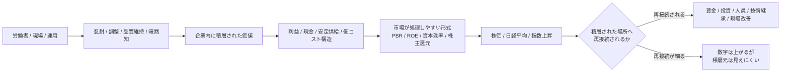

# 007. 日経平均の上昇は何の積層を価格化しているのか

## HSSモデルによる観測レポート

## 0. このレポートの扱い

- このレポートは投資助言ではありません。
- 日経平均、TOPIX、為替、個別銘柄の上昇・下落を予測するものではありません。
- 個別銘柄の売買判断を扱いません。
- 企業、投資家、労働者、経営者、政府、労働組合、業界を善悪で評価するものではありません。
- ここで扱うのは、日経平均という指数symbolの上昇において、「評価されているもの」と「数字として上がっているもの」が一致していない可能性をHSS語彙で観測することです。

このレポートでは、日経平均の上昇を、日本経済全体の単純な値上がりとして扱いません。
HSSでは、日経平均を、複数の企業価値、期待、資本効率、指数寄与度、資金フロー、積層historyが圧縮される指数symbolとして扱います。
そのうえで、労働者・現場・運用側に長期に積層された価値が、企業価値・資本効率・株価・日経平均として価格化されるとき、評価されているものと、数字が上がっている場所が一致しない可能性を観測します。

## 1. 外部ソースから取れる平均化された像

外部ソースから取れる平均化された像は、次のように整理できます。

- 日経平均 = 日本株を代表する指数symbolとして流通する。
- ただし日経平均は日本経済全体そのものではなく、225銘柄からなる価格加重型指数である。
- 日経平均の上昇は、高寄与度銘柄、テーマ株、資金フロー、指数設計の影響を強く受ける。
- 企業統治改革や資本効率改善は、PBR、ROE、株主還元、資本配分などの処理形式で市場に見えやすくなる。
- 労働側では、名目賃金が増えても実質賃金が低下するような生活実感とのズレがある。
- そのため、日経平均上昇を「日本全体が上がった」とだけ読むと、どこに価値が積層され、どこで数字が上がっているのかが見えにくくなる。

ここで参照する source anchor は、日経平均が東証プライム市場の225銘柄からなる price-weighted equity index として説明される文脈、日経平均の構成比率や日次サマリー、AI関連株や高寄与度銘柄による急騰、TOPIXとのズレ、上昇銘柄数の偏り、東証による資本コストや株価を意識した経営の要請、日本企業の現金保有と資本配分、実質賃金の推移です。

## 2. 平均化された説明で分解しきれていないポイント

平均化された説明だけでは、次の問いが残ります。

- 日経平均が上がったとき、本当に値上がりしているものは何か。
- 日本経済全体が上がっているのか、それとも指数symbolが上がっているのか。
- 高寄与度銘柄やAI関連期待が上がっているのか。
- 企業内に積層された価値が、資本効率・株主還元・PBR・ROEとして価格化されているのか。
- その価値の一部は、労働者・現場・運用側に積層されてきたものではないか。
- 評価されているものと、数字が上がっている場所は一致しているのか。
- 価格化された価値は、積層された場所へ再接続されるのか。

### このレポートでの「積層」の使い分け

このレポートでは、「積層」を一つの意味だけでは使いません。混同を避けるため、次のように使い分けます。

- 積層history

- バブル後、失われた30年、デフレ後、日本再評価など、時間をかけて形成された記憶・文脈・再接続可能領域を指す。
- 労働側の積層

- 労働者・現場・運用側に蓄積された忍耐、調整、品質維持、暗黙知、会社を回すための接続維持を指す。
- 価値の積層

- 経営、技術、資本、設備、ブランド、知財、需要、労働、現場運用などが企業内に蓄積し、後から企業価値として価格化されうる状態を指す。
- 価格化された積層

- 積層された価値が、PBR、ROE、資本効率、株主還元、株価、日経平均など、市場が処理しやすい数字や形式へ変換された状態を指す。

### HSSがこの観測に加える差分

通常の経済分析でも、実質賃金と株価、TOPIXと日経平均、高寄与度銘柄と市場全体のズレは観測できる。

HSSがここで加えるのは、それらを単なる指標差としてではなく、次の接続構造として見ることです。

- 価値がどこに積層されたのか
- その価値がどの処理形式へ変換されたのか
- どの数字として価格化されたのか
- 価格化された価値が、積層された場所へ再接続される経路を持つのか

したがって、このレポートでのHSS観測は、日経平均の上昇理由を説明することではなく、労働者・現場・運用側に積層された価値が、株価・指数・資本効率として価格化されるときに、接続元と価格化先がズレる構造を見ることにあります。

HSS本体では、継続接続、再接続、再展開、固定化、積層的な関係形成を主な観測対象として扱います。このレポートでは、そのうち、日経平均という指数symbolへの固定化、労働者・現場・運用側に積層された価値、価格化された価値が積層元へ再接続されるか、という範囲に絞って観測します。

## 3. HSSでの分解

日経平均の上昇は、日本経済全体の値上がりではなく、日経平均という指数symbolの中で、特定の銘柄群、期待、評価形式、資金フロー、積層historyが価格化された状態として観測できます。

その価格化の一部は、企業の財務指標や資本政策だけではなく、長期にわたり労働者・現場・運用側に積層されてきた忍耐、品質維持、調整、暗黙知、低コストでの安定運用に支えられている可能性があります。

- この図は、労働者が唯一の価値源であると主張するものではありません。
- 企業価値には経営、技術、資本、設備、ブランド、知財、需要、為替、政策、資本市場など複数の接続先があります。
- ここで観測するのは、その一部として、労働者・現場・運用側に積層された価値が、株価や指数として価格化されるときのズレです。

### 「再接続が細る」とは何を観測することか

このレポートでいう「再接続が細る」とは、株価、指数、PBR、ROE、資本効率、株主還元期待として価格化された価値が、労働者・現場・運用側へ戻る経路を十分に持たない状態を指します。

これは、株価が上がったのに賃金がすぐに上がらない、という単純な一対一の因果を述べるものではありません。

HSSで観測するのは、次のような接続の非対称性です。

- 株価や指数は上がるが、賃金、現場改善、人員、技術継承、運用の持続可能性への再接続が見えにくい。
- 資本効率や株主還元期待は数字として処理されるが、その価値を支えてきた現場運用や品質維持は数字として見えにくい。
- 日経平均は上がるが、市場全体、生活実感、労働側の実感が同じように上がるとは限らない。

このため、再接続の観測では、株価や指数だけでなく、賃金、人員、現場投資、技術継承、運用改善、生活実感との接続を見る必要があります。

## 4. 日経平均という指数symbol

- 日経平均は、日本経済全体そのものではない。
- 日経平均は、225銘柄からなる価格加重型の指数symbolである。
- 日経平均は、日本企業や日本経済を読むためのKPI / dashboard のように振る舞う場合がある。
- しかし、KPI / dashboard は実体そのものではない。
- 日経平均が上がることは、日本企業全体、労働者全体、家計、地域経済、生活実感が同じように上がることを意味しない。

日経平均とTOPIX、または日経平均の上昇幅と構成銘柄の騰落銘柄数がズレる局面では、日経平均という指数symbolが、市場全体の均一な上昇ではなく、高寄与度銘柄や指数設計を通じて価格化された数字であることが見えやすくなります。

HSSでは、このズレを、日経平均というdashboard的な処理形式と、市場全体・労働側・生活実感との再接続を確認するための補助線として扱います。

## 5. 最適化に見える積層の再価格付け

今回の上昇は、表面上はAI関連期待、高寄与度銘柄、資本効率改善、株主還元、海外資金流入、指数寄与度という最適化形式として見えます。
しかしHSSでは、その背後に、長期デフレ、低評価、低PBR、現金保有、現場維持、品質維持、低コストでの運用、労働者側の忍耐が積層している可能性を観測します。

- AIは単独原因ではなく、積層historyを再接続する強いsymbolとして働く場合がある。
- 資本効率改革は、積層された企業価値を市場が処理しやすい形式へ変換する。
- PBR、ROE、株主還元、自社株買い、資本配分は、積層を価格化しやすくする処理形式である。
- 数字として上がるのは株価や指数であり、積層された場所と一致するとは限らない。

## 6. 評価されているものと、数字が上がっているもののズレ

本当に評価されている可能性があるもの:

- 長期に維持された現場運用
- 品質維持
- 納期、調整、改善
- 低コストでの安定供給
- 組織内の暗黙知
- 労働者・現場・管理職が吸収してきた処理負荷
- 会社を回すための接続維持

数字として上がっているもの:

- 株価
- 日経平均
- 指数寄与度
- PBR
- ROE
- 資本効率
- 株主還元期待
- 企業価値評価
- 高寄与度銘柄

HSSでは、このズレを、価値が積層された場所と、価値が価格化される場所の不一致として観測します。

## 7. 観測境界: 仕事を通じた社会接続

この積層の背景には、日本社会において、仕事が単なる所得獲得手段ではなく、社会、周囲、生活、役割へ接続する媒介として機能してきた可能性があります。

これは、日本人が仕事を通じて社会と接続してきた一つの形式として補助的に観測できます。

ただし、この文化的接続OSそのものは、本レポートの直接の観測対象ではありません。

本レポートで扱うのは、その文化的接続OSの証明ではなく、労働者・現場・運用側に積層された価値が、企業価値・資本効率・株価・日経平均として価格化される構造までです。

## 8. 分解結果

| 観測対象 | HSSで見える状態 | 接続される先 |
| --- | --- | --- |
| 日経平均 | 指数symbolとして価格化される数字 | 株価、資金フロー、dashboard |
| 高寄与度銘柄 | 指数上昇を強く押し上げる接続点 | テーマ、期待、指数設計 |
| AI関連期待 | 積層historyを再接続するsymbol | 成長期待、資本市場 |
| PBR / ROE | 市場が処理しやすい評価形式 | 資本効率、企業価値 |
| 株主還元 | 企業価値を配分可能性として読む形式 | 配当、自社株買い、投資家 |
| 資本効率 | 積層価値を財務指標へ変換する形式 | 経営改善、市場評価 |
| 企業内現金 | 未配分の価値として再評価される余地 | 成長投資、還元、M&A |
| 現場運用 | 価値が日々維持される場所 | 安定供給、品質、顧客 |
| 品質維持 | 数字化されにくい継続的積層 | 信頼、ブランド、利益 |
| 労働者側の忍耐 | 処理負荷を吸収してきた層 | 運用安定、生活実感 |
| 暗黙知 | 形式化されにくい接続知 | 改善、調整、継承 |
| 実質賃金 | 生活側で見えるズレの指標 | 家計、労働実感 |
| 株価上昇 | 価格化された評価の表面 | 投資家、指数、報道 |
| 価格化された価値 | 積層が市場形式へ変換された状態 | 株価、指数、資本政策 |
| 再接続 | 価格化された価値が戻る経路 | 賃金、投資、人員、現場改善 |

## 9. 観測結果

このレポートで観測したズレは、次の三層に分けられます。

- 数字が上がる場所

- 株価、日経平均、指数寄与度、PBR、ROE、資本効率、株主還元期待。
- 評価されている可能性がある積層

- 労働者・現場・運用側に長期に蓄積された忍耐、調整、品質維持、暗黙知、低コストでの安定運用。
- 再接続が問われる場所

- 賃金、投資、人員、技術継承、現場改善、運用の持続可能性。

この三層が一致していれば、価格化された価値は積層された場所へ戻る経路を持つ。

しかし三層がズレる場合、日経平均や株価は上がっても、評価された積層が労働者・現場・運用側へ再接続されるとは限らない。

HSSでは、この状態を「評価されているもの」と「数字が上がっているもの」の不一致として観測します。

## 10. HSSモデルから推測できる観測仮説

以下の仮説は、外部ソースから直接導かれる結論ではなく、HSSを仮の観測軸として置いたときに見える観測仮説です。

これらは確定結論ではありません。

今後、賃金、現場投資、人員、技術継承、資本配分、株主還元、市場全体との接続を継続して観測することで、強まる場合も、弱まる場合もあります。

### 仮説1: 日経平均の上昇は、日本経済全体の値上がりではなく、指数symbolの価格化として観測できる

日経平均は日本経済全体そのものではなく、特定の銘柄群と指数設計を通じて処理される数字として観測できます。

### 仮説2: 本当に評価されているものと、数字が上がっているものは一致しない場合がある

評価されている積層が、株価、指数、PBR、ROE、資本効率など、別の場所の数字として現れる場合があります。

### 仮説3: 労働者・現場・運用側に積層された価値が、企業価値として価格化される場合がある

長期に維持された現場運用、品質維持、調整、暗黙知が、企業価値の一部として価格化される可能性があります。

### 仮説4: PBR、ROE、資本効率、株主還元は、積層された価値を市場が処理しやすくする形式として観測できる

これらの指標や政策は、企業内に積層された価値を市場が読み取れる形式へ変換する処理形式として観測できます。

### 仮説5: 日経平均は、日本経済のKPI / dashboard のように振る舞うが、日本経済そのものではない

日経平均は、日本企業や日本経済を読むための代表的な数字として流通しますが、生活実感、地域経済、労働側の状態を直接示すものではありません。

### 仮説6: 最適化に見える株価上昇の背後に、長期に積層された労働・運用・品質維持の再価格付けがある場合がある

株価上昇が資本効率改善として見える場合でも、その背後に長期の運用維持と品質維持が再評価されている可能性があります。

### 仮説7: 価格化された価値が積層された場所へ再接続されない場合、数字は上がっても評価された実感は戻りにくい

株価や指数が上がっても、賃金、投資、人員、技術継承、現場改善へ再接続されなければ、積層元に評価された実感は戻りにくくなります。

## HSSで見えたこと

- 日経平均の上昇は、日本経済全体の単純な上昇ではなく、指数symbolへの価格化として観測できる。
- HSSでは、価値が積層した場所と、数字が上がる場所のズレが見える。
- 重要なHSS上の問いは、価格化された価値が、価値の積層した場所へ再接続するかどうかである。

## 見えなかったこと / 保留

- このレポートでは、価格化された価値が賃金、投資、人員配置、技能継承、職場改善、生活実感へ再接続する / しない具体例までは観測していない。
- 再接続と非再接続の差は、観測点として残る。
- このレポートの仮説は、確認済みの結論ではなく、観測上の問いとして読む必要がある。
- このレポートは、投資助言、市場予測、政策判断、個別企業・労働者・投資家・経営者・政府・労組の評価を行わない。

## L1〜L3上の観測点

- L1 接触層:
  日経平均、株価、TOPIX、ニュース、指数サマリー、賃金統計、生活実感などが、投資家、企業、労働者、読者、社会的文脈に接触する。
- L2 反応・痕跡層:
  日本再評価、失われた30年後の見直し、実質賃金とのズレ、生活実感との違和感、現場側の処理負荷、評価されているものと数字が上がる場所のズレが痕跡として残る。
- L3 処理・ルーティング層:
  日経平均、TOPIX、PBR、ROE、資本効率、株主還元、指数寄与度、資金フロー、株価、企業価値評価などの処理形式へ振り分けられる。

## 接続確認状態

- 接続確認:
  日経平均は、日本経済全体そのものではなく、企業価値、期待、資本効率、指数寄与度、資金フローなどが圧縮される指数symbol / dashboard的処理形式として観測できる。
- 処理形式への吸収:
  企業内に積層された価値は、PBR、ROE、資本効率、株主還元、株価、日経平均など、市場が処理しやすい形式へ変換されやすい。
- 再接続可能領域:
  価格化された価値が、賃金、投資、人員、技術継承、現場改善、運用改善、生活実感へ戻るかは、継続観測点として残る。
- Blue residualsあり:
  数字としては上昇していても、評価されているものと、数字が上がっている場所のズレが違和感や未回収の問いとして残る。
- 情報不足 / 保留:
  労働者・現場・運用側に積層された価値が、どの程度どの企業価値や指数上昇へ寄与したかは、このレポート単体では確定しない。
- 対象外:
  株価予測、投資判断、個別企業の評価、政策評価、労働者や経営者の善悪判断は扱わない。

## 11. このレポートで断定しないこと

- 日経平均、TOPIX、為替、個別銘柄の今後の上昇・下落
- 投資判断
- 個別企業の良し悪し
- 経営者、投資家、労働者、政府、労働組合の善悪
- 日経平均が日本経済全体を代表するという断定
- 労働者が唯一の価値源であるという断定
- 企業が労働者の積層を理解していないという断定
- 日本人の文化的接続OSの証明
- 特定の雇用制度、労働法の分析
- すべての日本株上昇をこの構造で説明すること

## 12. 参考ソース

- [007. 日経平均・企業価値・労働側積層 Sources](../../sources/ja/007_nikkei_sources.md)

### 日経平均・指数構造に関するsource anchor

- Nikkei Stock Average Profile - Nikkei Indexes

- https://indexes.nikkei.co.jp/en/nkave/index/profile
- 日経平均が東証プライム市場の225銘柄からなる price-weighted equity index として説明される文脈を確認する。

- Nikkei 225 Daily Summary - Nikkei Indexes

- https://indexes.nikkei.co.jp/en/nkave/archives/summary?idx=nk225
- 日経平均の構成比率、P/E、P/B、騰落銘柄数、日次サマリーなど、指数がどのような数字として処理されるかを確認する。

### 日経平均急騰・高寄与度銘柄に関するsource anchor

- Japan's Nikkei tops 67,000 on AI boost; SoftBank becomes most valuable Japanese firm - Reuters

- https://www.reuters.com/world/asia-pacific/japans-nikkei-tops-67000-first-time-ai-boost-softbank-becomes-japans-most-2026-06-01/
- 日経平均が急騰した局面で、AI関連株、SoftBank Groupの寄与、TOPIXとのズレ、上昇銘柄数の偏りが報じられる文脈を確認する。

### 企業統治改革・資本効率に関するsource anchor

- TSE to Publish a List of Companies That Have Disclosed Information Regarding “Action to Implement Management That is Conscious of Cost of Capital and Stock Price” - Japan Exchange Group

- https://www.jpx.co.jp/english/news/1020/20231026-01.html
- 東証が上場企業に対して、資本コストや株価を意識した経営を要請し、その開示状況を投資家に示す文脈を確認する。

- Action on Cost of Capital-Conscious Management and Other Requests - Japan Exchange Group

- https://www.jpx.co.jp/english/news/1020/e20230414-01.html
- 資本コスト、株価、企業価値向上、投資家との対話が、企業価値改善を処理する形式として用いられる文脈を確認する。

- Japan governance reforms set to prise open $1.8 trillion cash hoard - Reuters

- https://www.reuters.com/world/asia-pacific/japan-governance-reforms-set-prise-open-18-trillion-cash-hoard-2026-06-11/
- 日本企業の現金保有、バブル崩壊後・デフレ後の金融保守性、資本配分、株主還元、成長投資、M&A期待が市場で再評価される文脈を確認する。

### 労働側の積層に関するsource anchor

- 2025年の実質賃金指数の前年比はマイナス1.3％で、4年連続のマイナスに - JILPT

- https://www.jil.go.jp/kokunai/blt/backnumber/2026/04/kokunai_01.html
- 名目賃金が上昇しても実質賃金が低下している文脈を確認し、労働者側に残る処理負荷や生活実感と、企業価値・株価として価格化される数字のズレを観測するための補助線として扱う。

- Monthly Labour Survey - Ministry of Health, Labour and Welfare

- https://www.mhlw.go.jp/english/database/db-l/monthly-labour.html
- 毎月勤労統計調査の統計系列、賃金、労働時間、常用雇用などの統計文脈を確認するためのsource anchorとして扱う。2025年の実質賃金前年比マイナス1.3%という具体的な文脈は、JILPT記事側で確認する。

### HSS内の接続先

- [001. ドラッカーのマネジメントとKPIへの圧縮](001_drucker_management_kpi.md)

- 日経平均を、日本経済・企業価値を読むKPI / dashboard 的な処理形式として読むために参照する。

- [003. イノベーションはなぜ伝票の束で止まるのか](003_innovation_invoice_bundle.md)

- 未固定の価値や接続候補が、PBR、ROE、資本効率、株主還元など、市場が処理しやすい形式へ変換される構造と接続して読むために参照する。

- [004. 「刺さる」と「かする」の接続構造](004_sasaru_kasuru_connection.md)

- 日経平均上昇が、バブル後、失われた30年、デフレ後、日本再評価といった積層historyへ接続する構造と接続して読むために参照する。

- [005. 自己責任化は個人版KPIである](005_han_self_responsibility_kpi.md)

- 管理・最適化・責任が個人側へルーティングされる構造と、労働者・現場・運用側に積層された価値が企業価値として価格化される構造を接続して読むために参照する。

これらはHSSの根拠や証明ではなく、観測対象の外部文脈を確認するためのsource anchorです。

## 13. 短い結論

日経平均の上昇は、日本企業の価値が再評価されているように見える。

しかしHSSでは、その価値がどこに積層され、どこで価格化されているのかを分けて観測する。

長期にわたり労働者・現場・運用側が吸収してきた負荷、維持してきた品質、積み上げてきた暗黙知が、企業価値・資本効率・株主還元余地として市場に再評価される場合がある。

このとき、数字として上がっているものは株価や指数であり、評価されている積層の発生地点とは一致しない。

したがって観測点は、誰が悪いかではなく、価格化された価値が、積層された場所へ再接続されるかどうかである。
