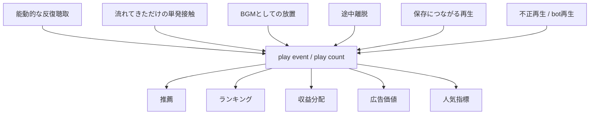
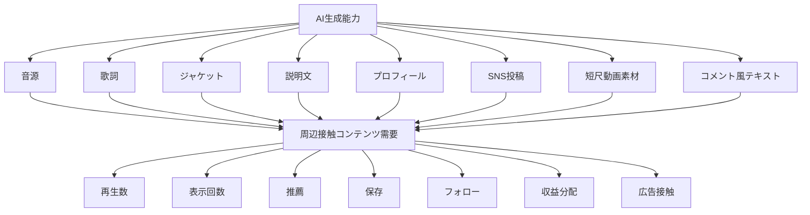

# 009. AI slopと呼ばれる現象は、実際には何を問題化しているのか

## HSSモデルによる観測レポート

> このレポートは、HSS core model を用いた個別観測レポートです。
> HSS本体の定義・用語・スコープは [hss-observation-notes](https://github.com/kuroam/hss-observation-notes) を参照してください。
> 本レポートはHSSの証明ではなく、HSS語彙を仮の観測軸として用いた接続構造の観測メモです。

> Source note: [009_ai_slop_revenue_model_sources.md](../../sources/ja/009_ai_slop_revenue_model_sources.md)

## 0. このレポートの立場と観測方法

このレポートでは、AIを使う側／使わない側、人間制作／AI生成という単純な対立軸を前提にしません。

現在、多くの制作、開発、調査、分析、文書作成の工程では、AIが下書き、補助、整理、検討、生成、編集、確認のいずれかに関与することがあります。

そのため、AIが関与したかどうかだけで、作品や制作者を一括して分類することは、現状の制作実態を十分に反映しない論点圧縮として扱います。

本レポートで扱うのは、AI利用の是非ではありません。
また、AI生成物そのものの価値判断でもありません。

扱うのは、AI slopという語が、どの論点を一つのラベルへ束ねているかです。

AI生成であること、低品質であること、低努力であること、大量投稿であること、低再生であること、低接続であること、不正収益を狙うこと、人間作者を偽装すること、権利問題を含むこと、既存産業を脅かすと見なされること、platformが作品を処理しきれないこと。

これらは、互いに接続する場合があります。
しかし、同じものではありません。

AI slopという語の強さは、これらの論点を短く、一つの否定的なラベルへ圧縮できる点にあります。

本レポートでは、HSSの観測語彙を用いて、AI slopという語に圧縮されている接続構造を分解します。

ここで見るのは、接続元、接続先、媒介symbol、処理形式、痕跡、ルーティングです。

---

## 1. 中心問い

AI slopと呼ばれる現象は、何を問題化しているのか。

本レポートでは、この問いを、AI生成物の善悪や品質判定としては扱いません。

ここで問うのは、AI slopという語によって何が問題化され、どの接続構造、処理形式、収益モデルが一つのラベルへ圧縮されているのかです。

AI slopが流入するとされる場所は、多くの場合、platformです。
特に音楽においては、streaming platform、playlist、recommendation、SNS、short video、再生数、保存数、表示回数、広告、サブスク収益分配が関わります。

ならば、最初に問うべきことは別にあります。

**AI slopとは何かを問う前に、AI slopが流入するとされる収益モデルは、音楽、周辺コンテンツ、制作者、聴取者の接続を何として数え、何として処理しているのか。**

この問いが、本レポートの中心です。

既存のstreaming platformを正常系として置き、その上でAI生成音楽を異物として扱うだけでは、見えなくなるものがあります。

音楽は、いつから再生イベントになったのか。
再生数は、何を測っているのか。
音楽への深い接続と、浅い接触は、同じplay eventとして処理されていないか。
音源、動画、SNS投稿、プロフィール、コメント、ライブ導線、ファンコミュニティは、どのように同じplatform指標へ接続されているのか。
AI生成能力は、その構造のどこへ接続したのか。

本レポートでは、AI slopと呼ばれる現象を、AI生成物そのものの問題としては扱いません。

それは、再生数、表示回数、推薦、保存、フォロー、SNS反応、周辺接触コンテンツ、収益分配を価値単位とする収益モデルに、AIの低摩擦な大量生成能力が接続したときに観測される問題として扱います。

本レポートでは、再生数、表示回数、保存、フォロー、コメント、シェア、滞在時間などの接触指標を、推薦、露出、広告、サブスク維持、収益分配へ接続する構造を、便宜的に「接触収益モデル」と呼びます。

---

## 2. 主対象論文を何として読むか

本レポートの主対象は、AI music slopをstreaming platform上の増加、低再生、大量投稿、推薦、distributor通過、detector脆弱性などから分析する論文です。

この論文は、重要なデータを提供しています。

AI生成音楽が増加していること。
多くのAI生成曲が低再生に留まっていること。
AI生成者の一部が大量投稿を行っていること。
distributorやplatformの検出・審査が十分に機能していない可能性があること。
AI検出器が運用上の限界を持つこと。

これらは、source anchorとして重要です。

ただし、本レポートでは、この論文を「AI slopを証明した論文」としては扱いません。

むしろ、この論文を、AI slopという語が何を圧縮しているかを見る観測対象として扱います。

主対象論文では、AI slopが、低品質、大量、収益目的、人間制作物への偽装、fake consumption、self-sustaining shadow industry といった接続先へ早い段階から接続されています。

そのため、この論文は、AI music slopを中立的に定義してから測定しているというより、AI slopというラベルがどの論点を束ね、どの処理形式や産業防衛へ接続されるかを見る観測対象として読めます。

本レポートでは、主対象論文に対して次の姿勢を取ります。

* データは使う。
* 解釈はそのまま採用しない。
* AI slopの証明ではなく、AI slopという語の圧縮構造を見る。
* 何を観測し、何を代理指標として扱い、どこで解釈を追加しているかを分ける。

---

## 3. 主対象論文の具体的分解

主対象論文の観測には、重要なものが多く含まれています。
しかし、それぞれが何を示しているのかは分ける必要があります。

| 主対象論文の観測                             | 接続されやすい解釈                    | 本レポートでの分解                                             |
| ------------------------------------ | ---------------------------- | ----------------------------------------------------- |
| AI tracksの多くが低再生                     | 低品質 / slop                   | 低再生は、低品質、低接続、未発見、推薦されにくさ、需要不足、時期の短さに分ける必要がある          |
| AI musiciansが大量投稿する                  | spray-and-pray / slop artist | 大量投稿、低努力、探索戦略、収益最適化、不正とは別に扱う                          |
| 多ジャンル投稿が見られる                         | 品質が低い / spam的                | 多ジャンル投稿は、量産、genre targeting、platform最適化、制作方針に分ける必要がある |
| AI tracks同士がrecommendation上で接続されやすい  | AI slop cluster / spam farm  | 音響特徴、metadata、genre、低再生クラスタ、推薦モデル上の近接性に分ける必要がある       |
| distributor実験でAI曲が通る                 | 入口制約が弱い / AI流入脅威             | 自己申告制度、AI検出、審査運用、policy enforcement、品質審査を分ける必要がある     |
| detector evasionが可能                  | AI moderation困難              | AI判定の不安定性を示すが、音楽品質判定ではない                              |
| royalty推定がある                         | shadow industry化             | 収益可能性と自立産業化は別。収益モデルへの接続可能性として扱う                       |
| AI music slopをprevent / throttleする問い | 業界防衛                         | 既存streaming ecosystemを正常系として置いていないかを確認する必要がある         |

この表で確認したいのは、主対象論文が間違っているということではありません。

重要なのは、観測された事実と、その事実が接続される解釈を分けることです。

AI-generatedであること、低再生であること、大量投稿であること、多ジャンル投稿であること、低品質であること、不正であること、既存産業を脅かすことは同じではありません。

この分離を行わないままAI slopという語を使うと、複数の接続が一語へ圧縮されます。

---

## 4. 音楽ビジネスにおける処理単位の変遷

主対象論文を読むためには、AI生成音楽だけでなく、音楽がどの収益モデルへ接続されているのかを見る必要があります。

音楽ビジネスは、音楽そのものを直接扱っているように見えます。
しかし、実際には時代ごとに、音楽を異なる処理単位へ変換してきました。

| 時期        | 主な処理単位 | 収益中心                      | 制作者との接続                                | 見えにくいもの               |
| --------- | ------ | ------------------------- | -------------------------------------- | --------------------- |
| CD販売      | 物理商品   | 購入                        | ライブ、ファンクラブ、店頭、雑誌、TV、ラジオ                | 購入後の聴取深度、再訪、記憶        |
| DL販売      | データ商品  | 購入                        | ライブ、Web、公式サイト、ブログ、初期SNS                | 購入後の接続、コピー、海賊版、無断流通   |
| Streaming | 再生イベント | 再生数、streamshare、広告、サブスク分配 | playlist、recommendation、SNS、動画、フォロー、保存 | 接続の深さ、文脈、ライブ接続、長期的な関係 |

CD販売では、音楽は主に物理商品として扱われました。
CD、アルバム、シングル、ジャケット、歌詞カード、店頭、流通、購入が収益の中心にありました。

もちろん、CDの売上枚数も、音楽への接続の深さを完全に測るものではありません。
買った後に何回聴いたのか、どの記憶に結びついたのかは、売上枚数だけでは分かりません。

それでも、CD販売では「購入」という比較的重い行為が収益の中心にありました。

DL販売では、音楽は物理商品からデータ商品へ移りました。
音源ファイル、単曲購入、アルバム購入、ダウンロード、所有に近い利用が中心になります。

物理流通の制約は弱まりましたが、コピー、海賊版、DRM、無断流通など、データ領域特有の問題も強まりました。

ただし、収益構造としては、まだ「購入」が中心に残っていました。

Streamingでは、この構造が大きく変わります。

音楽は、所有される商品ではなく、platform上で継続的に再生され、推薦され、保存され、収益分配される処理単位へ移りました。

ここで重要になるのは、購入ではなく、再生イベントです。

Streaming型モデルでは、音楽は作品であると同時に、platform上の処理イベントになります。
AI slopと呼ばれる現象は、このstreaming型モデルの処理形式が持つ粗さを見えやすくする契機になります。

---

## 5. 音楽は「音」だけではなくなった

Streaming以降の音楽市場では、音楽は音源単体として流通しているわけではありません。

音楽本体には、音源、楽曲、演奏、録音、歌詞、作曲、編曲、保存、反復聴取、プレイリスト文脈などが含まれます。

一方で、音楽に接続する周辺接触コンテンツも増えています。

MV、短尺動画、SNS投稿、ライブ告知、制作過程、プロフィール、コメント、ファンコミュニティ、プレイリスト文脈、シェア導線、アートワーク、説明文。

これらは音楽そのものではありません。

しかし、streaming / SNS時代では、音楽への接続を維持し、拡張し、platform上の反応指標へ接続する周辺コンテンツとして機能します。

この変化により、音楽は「音を売る商材」から、「音を中心にしたSNSコミュニティ型の複合商材」へ近づきました。

制作者は、音源だけでなく、SNS投稿、動画、コメント、ライブ導線、ファンコミュニティ、制作過程などを、無料または低収益で提供する圧力を受けます。

ここで非対称性が生じます。

制作者が提供する接続要素は増える。
一方で、収益や評価は、再生数、保存数、推薦、フォロー数、表示回数、コメント数、シェア数、滞在時間といったplatform上の処理単位へ粗く圧縮される。

この構造では、音楽は「音」だけではありません。

音源、動画、SNS、プロフィール、ライブ導線、ファンコミュニティが、継続接触を生むための環境として束ねられます。

AI slopと呼ばれる現象を、AI生成音源の大量流入だけとして見ると、この前提が見えにくくなります。

---

## 6. 誰が周辺接触コンテンツを要求しているのか

周辺接触コンテンツの供給圧は、単一の主体から出ているわけではありません。

| 要求主体         | 表向きの要求              | 実際に最適化されるもの        |
| ------------ | ------------------- | ------------------ |
| 消費者          | 便利に聴きたい、探したい、つながりたい | 低摩擦アクセス、推薦、継続接触    |
| platform     | 継続利用、滞在、反応、回遊       | サブスク維持、広告接触、推薦品質   |
| 広告・収益モデル     | 接触回数、視聴、滞在          | 在庫化されたアテンション    |
| 推薦アルゴリズム     | 意思はない               | 反応される形式、離脱されにくい形式  |
| レーベル・配信者     | 露出、成長、ファン維持         | 指標改善、カタログ活用        |
| 制作者          | 届けたい、残りたい、売れたい      | SNS、動画、ライブ導線、ファン対応 |
| 大量生成・収益化を狙う側 | 収益化したい、試したい、埋めたい    | 低コスト大量投入           |

ここでいう需要は、消費者の明示的な欲求だけを意味しません。

platform指標、推薦、露出、収益分配、制作者側の生存戦略が重なって生じる供給圧も含みます。

この要求は、誰か一人が命令しているものではありません。

消費者の利便性要求がplatform指標へ変換される。
platform指標が推薦や露出へ変換される。
推薦や露出が制作者の生存戦略へ戻る。
制作者は音源だけでなく、周辺接触コンテンツを供給する。
その供給物がまたplatform指標へ戻る。

この循環によって、接触コンテンツ需要は増大します。

AI slopは、この要求圧を作った原因ではありません。

AI生成能力は、すでに増大していた接触コンテンツ需要に対して、低摩擦な大量供給手段として接続しました。

---

## 7. 再生数ビジネスと処理形式への吸収

再生数は、便利な処理単位です。

デジタル配信、サブスク、広告、権利分配において、何らかの集計可能な単位は必要です。
再生数は、数えやすく、比較しやすく、自動処理しやすく、ランキング、推薦、収益配分、広告価値へ接続しやすい。

したがって、再生数モデルは、単純に悪い仕組みとして始まったわけではありません。

しかし、再生数が収益、推薦、露出、評価の基準になると、それは単なる観測値ではなく、最適化対象になります。

同じ1再生でも、人間側の接続としては異なる状態があります。

深い反復聴取と浅い単発接触は違います。
保存につながる再生とBGM的な通過も違います。
不正再生やbot再生は、通常の聴取とも違います。

しかしplatform上では、まずplay eventとして処理されます。

ここに、処理形式への吸収があります。

AI生成能力は、この再生数モデルを作った原因ではありません。

しかし、低摩擦で大量に音源データや周辺コンテンツを供給できるため、再生数モデルが持っていた粗さや誘因の歪みに接続しやすい。

AI slopと呼ばれる現象は、この接続によって観測されやすくなります。

---

## 8. データ領域不安とAIラベルの市場処理タグ化

AI slopへの不安には、AI生成そのものへの不安だけでなく、データ領域にある表現物への不安も含まれています。

データは複製しやすく、改変しやすく、出所が曖昧になりやすく、大量流通しやすく、platform指標へ処理されやすい。

この不安は、AI以前から存在していました。

海賊版、コピー、無断転載、模倣、SEO記事、stock素材、content farm。
これらも、データ領域にある表現物が、複製、流通、検索、収益、出所、権利、真正性と接続したときに問題化されてきたものです。

ただし、本レポートでは、AI生成物を海賊版や無断転載と同一視しません。

ここで観測するのは、AI slopという語が、AI生成への不安だけでなく、データ領域にある表現物の複製性、出所不透明性、流通容易性、platform処理形式への変換可能性をまとめて背負いやすいという点です。

また、AI-generated というラベルは、音楽品質そのものの判定ではなく、市場内の処理形式として使われる場合があります。

AI生成かどうかを検出する。
AI生成曲にタグを付ける。
おすすめやplaylistでの扱いを変える。
チャート上の扱いを分ける。
報酬分配やroyalty poolへの影響を議論する。
platformの信頼性を示す。
ユーザーに「安全な」platformとして訴求する。

ここで問題になっているのは、音として良いか悪いかだけではありません。

AI-generated というラベルが、推薦制御、チャート区分、報酬差、著作権倫理、人間アーティスト保護、platform信頼性へ接続されていることです。

AI検出やAIラベルを掲げるplatformも、streaming型収益モデルの外部にいるわけではありません。

AI生成音楽を検出し、タグ付けし、おすすめから外し、スコア化し、安全なplatformとして訴求することは、AI slopへの中立的な審査だけを意味しません。

それは、AI-generated label や anti-AI label を、platform信頼性、推薦制御、チャート区分、報酬分配、顧客獲得導線へ接続する処理形式でもあります。

Deezer系の事例は、AI生成音楽の品質評価そのものではなく、AI-generated label が、推薦制御、チャート区分、報酬分配、platform信頼性、顧客獲得導線へ接続される例として扱います。

調査方法や導線には未確認・注意点があるため、本レポートでは中立的な品質評価の根拠としては扱いません。

---

## 9. AI slopという語の接続先違い

AI slopという語は、誰にとっても同じ問題を指しているわけではありません。

同じ AI slop というsymbolでも、接続先は一つではありません。

| 立場                                    | 守りたい接続 / 阻害される接続                      | AI slopとして見えるもの         | 混同しやすい論点                        | HSS上の見方                        |
| ------------------------------------- | ------------------------------------- | ----------------------- | ------------------------------- | ------------------------------ |
| 自分の曲・作品を広めたい制作者                       | 検索、推薦、SNS表示、プレイリスト、承認、発見される経路         | 可視性を奪う競合ノイズ             | AI生成、低品質、大量投稿、露出競争              | 「作品が届く経路」が低接続大量生成物で濁る          |
| 流れてくるコンテンツを消費したいユーザー                  | feed、playlist、short video、推薦候補列、流し見体験 | feed体験を悪化させる低品質ノイズ      | 低品質、似た内容、釣り、反復表示                | platformが供給する候補列の品質劣化として現れる    |
| 深く追いたいファン / コミュニティ参加者                 | 本人性、継続性、物語、ライブ導線、記憶、関係性               | 真正性や本人性を疑わせるノイズ         | AI判定、偽装、人格性、ファン関係               | 作品単体ではなく、制作者・場・記憶への接続が揺らぐ      |
| キュレーター / レビュー側 / モデレーター / distributor | 選別、審査、推薦、掲載判断、品質確認                    | 選別・審査・モデレーション負荷         | 品質判定、AI検出、policy enforcement    | 判断前の処理負荷が増え、確認作業が外部化される        |
| 既存クリエイター / 権利者 / レーベル / カタログ保有者       | 権利、収益分配、検索結果、カタログ価値、ブランド              | 権利・収益・既存カタログの希釈         | 権利侵害、模倣、収益流出、産業防衛               | AI問題として語られつつ、既存資産の防衛へルーティングされる |
| AI活用制作者                               | 制作経路の説明、作品評価、正当な接続                    | AI関与だけで一括slop扱いされるラベル汚染 | AI生成、低努力、低品質、偽装                 | 生成経路だけが強調され、作品や接続の評価が潰れる       |
| platform / 広告主                        | 信頼、広告品質、ユーザー維持、推薦品質                   | platform信頼性・広告価値を下げるリスク | bot、fake consumption、低品質在庫、広告毀損 | 短期的な接触増加と長期的な信頼低下が衝突する         |
| 大量生成・収益化を狙う側                          | 再生数、表示回数、誘導、収益化導線                     | 邪魔ではなく利用可能な処理形式         | 低コスト生成、量産、最適化、不正との境界            | 増大した接触収益モデルへ低摩擦生成を接続する側        |

この表の目的は、AI slopを嫌がる人の一覧を作ることではありません。

目的は、AI slopという同じ語が、立場ごとに別の接続阻害を指していることを示すことです。

「AI slopが問題である」と言う前に、誰のどの接続が阻害されているのかを分ける必要があります。

---

## 10. AI生成能力がどこへ接続するのか

AIは、再生数モデルを作った原因ではありません。
Streaming型の収益モデルを作った原因でもありません。
音楽がSNSコミュニティ型の複合商材へ近づいた原因のすべてでもありません。

しかしAIは、その構造へ非常に接続しやすい能力を持っています。

AIは、音源だけを生成するわけではありません。

歌詞、ジャケット、説明文、プロフィール、SNS投稿、短尺動画素材、コメント風テキスト、派生コンテンツ。
これらを低摩擦で、大量に、短時間で供給できます。

ここで問題になるのは、AIが「音楽を作れること」そのものではありません。

問題は、すでに増大していた接触コンテンツ需要へ、AIの大量生成能力が接続したことです。

Streaming / SNS 型の音楽市場では、制作者に求められるものは音源だけではありません。
音源を届けるための周辺コンテンツ、プロフィール性、動画、投稿、ライブ導線、コミュニティ維持、継続接触も求められます。

そして、それらはplatform上で、再生数、表示回数、保存数、フォロー数、コメント数、シェア数、滞在時間、推薦、収益分配へ処理されます。

AI生成能力は、この処理形式へ接続します。

そのため、AI slopと呼ばれる現象は、AIが単独で生み出した問題としてではなく、増大した接触収益モデルに、AIの低摩擦な大量生成能力が接続した状態として観測します。

---

## 11. HSS観測としての整理

ここまでの議論を、HSS観測として整理します。

本レポートの観測対象は、AI slop言説、AI music slop論文、streaming型音楽市場、再生数ビジネス、増大した接触収益モデルです。

AI slopは、単なる低品質コンテンツの呼び名ではありません。
少なくとも本レポートでは、AI slopという語を、複数の論点が圧縮された媒介symbolとして扱います。

### 11.1 接続元

接続元には、AI生成能力、streaming platform、制作者、消費者、広告・収益モデル、推薦アルゴリズム、distributor、レーベル、AI生成者、slop farmがあります。

AI生成能力だけが接続元ではありません。

AI生成能力は、すでに存在していたplatform処理形式、再生数ビジネス、接触コンテンツ需要、推薦構造へ接続します。

### 11.2 接続先

接続先には、再生数、表示回数、推薦、収益分配、広告在庫、SNS反応、コミュニティ維持、authenticity表示、不正検知、既存産業防衛、platform信頼性、顧客獲得導線があります。

AI slopという語は、これらの接続先へ異なる形でルーティングされます。

制作者にとっては可視性の問題。
消費者にとってはfeed体験の問題。
深く追いたいファンにとっては真正性の問題。
distributorやmoderatorにとっては選別負荷の問題。
権利者にとっては収益やカタログ価値の問題。
AI活用制作者にとってはラベル汚染の問題。
platformにとっては信頼性と収益モデルの問題。

同じAI slopという語でも、接続先は一つではありません。

### 11.3 媒介symbol

媒介symbolには、AI slop、AI-generated、human-made、low quality、high volume、low effort、play count、fraud、authenticity、slop artist、human artist livelihoodがあります。

これらのsymbolは、複数の論点を短く束ねる働きを持ちます。

特にAI slopは、AI生成、低品質、低努力、大量投稿、低再生、低接続、不正、偽装、権利問題、authenticity不安、既存産業防衛、platform処理形式、増大した接触収益モデルを一語へ圧縮します。

そのため、AI slopという語をそのまま使うと、どの論点を扱っているのかが見えにくくなります。

### 11.4 処理形式

処理形式には、track、play event、view、save、follow、playlist、recommendation、royalty、detector label、distributor policy、ranking、engagement metric、AI-generated labelがあります。

AI slop問題は、この処理形式を抜きにしては読めません。

AI生成音楽が問題化されるのは、AIが音楽を作れるからだけではありません。

AI生成音楽が、trackとして登録され、play eventとして数えられ、recommendationに入り、royalty poolへ接続され、playlistやchartに並び、AI-generated labelで制御されるから問題化されます。

つまり、AI slopは、生成物そのものではなく、生成物がどの処理形式へ入るかによって問題化されます。

### 11.5 痕跡

痕跡には、保存、再訪、反復聴取、コメント、ファン化、違和感、不信、低接続感、スキップ、playlist追加、ライブ接続があります。

再生数だけでは、これらの痕跡を十分に分解できません。

深い反復聴取と、流れてきただけの単発接触は違います。
ライブへ接続する聴取と、BGMとして通過する聴取も違います。
保存され、再訪され、記憶される音楽と、すぐに忘れられる音源も違います。

しかしplatform上では、まず再生イベントとして処理されます。

ここに、処理形式への吸収があります。

### 11.6 ルーティング

AI slopという語は、AI問題、品質問題、不正問題、権利問題、platform問題、既存市場防衛、authenticity不安、ビジネスモデル問題、顧客獲得導線へルーティングされます。

どのルートに入るかによって、AI slopの意味は変わります。

AI slopを一つの問題として扱う前に、どのルートで語られているのかを分ける必要があります。

---

## 12. 処理形式に還元されない接続形式の例

ここまで見てきたように、streaming platformでは、音楽はtrack、play event、play count、recommendation、royaltyといった処理形式へ入りやすい。

しかし、音楽の接続形式は、それだけではありません。

ここでは、補助線としてクラシック音楽市場と初音ミク市場を扱います。

### 12.1 クラシック音楽市場

クラシック音楽では、音楽は単一のtrackとしてだけ存在していません。

作品、楽譜、作曲家、演奏、解釈、指揮者、演奏者、オーケストラ、録音、ホール、再演、批評、教育、歴史、レパートリー、聴取経験。

これらが、それぞれ異なる接続先を持ちます。

同じ作品でも、誰が演奏したのか、誰が指揮したのか、どの録音なのか、どの時代の解釈なのか、どのホールで聴いたのか、どの記憶に接続しているのかによって、意味は変わります。

ここで重要なのは、クラシック音楽を理想化することではありません。
また、クラシック音楽が高尚であり、streaming音楽が浅い、という話でもありません。

重要なのは、音楽にはtrack / play count では処理しきれない接続形式が存在するという点です。

### 12.2 初音ミク市場

初音ミクは、AI音楽そのものではありません。
また、初音ミクをAI生成音楽と同一視することも、本レポートの意図ではありません。

しかし、初音ミク市場は重要な示唆を持ちます。

そこでは、人間の声を録音した歌唱ではなく、合成音声、キャラクター、作曲者、調声、ライブ、イベント、二次創作、ファン文化、派生作品が接続を形成しています。

作曲者、調声、歌詞、キャラクター、二次創作、カバー、ライブ、イベント、ファン文化、共有記憶、派生作品。

これらは、単に「人間が歌っているかどうか」では測れません。

初音ミク市場は、人間の声ではないこと、合成技術が関与していること、データ領域にあることが、低接続やslopを自動的に意味しないことを示しています。

ここでも重要なのは、技術の種類そのものではありません。

重要なのは、どの接続が成立しているかです。

---

## 13. HSSで見えたこと

ここまでの観測から、AI slopと呼ばれる現象は、AIが単独で生み出した問題としては読めません。

AI生成能力は重要な接続元です。
低摩擦で、大量に、音源や周辺コンテンツを生成できるからです。

しかし、それが問題化されるのは、AI生成物が単独で存在しているからではありません。

AI生成物は、platformへ入ります。
trackとして登録されます。
play eventとして数えられます。
recommendationへ接続されます。
playlistへ入る場合があります。
royalty poolへ接続されます。
SNS投稿、短尺動画、プロフィール、説明文、コメント風テキストとして周辺接触コンテンツにもなります。
AI-generated labelによって、推薦制御、チャート区分、報酬差、透明性、platform信頼性へも接続されます。

つまり、AI slopは、AI生成物そのものではなく、AI生成物がどの処理形式へ入るかによって問題化されます。

本レポートでは、AI slopと呼ばれる現象を、AI生成物そのものの問題としては扱いません。

それは、再生数、表示回数、推薦、保存、フォロー、SNS反応、周辺接触コンテンツ、収益分配を価値単位とする収益モデルに、AIの低摩擦な大量生成能力が接続したときに観測される問題です。

AI slopという語は、この収益モデル上の接続問題を、AI生成、低品質、大量投稿、不正、権利問題、既存産業防衛へ一語で圧縮しやすい。

したがって、AI slopを論じるには、まずAI生成物を裁くのではなく、その作品や周辺コンテンツが、どの収益モデル、どの処理形式、どの接続先へルーティングされているかを分解する必要があります。

---

## 14. 見えなかったこと / 保留

本レポートでは、次の点は扱いません。

* AI音楽の品質評価
* 人間音楽とAI音楽の優劣
* 著作権法上の判断
* AI意識論
* AI創造性論
* streaming platformの経済分析の確定
* クラシック音楽市場の全体分析
* 初音ミク文化の全体分析
* AI関与度による制作者分類

これらはいずれも重要な論点ですが、本レポートの対象ではありません。

また、本レポートでは、AI生成物への不満を否定しません。

低品質な大量生成は存在しうる。
偽装は問題になりうる。
不正再生は問題である。
権利侵害も問題になりうる。
platformが低接続出力で埋まることも問題になりうる。

ただし、それらをAI生成そのものと同一視しません。

同様に、人間制作であることも、品質、接続の深さ、文化的価値、正当性を自動的に保証しません。

本レポートで扱うのは、AI生成物の価値判断ではなく、AI slopという語が複数の論点をどのように束ね、どの処理形式へ接続しているかです。

また、本レポートで観測した構造が、音楽streaming市場以外の領域にも見られるかは、今後の観測課題として残します。

作品、業務、接触、評価、成果物をplatform上の処理単位へ圧縮し、その処理単位を収益や評価の中心に置く業界では、AI生成能力の接続によって類似した問題が露出する可能性があります。

ただし、本レポートでは、その一般化は行いません。

---

## 15. 接続確認状態

### 接続確認

AI slopという語は、複数論点を一語に圧縮するsymbolとして観測できます。

特に、AI生成、低品質、低努力、大量投稿、低再生、不正、偽装、権利問題、authenticity不安、既存産業防衛、platform処理形式、増大した接触収益モデルが、一つのラベルへ圧縮されやすい状態が確認できます。

### 処理形式への吸収

音楽本体や周辺接触コンテンツへの接続は、platform上で再生数、表示回数、保存、フォロー、コメント、シェア、推薦、収益分配へ吸収されやすい。

深い反復聴取、浅い単発接触、BGM的通過、不正再生、保存につながる再生は、人間側の痕跡としては異なります。
しかし、platform上ではまずplay eventとして処理されます。

### 接続先違い

AI slopという語の接続先は一つではありません。

制作者にとっては、可視性の阻害。
消費者にとっては、feedやplaylistの品質劣化。
深く追いたいファンにとっては、本人性や真正性の揺らぎ。
キュレーターやdistributorにとっては、選別・審査負荷。
権利者やレーベルにとっては、収益分配やカタログ価値の希釈。
AI活用制作者にとっては、AI関与だけでslop扱いされるラベル汚染。
platformにとっては、信頼性、広告品質、顧客獲得、推薦品質の問題。

同じAI slopという語でも、阻害されている接続は異なります。

### Blue residualsあり

AI生成物への違和感は、AIそのものへの拒否だけではありません。

それは、platform処理形式への違和感として再接続されうる。
再生数ビジネスへの違和感として再接続されうる。
接触コンテンツ需要の増大への違和感として再接続されうる。
authenticity不安として再接続されうる。
既存市場防衛として再接続されうる。

このため、AI slopへの不満は、単純なAI嫌悪として片づけることもできません。

一方で、AI slopへの不満を根拠に、AI生成物全体を低品質・低接続・不正と扱うこともできません。

ここにBlue residualsが残ります。

### 情報不足

本レポートでは、AI生成物の長期的な接続を測定していません。

保存、再訪、反復聴取、ライブ接続、ファン形成、共同体形成、記憶への接続、二次創作への接続。

これらを確認しなければ、AI生成音楽が長期的にどの接続を形成するかは判断できません。

また、AI生成音楽と人間制作音楽の品質比較も、本レポートでは行いません。

### 対象外

AI生成の善悪、法的評価、人間音楽とAI音楽の優劣、AI関与度による制作者分類、既存音楽市場の全面評価は、本レポートでは扱いません。

---

## 16. Source anchors

このレポートでは、次のsource anchorを参照します。

これらは、各主張を証明するための根拠ではなく、AI slopという語がどの処理形式、立場、不安、収益モデルへ接続されているかを見るための観測足場として扱います。

* An Empirical Analysis of AI Slop in Music Streaming

  * 用途: 主対象。AI music slop論文のフレーミング、低再生、大量投稿、distributor、detector、収益推定の確認。
* Spotify for Artists / Royalties Guide

  * 用途: streaming royalties、streamshare、fixed per-stream rateではないこと、artist tools、ticketing / merch導線などの確認。
* Spotify Loud & Clear

  * 用途: streaming economy、payout flow、platform側の説明。
* Revenue sharing at music streaming platforms

  * 用途: pro-rata / user-centricなど、streaming収益配分モデルの設計論。
* The Impact of Social Media on Music Demand

  * 用途: short video / SNS exposure と streaming demand の接続。
* AI-Generated Algorithmic Virality

  * 用途: feed / search / ranking / algorithmic virality とAI生成コンテンツの接続。
* Measuring AI “Slop” in Text

  * 用途: AI slop定義・測定の不安定性。
* “That’s AI Slop, You Bot!”

  * 用途: AI slop accusation、authenticity、gatekeeping、label pollution。
* Why Slop Matters

  * 用途: AI slop肯定・価値化側の対照。
* Why AI Slop Matters, but Not Like That

  * 用途: socio-technical contextの必要性。
* An Endless Stream of AI Slop

  * 用途: review burden、commons、確認負荷・選別負荷の観測。
* Deezer / Ipsos survey and Deezer AI detection-related materials

  * 用途: AI-generated label が推薦制御、チャート区分、報酬分配、platform信頼性、顧客獲得導線へ接続される事例。
